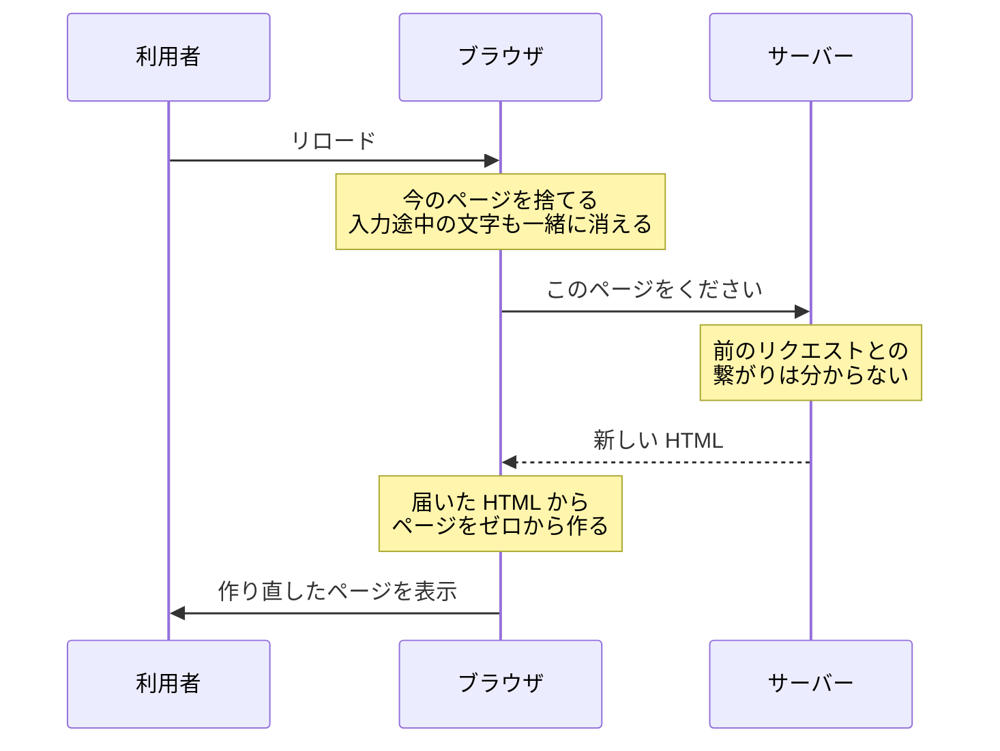

# Web はステートレス — リロードすると消えるものと消えないもの

## 今日のゴール

- リロードで消えるものと残るものを、保存されているかどうかで見分けられる
- サーバーもブラウザも、何もしなければ前の状態を持たないと分かる
- 残したいものには保存する処理が要ると分かる

## リロードで消えるものと残るもの

通販サイトでリロードすると、同じ画面の中で消えるものと残るものに分かれます。

消えるもの:

- 書きかけの文章
- 入力した内容
- スクロール位置

残るもの:

- ログイン状態
- カゴの中身
- 投稿済みのレビュー

書きかけの文章は消えるのに、投稿したレビューは残ります。同じ自分が打った文字なのに、扱いが分かれています。

この違いはどこから来るのでしょうか。

## サーバーは前のリクエストを覚えていない

リロードは、ブラウザがサーバーへ「このページをもう一度ください」と頼み直す操作です。

頼まれたサーバーは、届いたリクエストを見て返事を作り、返したらそのやりとりを覚えていません。次のリクエストが来たとき、それがさっきの続きなのか、別の誰かなのかを知りません。

HTTP は、リクエスト1回とレスポンス1回で完結するように作られています。前のやりとりを引き継がないこの性質を、**ステートレス**（状態を持たない）と言います。

だからサーバーから見ると、リロードして来た人も初めて来た人も区別がつきません。毎回が初対面です。

サーバーが覚えていないなら、ブラウザが覚えていればよさそうです。ところがブラウザも、リロードのときに今のページを持ち続けません。

## ブラウザはページを捨てて作り直す

リロードすると、ブラウザは今表示しているページをいったん閉じて、サーバーから届いた HTML でページを新しく作り直します。今のページを直すのではなく、捨ててゼロから作ります。

書きかけの文章も、入力した内容も、スクロール位置も、今のページの上にあったものです。ページを捨てるとき、一緒に捨てられます。

ページの上で動いていた JavaScript も終了し、変数に入れていた値もこのとき消えます。

つまり、サーバーは覚えておらず、ブラウザもページごと捨てます。**何もしなければ、リロードのたびに全部消える**のが Web の素の動きです。

それでも、カゴの中身とログインは残っていました。捨てられるページの上ではない場所に、置かれているからです。

## 残っているものには保存先がある

カゴに商品を入れた瞬間、その情報はサーバーのデータベースに書き込まれています。投稿したレビューも、注文の履歴も同じです。

リロードで届く新しい HTML は、サーバーがこの保存された内容をもとに作ったものです。カゴの中身はページの上で生き残ったのではなく、**保存された内容から毎回作り直されています**。

書きかけの文章が消えて、投稿済みのレビューが残るのも同じ理由です。投稿ボタンを押した文字はサーバーに保存されていて、押していない文字はページの上にしかありません。

ログインが残るのは、もう1つの保存場所があるからです。ブラウザには、ページを捨てても消えない保存場所が別にあります。

ログインすると、そこに「ログインした証明」にあたる値が保存されます。以降のリクエストにはこの証明が添えられるので、サーバーは毎回初対面のまま「ログイン済みの人からのリクエスト」だと分かります。

ブラウザを閉じても下書きが残るメモアプリなども、このブラウザ側の保存場所を使っています。

画面に出ているものは、放っておけば消えます。残っているものは、誰かがどこかに保存しています。

カゴの中身が残るのは当たり前ではなく、残るように作った人がいるからです。

## 何を残すかは作る側が決めている

画面に出したものは、何もしなければリロードで消えます。残したいものがあるなら、消える前にサーバーかブラウザのどちらかへ保存する処理を入れることになります。

長い応募フォームで「途中まで書いた内容を、次に開いたときも残したい」と思ったら、それは打たれた内容をどこかへ保存して、開き直したときに読み込む機能を作る、という話です。そういう機能を入れない限り、書きかけの内容はリロードのたびに消えます。

逆に、何でも保存すればよいわけでもありません。消えていいものまで残すと、別の困りごとが出ます。

たとえば検索の絞り込み条件を保存すると、翌日開いたときも昨日の条件で絞られたままです。全部の商品を見たいだけの利用者には、品揃えの悪いサイトに見えます。

利用者には「表示がおかしくなったらリロードすれば直る」という感覚もあります。何もかも残す作りは、このやり直しの手段を奪います。

画面の中のひとつひとつについて、消えていいものか、残るべきものかを分けます。残るべきなら保存先を決め、消えていいなら何もしません。

## まとめ

- 画面に出ているものは、何もしなければリロードで消える
- サーバーはリクエスト1回ごとに初対面で、ブラウザはページごと捨てて作り直す
- 残っているものは、サーバーかブラウザのどこかに保存されている
- 残したいものには保存の処理が要り、消えていいものは保存しない
