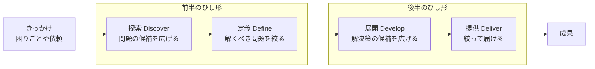

# ダブルダイヤモンド — 解決策の前に問題を決める

## 今日のゴール

- 問題と解決策を分けて、それぞれ広げてから絞るという型を知る
- 探索・定義・展開・提供の4段階で、やることと成果物を知る
- いまが広げる時間か絞る時間かを、発散と収束という言葉で区別できるようになる

## 問題のひし形と解決策のひし形

作るものを決めるまでの進め方に、**ダブルダイヤモンド**という型があります。イギリスのデザインカウンシル（Design Council）が2004年に公開したもので、ひし形（ダイヤモンド）を2つ横に並べた図で表されます。

前半のひし形では、解くべき問題は何かを決めます。後半のひし形では、その問題をどう解くかを決めます。

問題と解決策をわざわざ分けるのは、依頼や思いつきの多くが解決策の形をしているからです。「この機能がほしい」という依頼の手前には、「誰が何に困っているのか」という、まだ確かめられていない問題が隠れています。

各ひし形の左半分は選択肢を**広げる**時間、右半分は**絞る**時間です。広がって狭まる形が2回続くので、ひし形が2つ並びます。

4つの段階には、探索（Discover）、定義（Define）、展開（Develop）、提供（Deliver）という名前が付いています。頭文字を取って 4D とも呼ばれます。

## 探索（Discover）— 問題の候補を広げる

最初の段階は、解くべき問題を決めるための材料集めです。きっかけになった困りごとや依頼に対して、原因を1つに決めつける前に、現場を広く見ます。

見方によって、集まる材料が変わります。

- **行動データの分析**: どこで、どれくらいの人がつまずいているかが分かる。ただし、なぜかは分からない
- **利用者への聞き取り**: 理由や、そのときの気持ちが分かる。ただし、聞ける人数は少なく、答えは本人の記憶に頼る
- **観察と自分での操作**: 操作の様子を見たり、自分で同じ手順をなぞったりすると、本人も言葉にしない引っかかりを拾える

数字は「どこで」を、聞き取りは「なぜ」を、観察は「言葉にならないもの」を教えてくれます。種類の違う材料を重ねるほど、問題の候補は思い込みの外まで広がります。

広げていくと、「そもそも困っていない人が混ざっている」のように、きっかけになった困りごとの前提そのものが崩れることもあります。だから、この段階では出てきた候補をまだ捨てません。

探索の成果物は、こうして集めた気づきの一覧です。探索を飛ばすと、最初の思いつきが確かめられないまま唯一の問題になります。

## 定義（Define）— 解くべき問題を1つに絞る

次の段階では、探索で広げた候補を絞ります。全部は解けないので、どれを解くかを選ぶ段階です。

絞るときの物差しは1つではありません。

- **効き目の大きさ**: 件数や金額で見て、どの候補が一番効いているか
- **動かせる範囲**: 価格や制度は事業側の判断でも、画面や導線は自分たちで変えられる
- **確かめやすさ**: 解けたかどうかを、あとから数字で判定できるか

選んだら、問題を一文に固定します。誰が、いつ、何に困っているかが入った一文です。

この一文の粒度が、後半の質を決めます。

「売上が伸びない」のように広すぎると、後半で解決策が無限に広がって絞れません。逆に一文まで絞れていれば、解決策の範囲は自然に定まります。

定義の成果物は、この問題文です。デザインの現場では、条件や進め方も添えて**ブリーフ**と呼ばれる文書にまとめられます。

ここまでが前半のひし形です。まだ何も作っていません。

## 展開（Develop）— 解決策の候補を広げる

問題が決まって、ここで初めて解決策の番になります。定義した問題文に対して、解き方を複数並べます。

1案目に飛びつかないのは、探索と同じ理由です。案は、比べて初めて良し悪しが言えます。

並べたら、小さく試します。画面の絵を数人に見せて反応を比べる、紙の試作で操作の流れをなぞってもらう、といった安い試し方がこの段階の中心です。

作り込む前に案を減らすほど、無駄な実装が減ります。展開の成果物は、試して手応えを確かめた少数の案です。

## 提供（Deliver）— 作り込んで届けて確かめる

最後の段階で、残った案を作り込んでリリースします。エンジニアの実装作業は、主にここに置かれています。

提供はリリースで終わりません。定義した問題が実際に解けたかを計測して判定するところまでが提供です。

定義の物差しに「数字で判定できるか」を入れておいたのは、ここで効きます。

解けていなければ、定義か展開のどこかがずれていたと分かります。解けていれば、計測の中から次の気づきが出てきます。

どちらに転んでも、結果は次の探索の入口になります。

4つの段階を整理すると、こうなります。

| 段階 | やること | 成果物 |
|---|---|---|
| 探索（Discover） | 問題の候補を広げる | 気づきの一覧 |
| 定義（Define） | 解くべき問題を1つに絞る | 問題文（ブリーフ） |
| 展開（Develop） | 解決策の候補を広げて試す | 手応えを確かめた少数の案 |
| 提供（Deliver） | 作り込んで届けて確かめる | リリースと計測結果 |

## 広げる時間と絞る時間を混ぜない

4つの段階は、突き詰めると「広げる」と「絞る」の繰り返しです。広げる考え方を**発散**、絞る考え方を**収束**と呼びます。

ダブルダイヤモンドがわざわざ時間を分けるのは、発散と収束を同時にやると両方が壊れるからです。

案を出している最中に「それは工数がかかる」「前に似たことをやって失敗した」と評価が入ると、次の案が出なくなります。逆に、決める場面で新しい案を出し続けると、いつまでも決まりません。

ブレインストーミングに「批判禁止」というルールがあるのを聞いたことがあるかもしれません。あれは発散の時間に収束を持ち込ませないための決まりで、やっていることはこの型と同じです。

会議でも1人の設計でも、「いまは広げる時間か、絞る時間か」を先に決めておくだけで進み方が変わります。

ホワイトボードに付箋を貼っていく作業は発散、投票やグルーピングで付箋を減らす作業は収束です。デザイナーとの打ち合わせでは、発散と収束はこの意味でそのまま使われています。

## 一直線には進まない

図は左から右へ流れますが、実際の進行は行き来します。

展開で試作を見せたら、問題の定義そのものがずれていたと分かって定義に戻る。提供した後の計測が、次の探索のきっかけになる。

デザインカウンシル自身も、2019年の改訂（Framework for Innovation）で段階を行き来しながら繰り返すことを図に明記し、原則の1つに「繰り返す」を掲げました。

型の役目は、順番どおりに進ませることではありません。いま自分たちがどの段階にいて、広げる時間なのか絞る時間なのかを、全員で確かめられるようにすることです。

## 解決策の形で届いた依頼の受け方

作る側にいると、仕事はたいてい展開か提供の途中から始まります。前半のひし形に同席できないことも多いですが、受け取った依頼に聞き返すことはできます。

- この機能は、どんな問題を解くためのものですか
- その問題は、何で確かめましたか

探索と定義を通ってきた問題文が返ってくるなら、安心して後半に集中できます。返ってくるのが思いつきなら、作り始める前に小さく探索へ戻ることを提案できます。

数日かけて作ってから効かないと分かるより、先に1日かけて確かめるほうが安く済みます。

## まとめ

- 前半のひし形で解くべき問題を、後半のひし形で解き方を、それぞれ広げてから絞る
- 4段階の成果物は、気づきの一覧・問題文・手応えを確かめた案・リリースと計測結果
- いまが発散か収束かを共有すると、会議も設計も噛み合う
