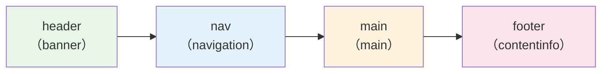

# Day X: セマンティック HTML — div で書けるのに、なぜタグを選ぶのか

## 今日のゴール

- HTML タグには「意味」があり、ブラウザや支援技術がそれを読み取っていることを知る
- div/span と、header/nav/main などのセマンティックタグの違いを知る
- React コンポーネントでもセマンティックなタグを選ぶ理由を知る

## div は「意味が空っぽ」のタグ

HTML には多くのタグがありますが、実は **見た目だけなら `<div>` と CSS で何でも作れます**。見出しっぽいもの、ナビゲーションっぽいもの、フッターっぽいもの ── すべて `<div>` で囲んでスタイルを当てれば、画面上は同じに見えます。

では、なぜわざわざ `<header>` や `<nav>` や `<main>` を使うのでしょうか。

答えは、**HTML のタグは見た目ではなく「意味」を伝えるもの**だからです。

`<div>` は **「何の意味も持たない汎用コンテナ」** です。同様に `<span>` はインライン（行の中）の汎用コンテナです。どちらもレイアウトやスタイリングの都合で使うためのタグであり、「このコンテンツは何なのか」という情報をまったく持ちません。

```html
<!-- div だけで書いた構造 -->
<div class="header">
  <div class="logo">サイト名</div>
  <div class="nav">
    <div class="nav-item">ホーム</div>
    <div class="nav-item">お知らせ</div>
  </div>
</div>
<div class="main">
  <div class="title">今日のニュース</div>
  <div class="text">新機能をリリースしました。</div>
</div>
<div class="footer">
  <div class="text">© 2026 サンプル</div>
</div>
```

人間がクラス名を読めば「ああ、ヘッダーだな」とわかります。しかし、**ブラウザやスクリーンリーダーはクラス名の意味を理解しません**。このコードは機械から見ると「div の中に div がある」としか読み取れない、意味が空っぽの構造です。

## セマンティック HTML — タグで「意味」を伝える

**セマンティック（semantic）** とは「意味的な」という意味の英単語です。セマンティック HTML とは、コンテンツの意味に合ったタグを選んで書く HTML のことです。

上のコードをセマンティックに書き直すと、こうなります。

```html
<!-- セマンティックなタグで書いた構造 -->
<header>
  <p>サイト名</p>
  <nav>
    <ul>
      <li><a href="/">ホーム</a></li>
      <li><a href="/news">お知らせ</a></li>
    </ul>
  </nav>
</header>
<main>
  <h1>今日のニュース</h1>
  <p>新機能をリリースしました。</p>
</main>
<footer>
  <p>© 2026 サンプル</p>
</footer>
```

見た目を整える前の段階では、どちらも似たようなものに見えるかもしれません。しかし、機械が読み取れる情報量はまったく違います。

## 主要なセマンティックタグとその役割

| タグ | 意味 | 使いどころ |
|------|------|-----------|
| `<header>` | ページやセクションの導入部分 | サイトのヘッダー、記事の冒頭 |
| `<nav>` | ナビゲーション（主要なリンク群） | グローバルメニュー、パンくずリスト |
| `<main>` | ページの主要コンテンツ | ページに 1 つだけ配置する |
| `<section>` | テーマでまとまったひとかたまり | 「自己紹介」「料金プラン」など |
| `<article>` | 独立した完結するコンテンツ | ブログ記事、ニュース、コメント |
| `<aside>` | 主要コンテンツの補足情報 | サイドバー、関連リンク |
| `<footer>` | ページやセクションの末尾情報 | 著作権表示、連絡先 |

いくつか補足します。

- `<main>` は **ページに 1 つだけ** 置きます。そのページ固有のコンテンツを囲むタグです
- `<section>` と `<article>` は似ていますが、`<article>` は「それだけ取り出しても意味が通じる」独立したコンテンツに使います。ブログの1記事、1つのコメント、1つのニュースなどです
- `<section>` は「テーマでまとまったひとかたまり」です。見出し（`<h2>` など）を伴うのが自然です

## スクリーンリーダーはランドマークでページを移動する

**スクリーンリーダー**（画面読み上げソフト）は、視覚に障害のある方が Web を使うための支援技術です。画面を見る代わりに、ページの内容を音声で読み上げます。

スクリーンリーダーには **ランドマーク（目印）ジャンプ** という機能があります。`<header>`、`<nav>`、`<main>`、`<footer>` などのセマンティックタグは、ブラウザによって自動的に **ランドマーク** として認識されます。



スクリーンリーダーのユーザーは、ランドマーク一覧を表示して「ナビゲーションに移動」「メインコンテンツに移動」といった操作ができます。これは晴眼者（目が見える人）がページをざっと見渡して目的の場所を見つけるのに相当します。

div だけで書かれたページでは、ランドマークが存在しません。スクリーンリーダーのユーザーは、ページの先頭から1行ずつ読んでいくしかなくなります。

## div だらけのコードとセマンティックなコードの比較

AI にコードを生成させると、`<div>` だらけのコードが出てくることがあります。以下は、よくあるブログ記事ページの例です。

```html
<!-- AI が出しがちな div だらけのコード -->
<div class="page">
  <div class="top-bar">
    <div class="site-title">My Blog</div>
    <div class="menu">
      <div class="menu-item">ホーム</div>
      <div class="menu-item">記事一覧</div>
    </div>
  </div>
  <div class="content">
    <div class="post">
      <div class="post-title">HTML の基礎を学ぼう</div>
      <div class="post-date">2026年4月12日</div>
      <div class="post-body">
        <div class="paragraph">HTML はマークアップ言語です。</div>
      </div>
    </div>
    <div class="sidebar">
      <div class="sidebar-title">カテゴリー</div>
      <div class="sidebar-list">
        <div class="sidebar-item">HTML</div>
        <div class="sidebar-item">CSS</div>
      </div>
    </div>
  </div>
  <div class="bottom-bar">© 2026 My Blog</div>
</div>
```

これをセマンティックに書き直します。

```html
<!-- セマンティックなコード -->
<header>
  <p><a href="/">My Blog</a></p>
  <nav aria-label="メインメニュー">
    <ul>
      <li><a href="/">ホーム</a></li>
      <li><a href="/posts">記事一覧</a></li>
    </ul>
  </nav>
</header>
<main>
  <article>
    <h1>HTML の基礎を学ぼう</h1>
    <time datetime="2026-04-12">2026年4月12日</time>
    <p>HTML はマークアップ言語です。</p>
  </article>
  <aside aria-label="カテゴリー">
    <h2>カテゴリー</h2>
    <ul>
      <li><a href="/category/html">HTML</a></li>
      <li><a href="/category/css">CSS</a></li>
    </ul>
  </ul>
  </aside>
</main>
<footer>
  <p>© 2026 My Blog</p>
</footer>
```

変わったポイントを見てみましょう。

- **ナビゲーションがリンクになった**: div の中にテキストがあるだけでは、クリックしてもどこにも行けません。`<nav>` + `<a>` でリンクとして機能します
- **記事が `<article>` になった**: この記事だけを取り出しても意味が通じる独立したコンテンツなので `<article>` が適切です
- **日付が `<time>` になった**: `<time>` タグの `datetime` 属性を使うと、機械が日付を正確に認識できます
- **サイドバーが `<aside>` になった**: 記事の補足情報であることが明確になります
- **`aria-label` を使っている**: 同じ種類のランドマークが複数あるとき（`<nav>` が 2 つあるなど）、`aria-label` で名前を付けることで区別できます

## React コンポーネントでもセマンティックなタグを使う

「React を使うなら HTML の書き方は関係ない」と思うかもしれません。しかし、React のコンポーネントも最終的には HTML としてブラウザに出力されます。

```tsx
// ❌ div だけで書いた React コンポーネント
function BlogPost({ title, date, content }: BlogPostProps) {
  return (
    <div className="post">
      <div className="post-title">{title}</div>
      <div className="post-date">{date}</div>
      <div className="post-body">{content}</div>
    </div>
  );
}
```

```tsx
// ✅ セマンティックなタグを使った React コンポーネント
function BlogPost({ title, date, content }: BlogPostProps) {
  return (
    <article>
      <h2>{title}</h2>
      <time dateTime={date}>{date}</time>
      <p>{content}</p>
    </article>
  );
}
```

コンポーネントという単位で考えると「div で囲んでおけばいいか」と思いがちですが、**ブラウザに出力される HTML の意味は変わりません**。コンポーネントの中でも、コンテンツの意味に合ったタグを選ぶことが大切です。

## div を使ってよい場面

ここまで「div はダメ」のような話をしてきましたが、div にも正しい使いどころがあります。

**レイアウトやスタイリングのためにグループ化が必要で、意味的なタグが当てはまらないとき**に div を使います。

```html
<main>
  <article>
    <h1>記事タイトル</h1>
    <!-- この div は 2 カラムレイアウトのためのラッパー -->
    <div style="display: flex; gap: 16px;">
      <div>
        <p>本文がここに入ります。</p>
      </div>
      <div>
        
      </div>
    </div>
  </article>
</main>
```

ポイントは **「まずセマンティックなタグを検討し、当てはまらないときに div を使う」** という順番です。最初から div で書くのではなく、意味のあるタグがないかを考えてから div を選ぶ習慣を持ちましょう。

## まとめ

- `<div>` と `<span>` は意味を持たない汎用タグ。レイアウト用に使うもの
- `<header>`、`<nav>`、`<main>`、`<section>`、`<article>`、`<aside>`、`<footer>` はコンテンツの意味を表すセマンティックタグ
- スクリーンリーダーはセマンティックタグをランドマークとして認識し、ページ内を効率的に移動できる
- div だらけのページは機械から見ると「意味が空っぽ」
- React コンポーネントでも、最終的に出力される HTML の意味を意識してタグを選ぶ
- div を使うのは「意味的なタグが当てはまらないとき」が基本
