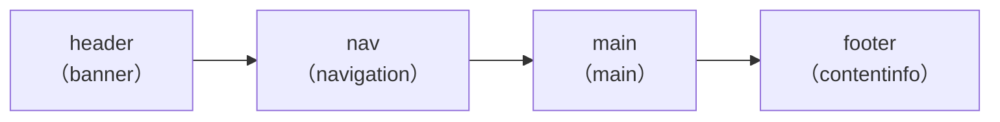

# Day X: セマンティック HTML — ページの構造を伝えるタグ

## 今日のゴール

- HTML タグが見た目だけでなく「ページの構造」を機械に伝えていることを知る
- ランドマーク、見出し階層、セクショニングの3つの構造を知る
- React のコンポーネント分割で見出しレベルが壊れやすい問題を知る

## 人間と機械はページの見方が違う

Web ページを開いたとき、人間は見た目で瞬時に構造を把握できます。「上にメニューがあるな」「ここがメインの内容だな」「右にサイドバーがあるな」と、レイアウトや文字の大きさから判断しています。

しかし、検索エンジンのクローラーやスクリーンリーダー（画面読み上げソフト）は見た目を認識できません。代わりに、**HTML のタグから構造を読み取っています**。

つまり、HTML のタグ選びは見た目の問題ではなく、**ページの構造を正しく伝えられるかどうか**の問題です。

HTML がページの構造を伝える仕組みは大きく3つあります。

## 1. ランドマーク — ページの「地図」

`<header>`、`<nav>`、`<main>`、`<footer>` などのタグは、ページの大まかな領域を示します。これらは**ランドマーク**（目印）と呼ばれ、ページのどこに何があるかを示す「地図」の役割を果たします。

```html
<header>
  <p><a href="/">My Blog</a></p>
  <nav>
    <ul>
      <li><a href="/">ホーム</a></li>
      <li><a href="/posts">記事一覧</a></li>
    </ul>
  </nav>
</header>
<main>
  <h1>今日のニュース</h1>
  <p>新機能をリリースしました。</p>
</main>
<footer>
  <p>&copy; 2026 My Blog</p>
</footer>
```



カッコ内の `banner`、`navigation` などは、ブラウザがタグから自動的に割り当てる**ロール**（役割）です。スクリーンリーダーはこのロールを使って「ナビゲーションに移動」「メインコンテンツに移動」といった操作を提供します。

主要なランドマークタグは以下の通りです。

| タグ | ロール | 意味 |
|------|--------|------|
| `<header>` | banner | ページやセクションの導入部分 |
| `<nav>` | navigation | 主要なナビゲーション |
| `<main>` | main | ページの主要コンテンツ（ページに1つ） |
| `<aside>` | complementary | 主要コンテンツの補足情報 |
| `<footer>` | contentinfo | ページやセクションの末尾情報 |

これらのタグをすべて `<div>` に置き換えても、見た目は CSS で同じにできます。しかしその場合、機械から見るとページの「地図」が存在しないことになります。

## 2. 見出し階層 — ページの「目次」

`<h1>` から `<h6>` まで、6段階の見出しタグがあります。これらはページの**目次**（アウトライン）を構成します。

```html
<h1>料理レシピ</h1>
  <h2>和食</h2>
    <h3>肉じゃが</h3>
    <h3>味噌汁</h3>
  <h2>洋食</h2>
    <h3>ハンバーグ</h3>
```

この見出し構造は、本の目次と同じ「章 → 節 → 項」の階層です。

```
料理レシピ
├── 和食
│   ├── 肉じゃが
│   └── 味噌汁
└── 洋食
    └── ハンバーグ
```

スクリーンリーダーのユーザーは、見出し一覧を表示してページ内を移動できます。検索エンジンも見出しの階層からページの内容を把握しています。

### 見出しレベルは飛ばさない

見出しレベルは h1 → h2 → h3 のように順番に深くします。h1 の次にいきなり h3 を使うと、目次の階層が壊れます。

```html
<!-- ❌ h2 を飛ばしている -->
<h1>お知らせ</h1>
<h3>2026年4月のお知らせ</h3>

<!-- ✅ 正しい階層 -->
<h1>お知らせ</h1>
<h2>2026年4月のお知らせ</h2>
```

深い階層から浅い階層に**戻る**のは問題ありません。上の例でも、h3（肉じゃが）の後に h2（洋食）に戻っています。本の目次でも節が終われば次の章に移るのは自然です。

なお、`<h1>` はページの最上位の見出しなので、ページに1つが基本です。h1 が複数あるときは、階層が正しく作れていないサインです。

### 文字サイズを変えたいだけなら CSS

ブラウザは h1 を大きく、h2 をやや小さく表示します。この見た目のせいで「文字を大きくしたいから h1」「小さくしたいから h4」という使い方をしてしまうことがあります。

文字の大きさを変えたいだけなら CSS の `font-size` を使います。タグは「意味」を、CSS は「見た目」を担当する ── HTML と CSS の基本的な役割分担です。

## 3. セクショニング — コンテンツのまとまり

`<section>` と `<article>` は、コンテンツのまとまりを示すタグです。

```html
<main>
  <h1>技術ブログ</h1>

  <article>
    <h2>React 入門</h2>
    <p>React はUIライブラリです。</p>
  </article>

  <article>
    <h2>Next.js の概要</h2>
    <p>Next.js は React のフレームワークです。</p>
  </article>
</main>
```

使い分けの基準はシンプルです。

- **`<article>`**: それだけ取り出しても意味が通じる、独立したコンテンツ。ブログの1記事、1つのコメント、1つの商品カードなど
- **`<section>`**: テーマでまとまったひとかたまり。「料金プラン」「よくある質問」など、見出しを伴うのが自然

`<article>` は「別の場所に貼っても成立するか？」で判断するとわかりやすいです。ブログ記事は RSS フィードに載せても成立しますが、「料金プラン」セクションだけ取り出しても意味が通じません。

### セクショニングと見出し

`<section>` にはそのまとまりのタイトルとして見出しを付けるのが自然です。さらに、小見出し（h3 など）がある場合は `<section>` でラップすると、どこからどこまでがそのサブセクションなのかが明確になります。

```html
<main>
  <h1>料理レシピ</h1>

  <section>
    <h2>和食</h2>
    <p>和食の代表的なレシピを紹介します。</p>

    <section>
      <h3>肉じゃが</h3>
      <p>材料：じゃがいも、牛肉、にんじん...</p>
    </section>

    <section>
      <h3>味噌汁</h3>
      <p>材料：豆腐、わかめ、味噌...</p>
    </section>
  </section>

  <section>
    <h2>洋食</h2>
    <h3>ハンバーグ</h3>
    <p>材料：ひき肉、玉ねぎ、パン粉...</p>
  </section>
</main>
```

`<section>` でまとまりを囲み、見出しでタイトルを付ける。この組み合わせがページの構造を作ります。

## React のコンポーネント分割で見出しレベルが壊れやすい

React ではページを小さなコンポーネントに分割します。ここで見出しレベルの問題が起きやすくなります。

```tsx
// 常に h2 を出力するコンポーネント
function SectionTitle({ children }: { children: React.ReactNode }) {
  return <h2>{children}</h2>;
}

function Page() {
  return (
    <main>
      <h1>料理レシピ</h1>
      {/* ここでは h2 が正しい */}
      <SectionTitle>和食</SectionTitle>
      <section>
        {/* ここでは h3 が欲しいが、h2 が出力されてしまう */}
        <SectionTitle>肉じゃが</SectionTitle>
        <p>材料：じゃがいも、牛肉、にんじん...</p>
      </section>
    </main>
  );
}
```

出力される HTML は h1 → h2 → h2 となり、「肉じゃが」が「和食」の下位ではなく同じレベルに見えてしまいます。

対策として、見出しレベルを props で受け取る設計があります。

```tsx
function SectionTitle({
  level,
  children,
}: {
  level: 1 | 2 | 3 | 4 | 5 | 6;
  children: React.ReactNode;
}) {
  const Tag = `h${level}` as const;
  return <Tag>{children}</Tag>;
}

function Page() {
  return (
    <main>
      <h1>料理レシピ</h1>
      <SectionTitle level={2}>和食</SectionTitle>
      <section>
        <SectionTitle level={3}>肉じゃが</SectionTitle>
        <p>材料：じゃがいも、牛肉、にんじん...</p>
      </section>
    </main>
  );
}
```

コンポーネントを作るときは「ページのどの階層で使われるか」を意識することが大切です。

## div を使ってよい場面

ここまで「タグで意味を伝える」話をしてきましたが、`<div>` にも正しい使いどころがあります。

**レイアウトやスタイリングのためにグループ化が必要で、意味的なタグが当てはまらないとき**に使います。

```html
<main>
  <article>
    <h1>記事タイトル</h1>
    <!-- 2カラムレイアウトのためのラッパー。意味的なタグが当てはまらない -->
    <div style="display: flex; gap: 16px;">
      <div>
        <p>本文がここに入ります。</p>
      </div>
      <div>
        
      </div>
    </div>
  </article>
</main>
```

ポイントは **「まず意味のあるタグを検討し、当てはまらないときに div を使う」** という順番です。

## まとめ

- HTML タグは見た目ではなく、ページの構造を機械に伝えるもの
- **ランドマーク**（header, nav, main, aside, footer）はページの「地図」を作る
- **見出し階層**（h1〜h6）はページの「目次」を作る。レベルを飛ばさない、h1 はページに1つ
- **セクショニング**（section, article）はコンテンツのまとまりを示す。article は独立して成立するもの
- React のコンポーネント分割では見出しレベルが壊れやすい。props でレベルを指定する設計が有効
- div はレイアウト用。意味のあるタグが当てはまらないときに使う
