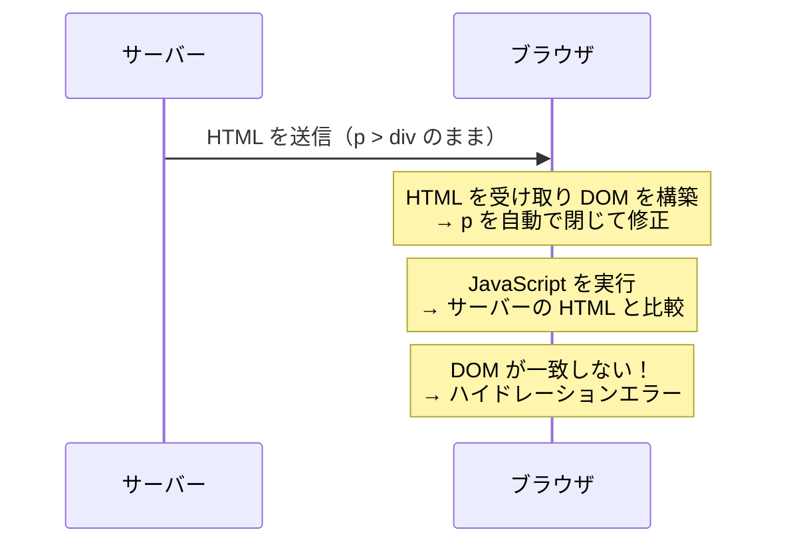

# Day 5: HTML のネスティングルール — 動くけど壊れているコード

## 今日のゴール

- HTML には「この要素の中にこの要素は入れてはいけない」というルールがあることを知る
- ルール違反をブラウザが自動修正することで、意図しない DOM になることを知る
- サーバーとクライアントで DOM が食い違うと Next.js のハイドレーションエラーになることを知る

## 「動いているから正しい」とは限らない

HTML には「この要素の中にはこの要素を入れてはいけない」というネスティング（入れ子）ルールがあります。違反しても**ブラウザはエラーを出さず、黙って DOM を修正**します。見た目は問題なく動いているように見えるのに、内部の構造が壊れている — そういうコードは実際のプロジェクトでもよく見かけます。

なぜこれが問題なのかを、具体的に見ていきましょう。

## `<p>` の中に `<div>` は入れられない

`<p>`（段落）は**フレージングコンテンツ**（テキストやリンクなど、文の中に含められる要素）しか子に持てません。`<div>` はフレージングコンテンツではないので、`<p>` の中に入れると壊れます。

```html
<!-- ❌ p の中に div を入れている -->
<p>
  お知らせがあります。
  <div class="highlight">重要なお知らせ</div>
</p>
```

このコードをブラウザに渡すと、ブラウザは以下のように**自動修正**します。

```html
<!-- ブラウザが実際に解釈した結果 -->
<p>お知らせがあります。</p>
<div class="highlight">重要なお知らせ</div>
<p></p>
```

`<div>` を見つけた時点でブラウザが `<p>` を自動で閉じてしまい、元の HTML とは異なる構造になります。空の `<p>` まで生まれています。

### 正しい書き方

```html
<!-- ✅ div で全体を囲む -->
<div>
  <p>お知らせがあります。</p>
  <div class="highlight">重要なお知らせ</div>
</div>
```

`<p>` の中にブロック要素を入れたい場合は、`<p>` の外に出すのが正解です。テキストの一部を強調したいだけなら、`<span>` や `<strong>` を使いましょう。これらはフレージングコンテンツなので `<p>` の中に入れられます。

```html
<!-- ✅ span や strong なら p の中に入れられる -->
<p>
  お知らせがあります。<strong>重要なお知らせ</strong>です。
</p>
```

## `<a>` の中に `<a>` はネストできない

リンクの中にリンクを入れることはできません。

```html
<!-- ❌ a の中に a -->
<a href="/articles/1">
  記事タイトル
  <a href="/users/yamada">山田太郎</a>
</a>
```

ブラウザは内側の `<a>` を見つけた時点で外側の `<a>` を閉じてしまいます。結果として、リンクの範囲が意図したものとは全く異なる構造になります。

### 正しい書き方

```html
<!-- ✅ リンクを分離する -->
<div>
  <a href="/articles/1">記事タイトル</a>
  <span> — </span>
  <a href="/users/yamada">山田太郎</a>
</div>
```

「カード全体をクリックできるようにしたいが、中にも別のリンクがある」というパターンは Web でよく出てきます。これは CSS で対応する方法がありますが、HTML のネストで解決しようとしてはいけません。

## `<button>` の中に `<a>` を入れてはいけない

```html
<!-- ❌ button の中に a -->
<button>
  <a href="/about">詳しく見る</a>
</button>
```

`<button>` はインタラクティブコンテンツ（ユーザーが操作する要素）です。`<a>` もインタラクティブコンテンツです。**インタラクティブコンテンツの中にインタラクティブコンテンツを入れることはできません。** クリックしたときにボタンの動作が発生するのか、リンクの遷移が発生するのか、ブラウザが判断できなくなります。

### 正しい書き方

```html
<!-- リンクとして遷移させたいなら a だけを使う -->
<a href="/about">詳しく見る</a>

<!-- ボタンの見た目にしたいなら CSS でスタイルを当てる -->
<a href="/about" class="button-style">詳しく見る</a>
```

ボタンの見た目でリンクしたい場合は、`<a>` タグに CSS でボタンのスタイルを当てます。逆に、クリックで JavaScript の処理を実行したいなら `<button>` だけを使います。

## `<ul>` / `<ol>` の直下は `<li>` のみ

```html
<!-- ❌ ul の直下に div -->
<ul>
  <div>
    <li>りんご</li>
    <li>みかん</li>
  </div>
  <div>
    <li>ぶどう</li>
  </div>
</ul>

<!-- ✅ ul の直下は li のみ -->
<ul>
  <li>りんご</li>
  <li>みかん</li>
  <li>ぶどう</li>
</ul>
```

`<ul>`（順序なしリスト）と `<ol>`（順序付きリスト）の直下に置けるのは `<li>` だけです。`<li>` の**中に**は `<div>` やほかの要素を自由に入れられます。

```html
<!-- ✅ li の中には何でも入れられる -->
<ul>
  <li>
    <div class="card">
      <h3>りんご</h3>
      <p>青森県産のりんごです。</p>
    </div>
  </li>
  <li>
    <div class="card">
      <h3>みかん</h3>
      <p>愛媛県産のみかんです。</p>
    </div>
  </li>
</ul>
```

## よくある違反パターン一覧

| 違反パターン | 理由 | 正しい対処 |
|-------------|------|-----------|
| `<p>` の中に `<div>` | `<p>` はフレージングコンテンツのみ | `<div>` で囲む構造に変える |
| `<a>` の中に `<a>` | インタラクティブの入れ子禁止 | リンクを分離する |
| `<button>` の中に `<a>` | インタラクティブの入れ子禁止 | どちらか一方にする |
| `<ul>` の直下に `<div>` | `<ul>` の直下は `<li>` のみ | `<li>` の中に `<div>` を入れる |
| `<table>` の直下に `<tr>` なしで `<td>` | `<td>` は `<tr>` の中にのみ | `<tr>` で囲む |

## なぜ問題になるのか — ハイドレーションエラー

ここまでの違反は「見た目が少し崩れるかもしれない」程度に思えるかもしれません。しかし、Next.js を使う場合は**深刻な問題**になります。

Next.js は、まずサーバー側で HTML を生成し、その後ブラウザ側で JavaScript を実行して HTML に動きをつけます。この「サーバーで作った HTML にブラウザで JavaScript を接続する」過程を**ハイドレーション**と呼びます。



1. **サーバー**が HTML を生成する（`<p><div>...</div></p>` のまま文字列として送る）
2. **ブラウザ**が HTML を受け取り、DOM（画面の構造）を構築する。このとき `<p>` の中の `<div>` を検出し、自動で修正する
3. Next.js の JavaScript が動き始め、サーバーが意図した DOM とブラウザの DOM を比較する
4. **構造が一致しない** → ハイドレーションエラー

ハイドレーションエラーが起きると、Next.js はコンソールに以下のような警告を表示します。

```
Warning: Expected server HTML to contain a matching <div> in <p>.
```

最悪の場合、ページ全体が再レンダリングされてパフォーマンスが悪化したり、画面がちらついたりします。

## React の validateDOMNesting 警告

React には、ネスティングルール違反を検出する仕組みが組み込まれています。開発モードで違反するコードを書くと、コンソールに以下のような警告が出ます。

```
Warning: validateDOMNesting(...): <div> cannot appear as a descendant of <p>.
```

この警告が出たら、HTML の構造を見直すサインです。「動いているから大丈夫」と無視すると、先ほど説明したハイドレーションエラーにつながります。

> **開発中に見かけたら必ず修正しましょう。** React がわざわざ警告を出しているのは、無視すると本番環境で問題が起きるからです。

## まとめ

- HTML には「この要素の中にこの要素は入れてはいけない」というネスティングルールがある
- `<p>` の中に `<div>` は入れられない。`<a>` の中に `<a>` も、`<button>` の中に `<a>` もダメ
- `<ul>` / `<ol>` の直下に置けるのは `<li>` だけ
- 違反してもブラウザはエラーを出さず、黙って DOM を修正する。だから「動いているけど壊れている」状態になる
- サーバーとブラウザで DOM が食い違うと、Next.js のハイドレーションエラーが起きる
- React の `validateDOMNesting` 警告は必ず修正する
