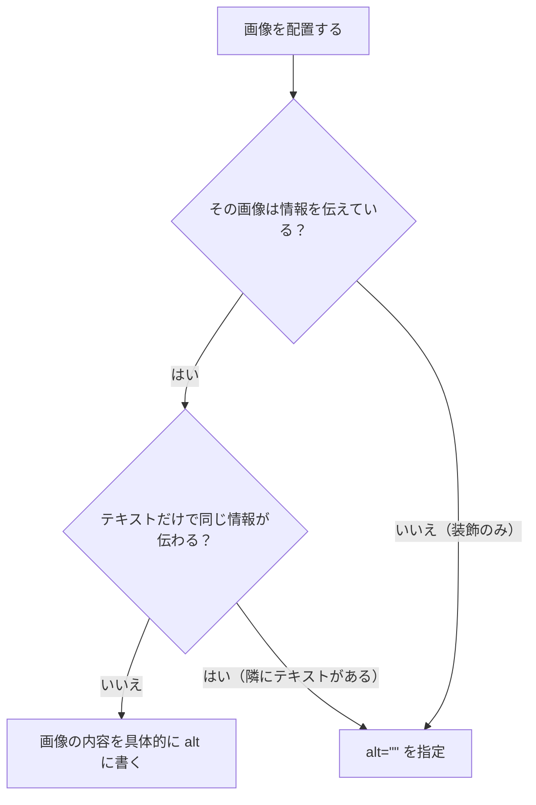

# alt 属性 — 画像を言葉で伝える

## 今日のゴール

- `alt` は「付けるもの」ではなく「何を伝えるか考えるもの」だと知る
- 画像の種類によって `alt` の書き方が変わることを知る
- `alt=""` で装飾画像をスクリーンリーダーにスキップさせる方法を知る

## なぜ alt をもう一度取り上げるのか

Day 2 で `alt` 属性の基本を紹介しました。「画像が表示されないときの代わりのテキスト」という説明でした。今日はもう一歩踏み込んで、「どんな画像に、どんな alt を書くのか」を考えます。

`alt` は「とりあえず何か書いておけばいい」ものではありません。書き方を間違えると、スクリーンリーダーのユーザーにとってはノイズになったり、逆に必要な情報が欠落したりします。

## スクリーンリーダーは画像を見られない

スクリーンリーダーとは、画面の情報を音声で読み上げるソフトウェアです。視覚障害のある方をはじめ、多くの人が日常的に使っています。

スクリーンリーダーは画像のピクセル（色の点の集まり）を解釈できません。画像があることは認識できますが、そこに何が写っているかはわかりません。そこで `alt` 属性のテキストが読み上げられます。

```html

```

この場合、スクリーンリーダーは「2026年4月の社員集合写真。オフィスの前で全員が笑顔で写っている、画像」のように読み上げます。`alt` がなければ「team-photo.jpg、画像」のようにファイル名が読まれるか、単に「画像」とだけ言われて、何の画像かわかりません。

## 画像の種類別: alt の書き方

すべての画像に同じ方針で `alt` を書くわけではありません。画像の「役割」によって書き方が変わります。

### 1. 情報を持つ画像 — 何が写っているかを伝える

記事中の写真やイラストなど、画像そのものが情報を伝えている場合です。

```html
<!-- ✅ 画像の内容を具体的に伝える -->


<!-- ✅ 商品写真 -->


<!-- ✅ 人物写真 -->

```

**ポイント**: 画像がなくなったときに失われる情報を `alt` で補います。グラフなら数値の傾向を、商品写真なら見た目の特徴を伝えます。

### 2. 装飾画像 — alt を空にしてスキップさせる

区切り線、背景パターン、純粋にデザイン上の装飾としての画像など、情報を持たない画像の場合です。

```html
<!-- ✅ 装飾画像は alt="" で読み飛ばさせる -->


```

`alt=""` と空の値を指定すると、スクリーンリーダーはその画像を完全に読み飛ばします。装飾画像にまで `alt` をつけると、スクリーンリーダーのユーザーは余計な情報を聞かされることになります。

**重要**: `alt` 属性を省略する（`alt` 自体を書かない）のと、`alt=""` と書くのは全く違います。

```html
<!-- ❌ alt 属性を省略 → スクリーンリーダーがファイル名を読み上げてしまう -->


<!-- ✅ alt="" → スクリーンリーダーが読み飛ばす -->

```

`alt` を省略すると、スクリーンリーダーは「decorative-line.png、画像」のようにファイル名を読み上げます。ユーザーにとっては意味不明な情報です。`alt=""` なら読み飛ばしてくれます。

### 3. ロゴ — 会社名やサービス名を伝える

```html
<!-- ✅ ロゴにはその組織やサービスの名前を書く -->


<!-- ✅ ロゴがリンクの中にある場合は、リンク先も含めて考える -->
<a href="/">
  
</a>
```

ロゴが `<a>` タグの中にある場合、そのリンクの目的（ホームに戻る）も含めて `alt` を書くと親切です。

### 4. アイコン — テキストと一緒か、アイコン単体か

```html
<!-- テキストと一緒のアイコン → alt="" でスキップ -->
<button>
  
  検索
</button>

<!-- アイコン単体のボタン → alt に操作の意味を書く -->
<button>
  
</button>
```

テキストが横に添えられているなら、アイコンの `alt` は空でかまいません。テキストが読み上げられるからです。しかし、アイコンだけのボタンの場合は `alt` がないと「ボタン」としか読み上げられず、何をするボタンなのかわかりません。

> **補足**: アイコン単体のボタンの場合、`alt` の代わりに `<button>` に `aria-label` 属性を付ける方法もあります。`aria-label` は Day 44 のアクセシビリティ実践で詳しく扱います。
>
> ```html
> <button aria-label="検索">
>   
> </button>
> ```

### 5. グラフ・図表 — データの要点を伝える

```html
<!-- ✅ グラフの傾向・要点を伝える -->

```

グラフの画像は、すべてのデータポイントを `alt` に書き出す必要はありません。「このグラフが伝えたいこと」を要約して書きます。もし詳細なデータが必要であれば、`alt` ではなく本文中のテーブルで提供するのが適切です。

## 「画像」「写真」とだけ書く alt は意味がない

```html
<!-- ❌ 意味のない alt -->


<!-- ✅ 何が写っている／描かれているかを書く -->


```

「画像」「写真」という `alt` は、ファイル名が読み上げられるのとほとんど変わりません。スクリーンリーダーは `` タグを見つけた時点で「画像」であることは伝えます。`alt` に「画像」と書くと「画像、画像」のように二重に伝わってしまいます。

## alt を書くときの判断フロー

画像を配置するとき、以下の順番で考えるとよいでしょう。



1. **情報を伝えている画像か？** → 装飾なら `alt=""`
2. **テキストだけで同じ情報が伝わるか？** → 隣にテキストがあるなら `alt=""`、なければ内容を書く

より詳しく迷いやすいパターンまで整理したものが W3C WAI にあります。実務で判断に迷ったら参照してみてください。

- [altディシジョンツリー（W3C WAI 日本語版）](https://www.w3.org/WAI/tutorials/images/decision-tree/ja)

## next/image でも同じルール

Next.js の `next/image` コンポーネントを使う場合でも、`alt` のルールは同じです。

```jsx
import Image from "next/image";

// 情報を持つ画像 → 具体的な alt を書く
<Image
  src="/photos/team.jpg"
  alt="開発チームのメンバー5人が会議室で打ち合わせをしている"
  width={800}
  height={600}
/>

// 装飾画像 → alt="" を指定する
<Image
  src="/images/decorative-wave.svg"
  alt=""
  width={1200}
  height={100}
/>
```

`next/image` は画像の最適化（サイズ調整、フォーマット変換、遅延読み込みなど）を自動で行ってくれるコンポーネントですが、`alt` は開発者が考えて書く必要があります。技術がどれだけ進歩しても、「この画像が何を伝えているか」を判断できるのは人間だけです。

> `next/image` では `alt` 属性が必須です。指定しないとビルド時にエラーになります。Next.js が `alt` を強制しているのは、それだけ重要な属性だからです。

## まとめ

- `alt` は「付けるもの」ではなく「何を伝えるか考えるもの」
- スクリーンリーダーは画像のピクセルを解釈できない。`alt` がその画像の代弁者になる
- 情報を持つ画像には、何が写っている／描かれているかを具体的に書く
- 装飾画像は `alt=""` にして、スクリーンリーダーに読み飛ばさせる。`alt` 属性の省略と `alt=""` は意味が異なる
- ロゴにはサービス名、アイコン単体にはその操作の意味を書く
- 「画像」「写真」とだけ書く `alt` は意味がない。画像であることは `` タグ自体が伝える
- `next/image` でも `alt` のルールは同じ。`alt` は必須属性として強制される
