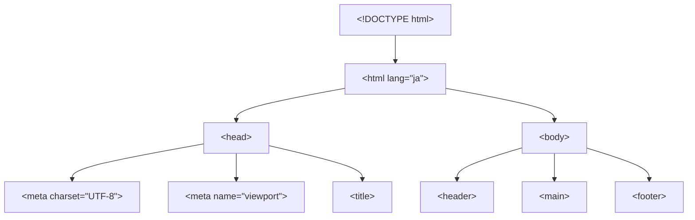

# HTML の基本構造 — DOCTYPE から body まで

## 今日のゴール

- HTML の先頭数行がそれぞれブラウザへの具体的な指示であることを知る
- `<head>` と `<body>` の役割の違いを知る
- `lang` 属性や `charset` がなぜ必要かを知る

## 「おまじない」の正体

AI にページを作ってもらうと、必ずこんなコードから始まります。

```html
<!DOCTYPE html>
<html lang="ja">
  <head>
    <meta charset="UTF-8" />
    <meta name="viewport" content="width=device-width, initial-scale=1.0" />
    <title>ページタイトル</title>
  </head>
  <body>
    <!-- ここに画面に表示する内容 -->
  </body>
</html>
```

「毎回同じだし、おまじないみたいなもの」と思うかもしれません。でも、この数行にはそれぞれ明確な意味があります。1行ずつ見ていきましょう。

## DOCTYPE — ブラウザへの「標準モードで表示して」という宣言

```html
<!DOCTYPE html>
```

この1行は「この文書は HTML5 ですよ」とブラウザに伝える宣言です。**タグではなく宣言文**なので、閉じタグはありません。

### DOCTYPE がないとどうなるか

DOCTYPE がないと、ブラウザは**互換モード（Quirks Mode）**で表示します。これは、1990年代後半の古い Web ページとの互換性を保つためのモードです。

互換モードでは、CSS のボックスモデル（Day 5 で学んだ `width` や `padding` の計算方法）が現在の標準と異なる動作をします。たとえば `box-sizing: content-box` が前提になり、`width: 200px` に `padding: 20px` を足すと実際の幅が 240px になるなど、意図しないレイアウト崩れが起きます。

```html
<!-- ✅ 標準モードで表示される -->
<!DOCTYPE html>
<html lang="ja">
  <!-- ... -->
</html>

<!-- ❌ DOCTYPE がない → 互換モードになる可能性がある -->
<html lang="ja">
  <!-- ... -->
</html>
```

現代の Web 開発では、常に `<!DOCTYPE html>` を書いて**標準モード（Standards Mode）**で動作させます。ちなみに、HTML5 以前は DOCTYPE の書き方がとても長く複雑でしたが、HTML5 では `<!DOCTYPE html>` のたった15文字に簡略化されました。

## html 要素と lang 属性

```html
<html lang="ja">
```

`<html>` タグはページ全体を囲むルート要素です。ここに指定する `lang` 属性は、ページの言語をブラウザに伝えます。

### lang 属性が影響する場面

| 場面 | 影響 |
|------|------|
| スクリーンリーダー | `lang="ja"` なら日本語として読み上げ、`lang="en"` なら英語として読み上げる。言語が違うと発音がおかしくなる |
| ブラウザの翻訳機能 | 「このページを翻訳しますか？」の判定に使われる |
| CSS | `lang` に応じてフォントやハイフネーションの動作が変わる |
| 検索エンジン | ページの言語を判定する手がかりにする |

特に重要なのはスクリーンリーダーへの影響です。`lang="en"` のページに日本語を書くと、スクリーンリーダーが日本語のテキストを英語の発音規則で読み上げようとして、まったく意味が通じなくなります。

```html
<!-- ✅ 日本語のページ -->
<html lang="ja">

<!-- ✅ 英語のページ -->
<html lang="en">

<!-- ✅ ページ内の一部だけ言語が異なる場合 -->
<p>日本語のテキストの中に <span lang="en">English text</span> が混じる場合</p>
```

## head — ブラウザへの指示書

`<head>` の中身は画面には表示されません。ブラウザ、検索エンジン、SNS などに向けた**メタ情報（ページについての情報）**を書く場所です。

### charset — 文字化けを防ぐ

```html
<meta charset="UTF-8" />
```

**charset（character set = 文字集合）**は、HTML ファイルの文字エンコーディングを指定します。**UTF-8** は世界中の文字（日本語、中国語、アラビア語、絵文字など）を扱える標準的なエンコーディングです。

この指定がなかったり、ファイルの実際のエンコーディングと食い違ったりすると、ブラウザが文字を正しく解釈できず**文字化け**が起きます。

```
正しい表示: こんにちは
文字化け:   ã"ã‚"ã«ã¡ã¯
```

`<meta charset="UTF-8">` は `<head>` のできるだけ先頭に書きます。ブラウザは HTML を先頭から読んでいくので、文字エンコーディングの指定が遅れると、それまでに読んだ部分が文字化けする可能性があるためです。

### viewport — スマートフォンでの表示を制御する

```html
<meta name="viewport" content="width=device-width, initial-scale=1.0" />
```

**ビューポート（viewport）**は「ブラウザがページを表示する領域」のことです。

この指定がないと、スマートフォンのブラウザは「このページは PC 向けだろう」と判断して、980px 程度の幅があるものとして描画し、画面全体を縮小して表示します。結果として文字がとても小さくなります。

| 設定 | 意味 |
|------|------|
| `width=device-width` | ページの幅をデバイスの画面幅に合わせる |
| `initial-scale=1.0` | 初期表示の拡大率を 100% にする |

レスポンシブデザイン（Day 8 で詳しく学びます）には必須の設定です。

### title — タブと検索結果に表示される名前

```html
<title>お問い合わせ | サンプルサイト</title>
```

`<title>` は以下の場面で使われます。

- **ブラウザのタブ**に表示される
- **検索エンジンの検索結果**でページのタイトルとして表示される
- **ブックマーク**したときの名前になる

```html
<!-- ❌ すべてのページで同じ title -->
<title>サンプルサイト</title>

<!-- ✅ ページごとに具体的な title -->
<title>お問い合わせ | サンプルサイト</title>
```

ページごとに具体的なタイトルを付けることで、タブが複数開いているときに区別しやすくなり、検索結果でもクリックされやすくなります。

## body — 画面に表示する内容

```html
<body>
  <header>
    <h1>サイトタイトル</h1>
    <nav><!-- ナビゲーション --></nav>
  </header>

  <main>
    <h2>メインコンテンツ</h2>
    <p>ここに本文を書きます。</p>
  </main>

  <footer>
    <p>&copy; 2026 サンプルサイト</p>
  </footer>
</body>
```

`<body>` の中に、ユーザーが実際に見る内容を書きます。Day 1 で学んだ見出し・段落・リスト、Day 2 のリンク・画像、Day 3 のフォーム・テーブルなど、これまで書いてきた HTML タグはすべて `<body>` の中に配置するものでした。

## 全体像を図で見る

HTML 文書の構造をツリーで表すと、こうなります。



`<head>` はブラウザへの指示書、`<body>` はユーザーに見せる内容。この2つが `<html>` の直接の子要素になっています。

## Next.js でも同じ構造が登場する

後半で学ぶ Next.js（App Router）では、`app/layout.tsx` というファイルでこの基本構造を定義します。

```tsx
// app/layout.tsx（Next.js の例）
export default function RootLayout({
  children,
}: {
  children: React.ReactNode;
}) {
  return (
    <html lang="ja">
      <body>{children}</body>
    </html>
  );
}
```

ここでも `<html lang="ja">` が登場しています。Next.js がどれだけ多くのことを自動化してくれても、HTML の基本構造は変わりません。「なぜ `lang="ja"` と書くのか」を知っていれば、このコードの意味がすぐわかります。

## まとめ

- `<!DOCTYPE html>` はブラウザに標準モードで表示するよう指示する宣言。省略すると互換モード（Quirks Mode）になる
- `<html lang="ja">` の `lang` 属性はスクリーンリーダーの読み上げ言語や翻訳機能に影響する
- `<head>` にはブラウザや検索エンジン向けのメタ情報を書く。`charset`（文字化け防止）、`viewport`（スマホ対応）、`title`（タブ名・検索結果）が必須級
- `<body>` にユーザーが目にする内容を書く
- Next.js の `layout.tsx` でも `<html lang="ja">` を書く場面がある。HTML の基本構造はフレームワークが変わっても同じ
