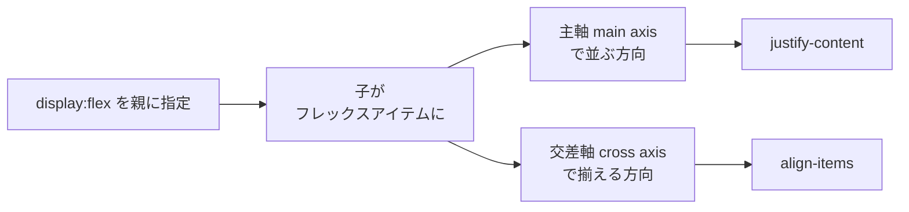

# 横に並べたい — Flexbox でレイアウトを宣言的に扱う

## 今日のゴール

- 要素を横に並べるのが昔は難しかった理由と、Flexbox が何を解決したかを説明できる
- 主軸 (main axis) と交差軸 (cross axis) という考え方で配置を捉えられる
- `justify-content` / `align-items` / `gap` / `flex: 1` が何を指定しているかイメージできる

## 「ただ横に並べたいだけ」がなぜ難しかったのか

ヘッダーにロゴとナビゲーションを左右に、カードを3枚横に、フォームのラベルと入力欄を1行に。フロントエンドの見た目の調整で「横に並べたい」と思う場面は山ほどあります。ところが AI 生成コードや古いチュートリアルで次のような書き方を見たことはないでしょうか。

```css
/* 昔ながらのやり方 */
.card {
  float: left;        /* 横に並べるため浮かせる */
  width: 33.33%;
}
.cards::after {
  content: "";
  display: block;
  clear: both;        /* 親が高さを失うのでおまじないが必要 */
}
```

```css
/* もうひとつの昔のやり方 */
.item {
  display: inline-block;  /* 横に並ぶ */
  /* しかし HTML の改行が「半角スペース」として隙間になる謎現象… */
}
```

どちらも「並べる」ことが目的ではなく、本来の目的（floatは回り込み、inline-blockは文中の画像）を流用した副作用です。だから高さが揃わなかったり、親要素が高さを失ったり、中央揃えが CSS 界の長年のネタになったりしました。

**Flexbox (Flexible Box Layout)** はこの問題を根本から解決するために作られた仕様です。「1次元（行または列）の並びを宣言的に配置する」ことを目的とした、**横並び・縦並びのための専用道具**です。親要素に `display: flex` と書くだけで、子要素たちはフレックスアイテムとなり、高さが揃い、親は自動で高さを持ち、隙間の謎現象も消えます。



主軸と交差軸は Flexbox を理解する鍵です。`flex-direction: row`（既定値）なら主軸は横、交差軸は縦。`column` にすれば主軸は縦、交差軸は横。以降の3つの柱は、この2つの軸に対して「どう並べ、どう揃え、どう伸び縮みさせるか」を指定する話です。

## 柱1: 並べる方向と折り返し

まずは並ぶ向きと、はみ出したときの挙動です。

```html
<nav aria-label="メインナビゲーション">
  <ul class="menu">
    <li><a href="/">ホーム</a></li>
    <li><a href="/news">お知らせ</a></li>
    <li><a href="/contact">お問い合わせ</a></li>
  </ul>
</nav>

<style>
  .menu {
    display: flex;          /* 子を横並びに */
    flex-direction: row;    /* 既定値。column にすると縦並び */
    flex-wrap: wrap;        /* 入りきらなければ折り返す */
    gap: 16px;              /* アイテム間の隙間 */
    list-style: none;
    padding: 0;
  }
</style>
```

ポイントは3つ。

- `flex-direction` で主軸の向きを決める（`row` / `column`）。スマホでは縦、PC では横、といった切り替えがメディアクエリ1行で済みます。
- `flex-wrap: wrap` で「折り返してよい」と宣言する。既定は `nowrap` で、横幅が足りなくてもはみ出すか縮むかしてしまいます。
- `gap` でアイテム間の隙間を指定する。

### gap が margin より優れる理由

昔は隙間の調整も一苦労でした。`margin-right: 16px` を全アイテムに付けると、末尾に余計な余白が残り `:last-child { margin-right: 0 }` のような例外処理が必要になります。折り返したときの行間も別途考える必要がありました。

`gap` は**アイテム同士の間にだけ**隙間を作ります。端には余白が付かず、折り返しても行間に同じ `gap` が効きます。例外処理がいりません。「隙間を表現する」のが目的なのだから、`margin` を流用するより `gap` を使うほうが意図が素直に伝わります。

Tailwind なら `class="flex flex-wrap gap-4"` と書くだけで同じことができます。

## 柱2: 揃える

並べたら次は「どこに寄せるか・どう揃えるか」です。ヘッダーの「ロゴは左、ログインボタンは右」もここで解決します。

```html
<header class="site-header">
  <a href="/" class="logo">MyApp</a>
  <button type="button" class="login">ログイン</button>
</header>

<style>
  .site-header {
    display: flex;
    justify-content: space-between; /* 主軸方向: 両端に寄せる */
    align-items: center;            /* 交差軸方向: 中央に揃える */
    padding: 12px 16px;
  }
</style>
```

- `justify-content` は**主軸方向**の配置。`flex-start`（左寄せ）/ `center`（中央）/ `flex-end`（右寄せ）/ `space-between`（両端揃えで間を等分）/ `space-around` / `space-evenly` がよく使う値です。
- `align-items` は**交差軸方向**の配置。`stretch`（既定・交差軸いっぱいに伸びる）/ `center`（中央揃え）/ `flex-start` / `flex-end` / `baseline`（文字のベースラインで揃える）が定番です。

かつて「縦横中央に置きたい」ために絶対配置と `transform: translate(-50%, -50%)` を使っていた時代は終わりました。今は `display: flex; justify-content: center; align-items: center;` の3行で済みます。

<div style="background:#f8fafc;color:#1e293b;border:1px solid #e2e8f0;border-radius:8px;padding:16px;margin:16px 0;">
  <strong>デモ: justify-content を切り替える</strong>
  <label style="display:block;margin-top:8px;">
    値:
    <select id="jc-demo" aria-label="justify-content の値" style="background:white;color:#1e293b;border:1px solid #cbd5e1;padding:4px;">
      <option>flex-start</option>
      <option selected>center</option>
      <option>flex-end</option>
      <option>space-between</option>
      <option>space-around</option>
    </select>
  </label>
  <div id="jc-box" style="display:flex;justify-content:center;background:white;color:#1e293b;border:1px dashed #94a3b8;border-radius:6px;padding:8px;margin-top:12px;min-height:64px;">
    <span style="background:#3b82f6;color:white;padding:8px 12px;border-radius:4px;">A</span>
    <span style="background:#10b981;color:white;padding:8px 12px;border-radius:4px;">B</span>
    <span style="background:#f59e0b;color:white;padding:8px 12px;border-radius:4px;">C</span>
  </div>
  <p style="color:#475569;font-size:0.9em;margin:8px 0 0;">ボックスが主軸上でどう動くかを観察してください。</p>
  <script>
    (function(){
      var sel = document.getElementById('jc-demo');
      var box = document.getElementById('jc-box');
      if (sel && box) sel.addEventListener('change', function(){ box.style.justifyContent = sel.value; });
    })();
  </script>
</div>

## 柱3: 伸ばす・縮める

Flexbox が「Flexible」と呼ばれる核心は、アイテムが**余った幅を分け合い、足りなければ譲り合う**ことにあります。これが `flex` ショートハンドです。

```html
<div class="row">
  <aside class="side">サイドバー</aside>
  <main class="main">メインコンテンツ</main>
</div>

<style>
  .row { display: flex; gap: 16px; }
  .side { width: 200px; flex-shrink: 0; } /* 縮めない */
  .main { flex: 1; }                       /* 残りを全部使う */
</style>
```

`flex: 1` は `flex-grow: 1; flex-shrink: 1; flex-basis: 0;` の短縮です。意味は「基準幅 0 から、余った空間を 1 の割合で受け取る」。サイドバーに `flex-shrink: 0` を付けているのは、狭い画面でもサイドバーの幅を守りたいからです。

- `flex-grow`: 余ったスペースを**どの比率で受け取るか**。`0` なら広がらない、`1` なら1人前、`2` なら2人前。
- `flex-shrink`: 縮めるときの比率。`0` にすると絶対縮まない。
- `flex-basis`: 計算の**出発点**となる幅。`auto` なら中身に応じて、`0` なら中身を無視してゼロから。

3つまとめて `flex: 1 1 200px`（伸び1・縮み1・基準200px）のように書きます。`flex: 1` / `flex: auto` / `flex: none` あたりは名前で覚えてしまって構いません。

### アクセシビリティ: order には頼らない

Flexbox には `order` プロパティがあり、DOM の順序と関係なくアイテムの表示順を入れ替えられます。しかしスクリーンリーダーやキーボードの Tab 移動は **DOM の順序**に従います。見た目では「ログインボタン → ロゴ」なのに、読み上げとフォーカスは「ロゴ → ログインボタン」という乖離が起きると、目の見えないユーザーや Tab で操作するユーザーが混乱します。

並び順を変えたいなら、まず HTML の順序を論理的に正しく書き、視覚的な配置は `flex-direction: row-reverse` ではなく HTML の順番そのもので表現するのが基本です。`order` は「モバイルで広告を下げたい」など限定的な用途にとどめ、視覚とキーボード操作の順序が一致するかを必ず確認します。

## Tailwind で書くとこうなる

配属先の Next.js + Tailwind では同じことをクラス名で書きます。

```tsx
export function SiteHeader() {
  return (
    <header className="flex items-center justify-between gap-4 px-4 py-3">
      <a href="/" className="font-bold">MyApp</a>
      <nav aria-label="メインナビゲーション">
        <ul className="flex gap-4">
          <li><a href="/news">お知らせ</a></li>
          <li><a href="/contact">お問い合わせ</a></li>
        </ul>
      </nav>
    </header>
  );
}
```

`flex` が `display: flex`、`items-center` が `align-items: center`、`justify-between` が `justify-content: space-between`、`gap-4` が `gap: 1rem`。CSS の知識がそのまま Tailwind クラスに対応しているのがわかります。**Tailwind は新しい言語ではなく、CSS の省略記法**なのです。

## まとめ

- 「横に並べたい」は本来シンプルな要求なのに、昔は `float` や `inline-block` の副作用に頼るしかなかった。Flexbox は**1次元の配置を宣言的に書く**ための専用道具として、この問題を解決した。
- 親に `display: flex` を付けると、子は主軸 (main axis) と交差軸 (cross axis) で配置されるフレックスアイテムになる。`flex-direction` / `flex-wrap` / `gap` で並び方、`justify-content` / `align-items` で揃え方、`flex: 1` などで伸び縮みを指定する。
- 隙間は `margin` ではなく `gap` で、並び順は `order` ではなく DOM 順で。宣言的に意図を書くほど、アクセシビリティもコードの読みやすさも自然に整う。今日はこの「主軸・交差軸・gap」という語彙だけ持ち帰れば OK。
