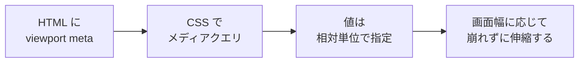

# 画面幅で見た目を変えたい — レスポンシブデザインと相対単位

## 今日のゴール

- スマホで崩れない Web ページを作るための「ビューポート」「メディアクエリ」「相対単位」の3点セットを理解する
- `px` / `%` / `em` / `rem` / `vw` / `dvh` / `ch` / `clamp()` を、どんな場面でどれを選ぶか言えるようになる
- 画面幅以外の条件（動きを減らす、ダークモード）でも分岐できることを知る

## PC では綺麗、スマホで崩れる

AI に頼んで作った Next.js アプリを PC ブラウザで開くと綺麗に見えるのに、スマホで開くと文字がはみ出したりボタンが小さすぎたりする。Tailwind のクラスに `md:` や `lg:` というプレフィックスが付いていて、AI は当たり前のように使っているけれど、あれが何なのかよくわからない。

この「画面幅に応じて見た目を変える」仕組みをレスポンシブデザインと呼ぶ。土台は3つだけ。

1. **ビューポート**（表示領域）という概念を OS/ブラウザに正しく伝える
2. **メディアクエリ**で「画面幅が◯◯のときだけ」という条件分岐を書く
3. **相対単位**で要素のサイズを絶対値ではなく比率で指定する



順番に見ていく。

## 柱1: ビューポートとメディアクエリ

### viewport meta タグを入れないとスマホは「PC レイアウトを縮小」してしまう

スマホのブラウザは、何も指定しないと「このページは PC 向けに作られているはず」と仮定して、仮想的に 980px 幅の画面で描画してから全体を縮小して表示する。その結果、文字が豆粒サイズになる。これを防ぐのが `viewport` meta タグ。

```html
<!doctype html>
<html lang="ja">
  <head>
    <meta charset="utf-8" />
    <meta name="viewport" content="width=device-width, initial-scale=1" />
    <title>レスポンシブの入口</title>
  </head>
  <body>
    <h1>こんにちは</h1>
  </body>
</html>
```

`width=device-width` で「画面の実際の幅をビューポート幅として使ってね」と伝え、`initial-scale=1` で「等倍で表示してね」と伝えている。Next.js（App Router）では `app/layout.tsx` の `metadata` や `viewport` エクスポートで自動的に付与される。

**アクセシビリティの注意**: 昔よく見かけた `user-scalable=no` や `maximum-scale=1` は書かないこと。視力の弱いユーザーがピンチズームで拡大できなくなるため、WCAG の達成基準に反する。

### @media で条件分岐する

メディアクエリは「画面幅が 768px 以上ならこのスタイル」という条件付き CSS。

```css
/* 既定（狭い画面向け）*/
.card {
  padding: 1rem;
  font-size: 1rem;
}

/* 画面幅が 768px 以上のときだけ上書き */
@media (min-width: 768px) {
  .card {
    padding: 2rem;
    font-size: 1.125rem;
  }
}
```

「狭い画面向けを先に書き、広い画面向けで上書きする」書き方を**モバイルファースト**と呼ぶ。逆に `max-width` で広い画面を既定にして狭い画面向けに上書きする書き方もあるが、現在はモバイルファーストが主流。理由はシンプルで、世界のトラフィックの半分以上がスマホからであり、CSS の優先度も素直だから。

### Tailwind の `md:` `lg:` の正体

Tailwind のブレイクポイントは、上記のメディアクエリをクラス名に変換したもの。

```html
<!-- 既定は縦並び、md（768px 以上）から横並び -->
<div class="flex flex-col md:flex-row gap-4">
  <aside class="w-full md:w-64">サイドバー</aside>
  <main class="flex-1">本文</main>
</div>
```

Tailwind v4 時点の既定ブレイクポイントは `sm:640px`、`md:768px`、`lg:1024px`、`xl:1280px`、`2xl:1536px`。すべて `min-width` なので、クラスを付けた幅以上で効く。AI が `md:flex-row` と書いたら「768px 以上で横並びにする」と脳内で読み替えればよい。

下のボックスは、メディアクエリで「画面幅 768px 以上なら背景色とラベルが変わる」サンプル。ブラウザのウィンドウ幅を狭めたり広げたりすると切り替わる。

<style>
.demo-mq{border:1px solid #cbd5e1;border-radius:8px;padding:1.25rem;background:#fef3c7;color:#1e293b;font-weight:bold;}
.demo-mq::before{content:"📱 狭い画面 (< 768px)";display:block;margin-bottom:0.5rem;font-size:0.85rem;color:#475569;}
@media (min-width: 768px){
  .demo-mq{background:#dbeafe;}
  .demo-mq::before{content:"🖥️ 広い画面 (>= 768px)";}
}
</style>

<div class="demo-mq">画面幅に応じて背景色が切り替わる</div>

## 柱2: 単位の使い分け

「この文字を 16px にして」と書くのは簡単だが、スマホで読むときも PC で読むときも 16px でよいのか、親要素のサイズに連動させたいのか、画面幅に合わせて伸び縮みさせたいのかで、選ぶ単位が変わる。

### 絶対単位と相対単位

| 単位 | 基準 | 使いどころ |
|------|------|-----------|
| `px` | 画面のピクセル | 境界線、影、細かい調整 |
| `%` | 親要素のサイズ | 幅やレイアウト比率 |
| `em` | 自分の `font-size` | パディングなど文字サイズに連動したい時 |
| `rem` | `<html>` の `font-size`（通常 16px） | 全体で統一したいサイズ。多くの場面の第一選択 |
| `vw` / `vh` | ビューポート幅 / 高さの 1% | ヒーロー画像の高さ、画面全体を使いたい時 |
| `ch` | 「0」の文字幅 | 読みやすい段落幅（例: `max-width: 60ch`） |

`rem` が推奨される理由のひとつはアクセシビリティ。ユーザーがブラウザ設定で「文字を大きく表示」にすると `<html>` の `font-size` が変わり、`rem` で書いた要素は一緒に拡大される。`px` で書いた要素は変わらない。

```css
/* 読み物として心地よい段落幅。日本語でも 40-70ch が目安 */
.prose {
  max-width: 65ch;
  font-size: 1rem; /* ユーザーの文字サイズ設定に追従 */
  line-height: 1.7;
}
```

### `dvh` / `svh` / `lvh` はなぜ生まれたか

スマホで `height: 100vh` を指定したら、アドレスバーに隠れて下のほうが切れた経験はないだろうか。`vh` は「ビューポート高さの 1%」だが、スマホのアドレスバーはスクロールで伸縮するため、`100vh` がどの瞬間を指すか曖昧だった。

この問題を解決するため、2023 年に新しい単位が全主要ブラウザで使えるようになった。

- `svh`（small viewport height）: アドレスバーが出ている状態の最小高さ
- `lvh`（large viewport height）: アドレスバーが隠れた状態の最大高さ
- `dvh`（dynamic viewport height）: 現在の実際の高さ（動的に変わる）

今からフルスクリーンの要素を作るなら `100dvh` を使っておけば、モバイルでも下が切れない。

```css
.hero {
  min-height: 100dvh; /* スマホのアドレスバー問題を回避 */
  display: grid;
  place-items: center;
}
```

### `clamp()` でブレイクポイント無しに滑らかに変える

メディアクエリは「◯◯px を境にカクッと切り替える」書き方。一方 `clamp(min, preferred, max)` は「最小値・理想値・最大値」の3つを渡すと、画面幅に応じて値が滑らかに変わる。

```css
h1 {
  /* 最小 1.5rem、画面幅に応じて 2vw + 1rem、最大 3rem */
  font-size: clamp(1.5rem, 2vw + 1rem, 3rem);
}

.container {
  /* 左右に適度な余白を残しつつ、最大 1200px */
  width: min(100% - 2rem, 1200px);
  margin-inline: auto;
}
```

ブレイクポイントごとに `font-size` を書き分けなくても、画面幅が変わるたびに文字サイズが連続的に追従する。下は `clamp()` の挙動を確認できるデモ。ウィンドウ幅を変えて見てほしい。

<div style="border:1px solid #cbd5e1;border-radius:8px;padding:1.25rem;background:#f8fafc;color:#1e293b;">
  <p style="margin:0 0 0.5rem;font-size:0.85rem;color:#475569;">↓ このテキストは画面幅に応じて滑らかに大きさが変わる</p>
  <p style="margin:0;font-size:clamp(1rem, 2vw + 0.5rem, 2rem);font-weight:bold;">画面幅に追従するタイトル</p>
</div>

## 柱3: 画面幅以外での分岐

メディアクエリは「画面幅」だけでなく、ユーザーの好みや環境も条件にできる。AI が書いたコードに何気なく混ざっていることがあるので、目にしたときに意味がわかると良い。

### `prefers-reduced-motion`: 動きを減らしたい人に配慮する

OS の設定で「視差効果を減らす」「アニメーションを減らす」を選んでいるユーザーがいる（めまいを起こす人や注意が逸れる人への配慮）。ブラウザはこの設定を CSS に伝えてくれる。

```css
.card {
  transition: transform 0.3s ease;
}

.card:hover {
  transform: translateY(-4px);
}

/* アニメーションを減らしたい人には動きを止める */
@media (prefers-reduced-motion: reduce) {
  .card {
    transition: none;
  }
  .card:hover {
    transform: none;
  }
}
```

### `prefers-color-scheme`: ダークモードに追従する

```css
:root {
  --bg: white;
  --fg: #111827;
}

@media (prefers-color-scheme: dark) {
  :root {
    --bg: #0b0f17;
    --fg: #e5e7eb;
  }
}

body {
  background: var(--bg);
  color: var(--fg);
}
```

Tailwind でも `dark:bg-slate-900` のようなクラスが裏で同じ仕組みを使っている。

最近のブラウザでは `light-dark()` という関数も使えるようになり、メディアクエリを書かずにライト/ダーク両方の色を一行で指定できる。

```css
:root { color-scheme: light dark; }
body {
  /* light モードでは白、dark モードでは #0b0f17 */
  background: light-dark(white, #0b0f17);
  color: light-dark(#111827, #e5e7eb);
}
```

### コンテナクエリ: 画面幅ではなく「自分が置かれた箱」で分岐する

レスポンシブの大きな進化として、2023 年に全ブラウザで使えるようになった **コンテナクエリ** がある。これは「画面幅」ではなく「親コンテナの幅」で分岐できる新しいアプローチ。

たとえば同じカードコンポーネントをサイドバーに置くと狭くて、メインエリアに置くと広いとき、従来のメディアクエリでは「画面幅」しか見られないので両方に対応できなかった。コンテナクエリなら、カード自身が「自分が今どのくらいの幅に置かれているか」を見て、レイアウトを変えられる。

```css
/* 親を「コンテナ」として登録 */
.card-wrapper { container-type: inline-size; }

.card { display: grid; gap: 0.5rem; }

/* カードの親コンテナが 400px 以上のときだけ横並び */
@container (min-width: 400px) {
  .card { grid-template-columns: auto 1fr; }
}
```

画面幅ではなく「自分を包む箱の幅」で分岐できるので、同じカードをどこに置いても自然に振る舞う。コンポーネント単位で思考する Next.js/React と相性が良い機能として、頭の片隅に置いておきたい。

## まとめ

今日はこれだけ覚えれば OK。

- レスポンシブの土台は **ビューポート meta タグ** + **メディアクエリ** + **相対単位** の3点セット
- **モバイルファースト**（狭い画面を既定にして広い画面で上書き）が現代の主流。Tailwind の `md:` `lg:` はまさにこの書き方のショートカット
- 単位は迷ったら `rem`。高さは `dvh`、段落幅には `ch`、滑らかに変えたい値には `clamp()`
- メディアクエリは画面幅だけでなく **`prefers-reduced-motion` や `prefers-color-scheme`** のようなユーザー設定にも効く。アクセシビリティは「特別な対応」ではなく、こうした仕組みの自然な活用で実現できる

AI が生成したコードに `md:flex-row` や `clamp()` や `dvh` を見つけたら、「なぜそれを選んだのか」を自分の言葉で説明できる状態が今日のゴール。
