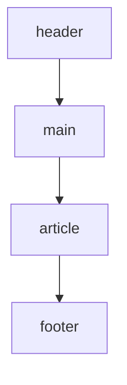
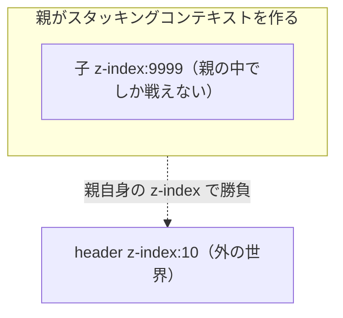

# 要素を好きな位置に置きたい — ポジショニングと重なり

## 今日のゴール

- `position` の 5 種類（`static` / `relative` / `absolute` / `fixed` / `sticky`）がそれぞれ「何の基準で」配置されるかを説明できる
- `z-index` が効かないときに疑うべきポイント（`position` 指定、スタッキングコンテキスト）を知っている
- モーダルやポップオーバーは `<dialog>` と `popover` 属性を使うのが今の推奨だと知っている

## 「ここに置きたい」が意外と難しい

AI が生成した Next.js アプリをいじっていて、こんな場面に出くわしたことはありませんか。

- 商品画像の右上に「NEW」バッジを重ねたい
- ボタンを押したらモーダルを画面中央にビシッと出したい
- ツールチップをアイコンの真下にふわっと出したい
- スクロールしてもヘッダーは上に貼り付いていてほしい

どれも普段見かける UI ですが、いざ自分で書こうとすると「なぜかバッジが右上に行かない」「モーダルが他の要素の下に隠れる」といった罠にハマります。これらはすべて **CSS のポジショニング（位置決め）** の話です。

## CSS は基本、上から順に並ぶ

HTML に要素を書くと、ブラウザは上から下へ、行の中では左から右へ要素を並べます。これを **通常フロー（normal flow）** と呼びます。通常フローでは、要素は「前の要素の次」に自動で配置され、重ねたり浮かせたりはできません。



ポジショニングは、この通常フローから要素を **抜き出して独自のルールで配置する仕組み** です。では抜き出した要素は何を基準に置かれるのか？ そこが今日のキモです。

---

## 柱 1：`position` の 5 種類と「何が基準か」

`position` プロパティには 5 つの値があります。それぞれ「何を基準に位置を決めるか」が違います。

| 値 | 通常フロー | 位置の基準 |
|---|---|---|
| `static`（初期値） | 残る | なし（`top`/`left` は無効） |
| `relative` | 残る | 元の位置 |
| `absolute` | 抜ける | 最も近い「位置指定された祖先」 |
| `fixed` | 抜ける | ビューポート（画面） |
| `sticky` | 残る | スクロール位置に応じて切り替わる |

### relative：元の位置を基準にズラす

`relative` は通常フローに残ったまま、`top` / `left` でズラせます。他の要素のレイアウトには影響しません。見た目だけを動かす、ちょっとした微調整に使います。

### absolute：画像の右上にバッジを置くやつ

一番よく使うのが `absolute` です。これは **「最も近い位置指定された祖先」を基準に、絶対座標で配置する** という意味です。「位置指定された祖先」とは `position` が `static` 以外の先祖要素のこと。該当する祖先がなければ、ビューポートが基準になります。

バッジを画像の右上に置きたいとき、親（カード）に `position: relative` を付けるのはこのためです。

```html
<article class="card">
  
  <span class="badge" aria-label="新着">NEW</span>
  <h3>Runner 2026</h3>
</article>

<style>
  .card {
    position: relative; /* バッジの基準になる */
    width: 240px;
  }
  .badge {
    position: absolute;
    top: 8px;
    right: 8px;
    background: #ef4444;
    color: white;
    padding: 2px 8px;
    border-radius: 4px;
    font-size: 12px;
  }
</style>
```

この「親に `relative`、子に `absolute`」は CSS で最頻出のイディオムです。Tailwind だと `relative` と `absolute top-2 right-2` の組み合わせで表現されます。

<div style="border:1px solid #e2e8f0;border-radius:8px;padding:16px;background:#f8fafc;color:#1e293b;">
  <div style="position:relative;width:200px;height:120px;background:#cbd5e1;border-radius:6px;display:flex;align-items:center;justify-content:center;color:#1e293b;">
    商品画像
    <span style="position:absolute;top:8px;right:8px;background:#ef4444;color:white;padding:2px 8px;border-radius:4px;font-size:12px;">NEW</span>
  </div>
  <p style="margin-top:8px;font-size:13px;color:#475569;">親が relative、バッジが absolute で右上に固定。</p>
</div>

### fixed：スクロールしても画面に貼り付く

`fixed` は **ビューポート（画面）** が基準です。スクロールしても位置が変わりません。「画面右下のチャットボタン」などに使います。

### sticky：スクロールに応じて固定化する

`sticky` は普段は通常フローにいて、スクロールして指定位置（`top: 0` など）に達すると、その場で固定されます。表のヘッダーや、セクションの見出しを上に貼り付けたいときに便利です。

```html
<nav style="position:sticky;top:0;background:white;color:#1e293b;">...</nav>
```

注意点：`sticky` は **スクロールコンテナの中で効く** ので、親に `overflow: hidden` などが付いていると予想通り動かないことがあります。

### 自分の中心でピタッと：translate の出番

モーダルを画面中央に出したいときのイディオムがこれです。

```css
.modal {
  position: fixed;
  top: 50%;
  left: 50%;
  translate: -50% -50%; /* 自分自身のサイズの半分ぶん戻る */
}
```

`top: 50%` だけだと「モーダルの左上」が画面中央になってしまうので、`translate: -50% -50%` で自分の幅と高さの半分ぶん引き戻して、中心同士を合わせます。`translate` プロパティは `transform: translate(...)` の短縮版で、今は単独で書けます。

---

## 柱 2：重なり順とスタッキングコンテキスト

ポジショニングで要素を浮かせると、他の要素と **重なる** ことが起きます。「モーダルが他の要素に隠れる」「ドロップダウンがヘッダーの下に潜り込む」── この悩みの正体が **z-index** です。

### `z-index` は「position 指定がある要素」にしか効かない

初心者が最初にハマる罠がこれです。

```css
.tooltip {
  z-index: 9999; /* これだけでは効かない */
}
```

`z-index` を効かせるには、その要素に `position: relative` / `absolute` / `fixed` / `sticky` のいずれかが必要です（`flex` / `grid` の子など一部例外はあります）。

### スタッキングコンテキスト：別世界の入れ子

もうひとつの罠が **スタッキングコンテキスト** です。一部のプロパティは「重なり順の新しい世界」を作り、その中の `z-index` は **外の世界と比較されません**。

スタッキングコンテキストを作る代表的なもの：

- `position` + `z-index`（auto 以外）
- `opacity` が 1 未満
- `transform`、`filter`、`will-change`、`isolation: isolate`

よくある事例：「親に `opacity: 0.9` を付けたら、子要素の `z-index: 9999` がなぜかヘッダーの下に潜った」。これは親がスタッキングコンテキストを作り、子の z-index はその親の中で閉じてしまったから起きます。



困ったときの対処法：親の `opacity` / `transform` を外す、あるいは浮かせたい要素を **DOM 上の上の階層に移動する**（React なら `Portal`、Next.js App Router でも同じ）。

---

## 柱 3：モーダルとポップオーバーの現代的アプローチ

モーダルやツールチップは、かつては全部 `position: fixed` + 自前の `z-index` 管理で作っていました。しかしフォーカストラップ（Tab キーがモーダル外に逃げないようにする）、背景の操作防止、Esc キーで閉じる、といった **アクセシビリティ対応を自力で書くのは大変** です。今はブラウザ標準の機能に任せられます。

### `<dialog>`：HTML だけでモーダルが作れる

```html
<button type="button" onclick="document.getElementById('confirm').showModal()">
  削除する
</button>

<dialog id="confirm" aria-labelledby="confirm-title">
  <h2 id="confirm-title">本当に削除しますか？</h2>
  <p>この操作は取り消せません。</p>
  <form method="dialog">
    <button value="cancel">キャンセル</button>
    <button value="ok">削除する</button>
  </form>
</dialog>
```

`showModal()` で開くと、ブラウザが **自動で** 次のことをやってくれます。

- 背景を暗くする（`::backdrop` でスタイル可能）
- 背景のクリックや Tab 操作を無効化（`inert` 相当）
- フォーカスをダイアログ内に閉じ込める（フォーカストラップ）
- Esc キーで閉じる
- トップレイヤーに表示するので `z-index` バトルが起きない

`<form method="dialog">` の中のボタンを押すと、そのダイアログが自動で閉じます。

### `popover` 属性：宣言的なポップオーバー

2024 年に Baseline 入りした新しい HTML 属性です。メニューやツールチップのように「トグルで出し入れするもの」を JavaScript なしで作れます。

```html
<button type="button" popovertarget="help">ヘルプ</button>

<div id="help" popover>
  <p>このフォームでは、メールアドレスとパスワードが必要です。</p>
</div>
```

`popover` を付けた要素はデフォルトで非表示になり、`popovertarget` を持つボタンで開閉できます。こちらもトップレイヤーに出るので、重なり順に悩まされません。Esc キーや外側クリックでの閉じる挙動も自動です。

### CSS Anchor Positioning：相対位置を CSS で指定

「ツールチップを特定のボタンの下に置きたい」── これを今までは JavaScript で座標計算していました。CSS Anchor Positioning を使えば CSS だけで書けます。

```css
.trigger { anchor-name: --help-btn; }

.tooltip {
  position: absolute;
  position-anchor: --help-btn;
  top: anchor(bottom);
  left: anchor(center);
  translate: -50% 8px;
}
```

2026 年 4 月時点では Chrome / Edge で安定、Safari と Firefox でも対応が進んでいます。まだ全環境で使えるとは言い切れないので、業務で採用するときはフォールバックを用意するか、[Floating UI](https://floating-ui.com/) などのライブラリを併用するのが安全です。

---

## sticky ヘッダーを体感する

<div style="border:1px solid #e2e8f0;border-radius:8px;max-height:200px;overflow-y:auto;background:white;color:#1e293b;">
  <header style="position:sticky;top:0;background:#1e293b;color:white;padding:8px 12px;font-weight:bold;">スクロールしても貼り付くヘッダー</header>
  <div style="padding:12px;color:#1e293b;">
    <p>上のヘッダーは position:sticky; top:0; が指定されています。</p>
    <p>このコンテナの中をスクロールすると、ヘッダーが上に貼り付いたままになります。</p>
    <p>行 1</p><p>行 2</p><p>行 3</p><p>行 4</p><p>行 5</p><p>行 6</p><p>行 7</p><p>行 8</p>
  </div>
</div>

---

## まとめ

- CSS は通常フローで要素を並べる。ポジショニングはそこから **抜き出して独自配置** する仕組み
- 覚えるのは「何を基準に配置されるか」── `relative` は元の位置、`absolute` は位置指定された祖先、`fixed` はビューポート、`sticky` はスクロール連動
- `z-index` は `position` 指定がないと効かない。親がスタッキングコンテキストを作ると、子の z-index は外と比較されない
- モーダルは `<dialog>` の `showModal()`、トグル式ポップオーバーは `popover` 属性に任せる。フォーカストラップやトップレイヤー表示を自前で書かなくていい
- 今日はこれだけ覚えれば OK：**「親 relative、子 absolute」** と **「モーダルは `<dialog>`」**
