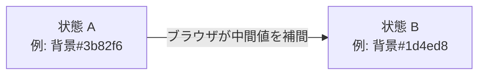
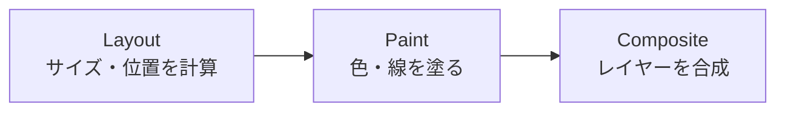

# 見た目を動かしたい — トランジションとアニメーション

## 今日のゴール

- `transition` と `animation` の役割の違いを説明できる
- 「速い動き」と「遅い動き」の差が何から生まれるかを知る（`transform`/`opacity` と `width`/`top` の違い）
- `prefers-reduced-motion` でユーザー配慮をする習慣を持つ

## 「動かしたい」はだいたい補間の話

ボタンにマウスを乗せるとふわっと色が変わる。ドロワー（横から出てくるメニュー）がスッと滑って出てくる。読み込み中にスピナーがくるくる回る。── どれもアプリを触っていれば毎日見る UI だけど、いざ自分で書いてみると「カチッ」と切り替わってしまったり、ガクガクしてなんだか安っぽく見えたりする。

やりたいのは「状態 A から状態 B に一瞬で切り替える」ではなく、「A と B の**あいだ**を滑らかに見せる」こと。CSS ではこの「あいだ」をブラウザが自動で計算してくれる仕組みが 2 種類用意されている。`transition` と `animation` だ。



この「中間値を自動で埋めてくれる」のが補間（ほかん）。アニメーションの話はぜんぶこの補間の上に乗っている。

実際に動かしてみよう（どちらもホバーまたはフォーカスで発火する）。

<div style="display:flex;gap:16px;flex-wrap:wrap;padding:16px;background:#f8fafc;color:#1e293b;border-radius:8px;">
  <button style="padding:12px 20px;border:none;border-radius:8px;background:#3b82f6;color:white;cursor:pointer;transition:background 300ms ease-in-out, transform 300ms ease-in-out;" onmouseover="this.style.background='#1d4ed8';this.style.transform='scale(1.05)'" onmouseout="this.style.background='#3b82f6';this.style.transform='scale(1)'" onfocus="this.style.background='#1d4ed8';this.style.transform='scale(1.05)'" onblur="this.style.background='#3b82f6';this.style.transform='scale(1)'">ホバー/フォーカスで変化</button>
  <div style="width:48px;height:48px;border:4px solid #e2e8f0;border-top-color:#3b82f6;border-radius:50%;animation:spin 1s linear infinite;"></div>
  <style>@keyframes spin { to { transform: rotate(360deg); } }</style>
</div>

左のボタンは `transition`、右のスピナーは `animation`。この違いから見ていく。

## 柱1: `transition` と `animation` の使い分け

### `transition` — A から B への一回きりの補間

`transition` は「プロパティがある値から別の値に変わったとき、その間を滑らかに見せて」というシンプルな指示。きっかけは `:hover`、`:focus`、クラスの付け外しなど、何らかの**状態変化**だ。

```css
.card {
  background: #3b82f6;
  transform: scale(1);
  transition: background 300ms ease-in-out, transform 300ms ease-in-out;
}

.card:hover,
.card:focus-visible {
  background: #1d4ed8;
  transform: scale(1.05);
}
```

`transition` は 4 つのプロパティでできている。

- `transition-property`: 何を補間するか（`background` や `transform`、`all` なども可）
- `transition-duration`: どれくらいの時間をかけるか（`300ms` や `0.3s`）
- `transition-timing-function`: 時間の進み方（`ease-in-out`、`linear`、`cubic-bezier(...)` など）
- `transition-delay`: 発火までの待ち時間

`timing-function` は意外と効く。`linear`（等速）だと機械的に、`ease-in-out`（最初と最後がゆっくり）だと自然に見える。迷ったら `ease-in-out` か `ease-out` を選んでおけば無難。

ポイントは `:focus-visible` も書くこと。キーボードで Tab 移動してきたユーザーにも同じ視覚フィードバックが届くようにするためで、`:hover` だけだとマウスユーザーしか気づけない。

### `@keyframes` と `animation` — 連続的・複雑な動き

一方、スピナーのように「ずっと回り続ける」「複数のキーフレームを経由する」といった動きは、`transition`（状態変化がきっかけ）では表現できない。そこで登場するのが `@keyframes` と `animation`。

```css
@keyframes spin {
  from { transform: rotate(0deg); }
  to   { transform: rotate(360deg); }
}

@keyframes fade-in {
  0%   { opacity: 0; transform: translateY(8px); }
  100% { opacity: 1; transform: translateY(0); }
}

.spinner {
  animation: spin 1s linear infinite;
}

.toast {
  animation: fade-in 250ms ease-out;
}
```

`@keyframes` は「何パーセントの時点でどの状態にいるか」を列挙した台本、`animation` はその台本を「何秒で、何回、どう再生するか」という再生指示。

使い分けの基準はシンプル。

- **状態 A → 状態 B の一回きり** → `transition`
- **無限ループ・複数段階・状態変化をきっかけにしない** → `animation`

## 柱2: 「速い動き」と「遅い動き」は何で決まるか

`transition: all 300ms` とつい書きたくなるけれど、補間できるプロパティには大きく 2 種類ある。**速いプロパティ**と**遅いプロパティ**だ。これを知らないと「なんかカクつく」UI ができあがる。

### ブラウザが絵を作る 3 ステップ

ブラウザが画面を描くとき、おおまかに次の処理を通る。



- **Layout**（レイアウト）: どこに何ピクセルで置くか計算する。重い。
- **Paint**（ペイント）: ピクセルを塗る。そこそこ重い。
- **Composite**（合成）: 塗り終わったレイヤーを GPU で重ね合わせる。軽い。

`width` や `top`、`margin` を変えるとレイアウトがやり直しになる。要素が 1 個動くだけで、その周りの要素の位置も計算し直しになるので、60fps（1 フレーム 16ms）を守るのがきつい。

一方、`transform`（`translate`/`scale`/`rotate`）と `opacity` はレイアウトも再塗りも発生せず、GPU 上で合成だけで済む。つまり、ほぼ無料で動かせる。

```css
/* 遅い: left を変えるとレイアウトが走る */
.slow { transition: left 300ms; }
.slow.open { left: 0; }

/* 速い: transform は合成レイヤだけで動く */
.fast { transition: transform 300ms ease-out; transform: translateX(-100%); }
.fast.open { transform: translateX(0); }
```

「要素を動かす・拡大縮小する・回転する」は `transform`、「見え隠れ」は `opacity`。この 2 つに寄せるだけで、体感の滑らかさが一段階変わる。

## 柱3: 動きをオフにできる人がいる

動きの演出は多くの人にとって気持ちいいが、**前庭障害**（めまいや乗り物酔いに近い症状）を持つ人にとっては、スライドや大きな拡大縮小がそのまま体調不良の引き金になる。OS には「視差効果を減らす」「アニメーションを減らす」という設定があり、ブラウザはそれを `prefers-reduced-motion` というメディアクエリで教えてくれる。

無視せず、習慣として次のように書く。

```css
.drawer {
  transition: transform 300ms ease-out;
}

@media (prefers-reduced-motion: reduce) {
  .drawer {
    transition-duration: 0.01ms;
  }
  .spinner {
    animation: none;
  }
}
```

`0` ではなく `0.01ms` にしているのは、JS 側で `transitionend` イベントを待っているコードを壊さないため（発火はするが一瞬で終わる）という実用的なテクニック。

`prefers-reduced-motion` はすべての主要ブラウザで使える。「そもそも装飾のアニメを入れるかどうか」を判断に入れておくと、UI 全体が親切になる。

## 最近のアニメーション関連の動き

CSS アニメーションは長く同じ機能が中心だったが、ここ数年で新しい仕組みが入ってきた。今日はひと目だけ紹介しておく。「そういうのがある」と覚えておけば、業務で遭遇したときに調べ直せる。

### View Transitions API — ページ/状態遷移を滑らかに

「画面遷移のときに、同じ役割の要素（たとえばサムネイル）を次の画面まで滑らかにつなげたい」という要望に応えるのが View Transitions API。CSS だけでは書きにくかった「画面全体のクロスフェード」や「要素の continuity（連続性）」をブラウザが面倒を見てくれる。Next.js の App Router でもページ遷移の演出に使える（2026 年時点では Chrome/Edge/Safari が対応、Firefox は実装進行中）。

### Scroll-driven animations — 時間ではなくスクロールで進むアニメ

通常の `animation` は時間で進むが、`animation-timeline: scroll()` を使うと「スクロール位置で進むアニメーション」が作れる。スクロール量に応じて見出しが変化する、プログレスバーが伸びる、といった表現が JS なしで書ける。2026 年時点で Chrome 系は対応、Safari/Firefox は進行中。

どちらも「まず普通の `transition`/`animation` を使いこなしてから」で十分。

## まとめ

- アニメーションの正体は「A と B の**あいだ**をブラウザに補間させる」こと
- **状態変化で一回**なら `transition`、**連続・複雑**なら `@keyframes` + `animation`
- 動かすなら `transform` と `opacity` に寄せる。`width`/`top` はレイアウトが走って遅い
- `prefers-reduced-motion` で動きを控える実装は、装飾を書いたら必ずセットで書く
- View Transitions や scroll-driven animations もあるが、まずは `transition` と `animation` で十分
