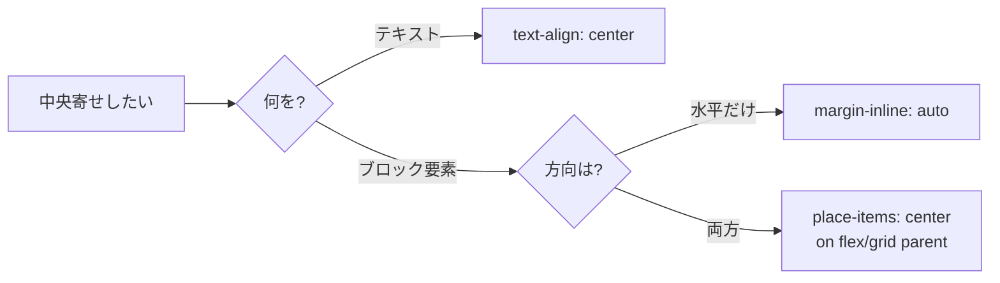

# 中央寄せしたい — 何でこんなに方法がいっぱいあるのか

## 今日のゴール

- 「中央寄せ」は **(1) 何を (2) どっち方向に (3) 何の中で** の 3 つで決まる、と分解できるようになる
- 水平方向と垂直方向では CSS の歴史が違い、方法が乱立しているのはそのせいだと理解する
- 現代の答えは `display: flex` / `display: grid` と `place-items: center` でほぼ終わる、と覚える

## 「中央寄せ」って検索するたびに答えが違う

`css centering` は Web フロントエンドで最も検索されるトピックの一つと言われる。AI に「この要素を中央寄せして」と頼んでみると、ある時は `text-align: center`、ある時は `margin: 0 auto`、ある時は `position: absolute; top: 50%; transform: translate(-50%, -50%)`、またある時は `display: flex` ...と毎回違う答えが返ってくる。

なぜこんなに方法が乱立しているのか。それは「中央寄せ」という言葉が曖昧だからだ。中央寄せは以下の 3 つが決まらないと手段が選べない。

1. **何を寄せるのか**: テキスト（文字）？ 画像や見出しなどのブロック要素？
2. **どっち方向に寄せるのか**: 水平（左右）？ 垂直（上下）？ 両方？
3. **何の中で寄せるのか**: 親要素全体？ 画面全体？ ボタンの中？

さらに CSS の歴史的事情として、水平方向の中央寄せは昔から簡単だったが、**垂直方向は長年の難題**だった。今でも残る古い手法は、その難題を無理やり解決した跡だ。



この 3 本柱で整理しよう。

## 柱 1: 水平方向は昔から簡単だった

CSS は紙の文書を想定して生まれたので、水平方向の中央寄せはもともとサポートされていた。何を寄せるかで使う道具が変わる。

### テキスト・インライン要素は `text-align`

文字や `<a>`、`<span>`、`` のような **インライン要素**（文章の中に流れる要素）を水平中央に寄せたいなら、親に `text-align: center` を付けるだけで済む。

```html
<section class="hero">
  <h1>ようこそ</h1>
  <p>本日のおすすめをご紹介します。</p>
</section>

<style>
  .hero {
    text-align: center;
  }
</style>
```

`text-align` という名前のとおり「テキストの位置揃え」なので、ブロック要素（`<div>` や `<section>` など箱として扱われる要素）自体を寄せることはできない点に注意。

### ブロック要素は `margin-inline: auto`

見出しの下のカード 1 枚、画面中央に置いた `<article>` ──こういう **ブロック要素そのもの** を水平中央に置きたい時は、幅を持たせて左右のマージン（外側の余白）を `auto` にする。

```html
<article class="card">
  <h2>お知らせ</h2>
  <p>キャンペーンを開始しました。</p>
</article>

<style>
  .card {
    max-width: 40rem;
    margin-inline: auto;
  }
</style>
```

`margin-inline` は 2022 年あたりから全ブラウザで使える **論理プロパティ**（書字方向に追従するプロパティ）で、`margin-left` と `margin-right` の両方を一度に指定できる。日本語の縦書きやアラビア語の右から左の文章でも、意図通り「行の流れに沿った両端」のマージンを調整してくれるので、昔ながらの `margin: 0 auto` より推奨される。

## 柱 2: 垂直方向は長年の難題だった

CSS が紙の文書を前提に設計されたため、「高さの中央に寄せる」という発想はそもそも想定外だった。長らく開発者は **ハック（本来の用途を曲げたテクニック）** で乗り切ってきた。現場で今も見かける 3 つを知っておくと、古いコードに出会っても驚かない。

### ハック 1: `line-height` で 1 行テキストを寄せる

ボタンのラベルなど **1 行だけのテキスト** なら、親の高さと同じ `line-height`（行の高さ）を指定すると、行ボックスが親いっぱいに広がって結果的に文字が縦中央に来る。

```html
<button type="button" class="pill">送信</button>

<style>
  .pill {
    height: 3rem;
    line-height: 3rem; /* height と同じ値 */
    padding-inline: 1.25rem;
  }
</style>
```

**弱点**: 2 行以上になると破綻する。高さ固定が前提なので柔軟性がない。

### ハック 2: `display: table-cell` + `vertical-align: middle`

HTML の `<table>` のセルは昔から縦中央寄せに対応していた。そこで `display: table-cell` でテーブルのセルのふりをさせて `vertical-align: middle` を効かせる、という手が流行した時期がある。

```html
<div class="box">
  <p>中身は縦中央に並ぶ</p>
</div>

<style>
  .box {
    display: table-cell;
    vertical-align: middle;
    height: 10rem;
  }
</style>
```

**弱点**: レイアウトが「テーブル」になるので他のスタイルに影響が出る。読みにくい。

### ハック 3: `position: absolute` + `transform: translate`

要素を `position: absolute`（親に対して自由に座標指定する配置）にして `top: 50%; left: 50%` で左上角を中央に置き、`transform: translate(-50%, -50%)` で自分の幅・高さの半分だけずらす。これで要素の **中心** が親の中心に一致する。

```html
<div class="modal-wrapper">
  <div class="modal" role="dialog" aria-label="確認">
    中央に浮かぶダイアログ
  </div>
</div>

<style>
  .modal-wrapper {
    position: relative;
    height: 20rem;
  }
  .modal {
    position: absolute;
    top: 50%;
    left: 50%;
    transform: translate(-50%, -50%);
  }
</style>
```

**弱点**: 通常の文書の流れから外れる、兄弟要素と重なる、レスポンシブで調整が面倒。今も使われる場面はあるが、次の柱 3 が使える状況ならそちらを選びたい。

## 柱 3: 現代は Flexbox と Grid で終わる

2017 年あたりから **Flexbox**（一次元のレイアウト専用モジュール）と **Grid**（二次元のレイアウト専用モジュール）が全ブラウザで安定し、中央寄せは劇的に簡単になった。今日これだけ覚えれば OK。

### `place-items: center` が最強

Grid コンテナまたは Flex コンテナに `place-items: center` を付けると、子要素が **水平・垂直の両方** で中央に来る。`place-items` は `align-items`（交差軸の揃え）と `justify-items`（主軸の揃え）の一括指定。

```html
<section class="stage">
  <article class="card">
    <h2>キャンペーン</h2>
    <p>本日より開始</p>
  </article>
</section>

<style>
  .stage {
    display: grid;
    place-items: center;
    min-height: 20rem;
  }
</style>
```

Flexbox でも同じ書き方ができるが、子要素が複数並ぶ場合は `justify-content: center; align-items: center` の組み合わせがより直感的だ。

```css
.stage {
  display: flex;
  justify-content: center; /* 主軸（デフォルトは水平）で中央 */
  align-items: center;     /* 交差軸（デフォルトは垂直）で中央 */
  min-height: 20rem;
}
```

### Tailwind ならクラスで表現

配属先で使う Tailwind CSS では、これらがそのままクラス名になっている。

```html
<section class="grid place-items-center min-h-80">
  <article class="rounded-lg bg-white p-6 shadow">
    <h2 class="text-xl font-bold">キャンペーン</h2>
    <p>本日より開始</p>
  </article>
</section>

<!-- Flex 版 -->
<section class="flex items-center justify-center min-h-80">
  ...
</section>
```

`place-items-center` は「Grid or Flex の親に付けるだけ」なので、AI が生成した Tailwind クラスの中にこれを見つけたら「あ、中央寄せしてるんだな」と即座に読めるようになる。

### アクセシビリティの落とし穴: はみ出し

中央寄せしたテキストが長くなった時にコンテナからはみ出すと、スクリーンリーダー利用者にも視覚的にも困る。`overflow-wrap: anywhere`（単語の途中でも改行を許可）を合わせて指定しておくと、URL のような長い文字列でも折り返されて安全だ。

```css
.card {
  overflow-wrap: anywhere;
}
```

また、中央寄せしたボタンやリンクは **フォーカスリング**（キーボード操作時のハイライト）が十分見える余白を確保しておくと、キーボード利用者が迷わない。`:focus-visible` で見た目を調整できる。

## インタラクティブデモ: 同じ要素を 5 通りで中央寄せ

以下はすべて「青いボックスの中に、白い四角を水平・垂直の中央に寄せる」例。スクロールしてそれぞれの方法を見比べてみよう。

<div style="display:grid;gap:1rem;grid-template-columns:repeat(auto-fit,minmax(240px,1fr));background:#f8fafc;color:#1e293b;padding:1rem;border-radius:0.5rem;">

  <div style="background:white;color:#1e293b;border-radius:0.5rem;padding:0.75rem;">
    <strong>1. Grid + place-items</strong>
    <div style="display:grid;place-items:center;background:#3b82f6;height:8rem;border-radius:0.25rem;margin-top:0.5rem;">
      <div style="background:white;color:#1e293b;padding:0.5rem 0.75rem;border-radius:0.25rem;">中央</div>
    </div>
    <small style="color:#475569;">display:grid; place-items:center;</small>
  </div>

  <div style="background:white;color:#1e293b;border-radius:0.5rem;padding:0.75rem;">
    <strong>2. Flex + items/justify</strong>
    <div style="display:flex;justify-content:center;align-items:center;background:#3b82f6;height:8rem;border-radius:0.25rem;margin-top:0.5rem;">
      <div style="background:white;color:#1e293b;padding:0.5rem 0.75rem;border-radius:0.25rem;">中央</div>
    </div>
    <small style="color:#475569;">display:flex; justify-content:center; align-items:center;</small>
  </div>

  <div style="background:white;color:#1e293b;border-radius:0.5rem;padding:0.75rem;">
    <strong>3. Flex item に margin:auto</strong>
    <div style="display:flex;background:#3b82f6;height:8rem;border-radius:0.25rem;margin-top:0.5rem;">
      <div style="background:white;color:#1e293b;padding:0.5rem 0.75rem;border-radius:0.25rem;margin:auto;">中央</div>
    </div>
    <small style="color:#475569;">親 flex、子に margin:auto;</small>
  </div>

  <div style="background:white;color:#1e293b;border-radius:0.5rem;padding:0.75rem;">
    <strong>4. position + translate</strong>
    <div style="position:relative;background:#3b82f6;height:8rem;border-radius:0.25rem;margin-top:0.5rem;">
      <div style="position:absolute;top:50%;left:50%;transform:translate(-50%,-50%);background:white;color:#1e293b;padding:0.5rem 0.75rem;border-radius:0.25rem;">中央</div>
    </div>
    <small style="color:#475569;">position:absolute; top/left:50%; translate(-50%,-50%);</small>
  </div>

  <div style="background:white;color:#1e293b;border-radius:0.5rem;padding:0.75rem;">
    <strong>5. text-align + line-height</strong>
    <div style="text-align:center;line-height:8rem;background:#3b82f6;height:8rem;border-radius:0.25rem;margin-top:0.5rem;">
      <span style="display:inline-block;line-height:normal;background:white;color:#1e293b;padding:0.5rem 0.75rem;border-radius:0.25rem;vertical-align:middle;">中央</span>
    </div>
    <small style="color:#475569;">古典。1 行前提で柔軟性に欠ける。</small>
  </div>

</div>

見た目の結果は同じだが、複数子要素への対応力、レスポンシブでの安定性、読みやすさで大きく差が出る。迷ったら **1 か 2**、それ以外は「歴史を知るための引き出し」として持っておけば十分だ。

## まとめ

- 「中央寄せ」は **何を・どっち方向に・何の中で** を分解して考える
- 水平方向は昔から簡単（`text-align: center` か `margin-inline: auto`）、垂直方向は長年の難題で多くのハックが生まれた
- 現代の答えは **`display: grid; place-items: center;`** か **`display: flex; justify-content: center; align-items: center;`** のどちらか
- Tailwind なら `grid place-items-center` / `flex items-center justify-content`（実際のクラス名は `justify-center`）で同じことができる
- 中央寄せしたテキストは `overflow-wrap: anywhere` とセットで考えると、長文や長い URL でも崩れない
- AI が昔ながらの書き方を出してきたら、Flex / Grid に置き換えられないか一度疑ってみる
