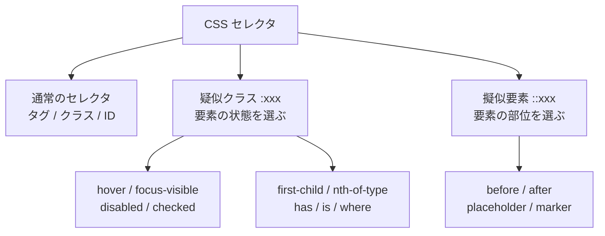

# hover と focus で見た目を変えたい — 疑似クラスと擬似要素

## 今日のゴール

- 疑似クラス（要素の「状態」）と擬似要素（要素の「特定部位」）の違いを説明できる
- `:hover` と `:focus-visible` を使い分けられるようになる
- `:has()` のような新しい親選択の武器と、`::before` / `::after` のような装飾用の擬似要素を知る

## よく見かける「あの書き方」から入る

AI が生成した CSS を眺めていると、こんな書き方が頻繁に出てくる。

```css
button:hover { background: #2563eb; }
button:focus-visible { outline: 2px solid #2563eb; outline-offset: 2px; }
button:disabled { opacity: 0.5; cursor: not-allowed; }

input::placeholder { color: #94a3b8; }

.card:has(> img) { padding-top: 0; }
```

`button` や `input` というタグ名は見慣れているのに、`:hover` や `::placeholder`、`:has(> img)` の部分はなんだか呪文っぽい。Tailwind を使っていても `hover:bg-blue-500`、`focus-visible:ring-2` のように同じ単語が出てくる。これらの正体は「要素の選び方を拡張するための記法」で、大きく **疑似クラス** と **擬似要素** の 2 系統に分かれている。



コロンが 1 つ（`:hover`）か 2 つ（`::before`）かで区別される。1 つは「状態」、2 つは「部位」と覚えておけば、初見の CSS を読むときの当たりが付く。

今日はこの 2 つを、**操作状態 → 構造 → 親選択と装飾** の 3 本の柱で眺めていく。

## 柱 1: 操作状態を捉える疑似クラス

ユーザーが要素に対して「何かしている最中」を CSS 側で受け取れるのが、このグループ。React のイベントハンドラを書かなくても、見た目だけなら CSS で完結することが多い。

### `:hover` とタッチ端末の落とし穴

`:hover` は「マウスカーソルが乗っている間」に当たるスタイル。PC では自然に動くが、スマホやタブレットでは「タップした瞬間に hover 判定が残る」ため、一度触れたボタンが押しっぱなしの見た目で固まるという現象が起きる。

これを避ける常套手段が `@media (hover: hover)` でラップすること。マウスのように「ホバーできる入力装置」が繋がっているときだけ hover スタイルを適用する。

```css
button {
  background: #3b82f6;
  color: white;
  transition: background 0.15s;
}

@media (hover: hover) {
  button:hover {
    background: #2563eb;
  }
}
```

Tailwind もこの考え方を内蔵していて、`hover:` プレフィックスは同様の判定を通してから適用される（`hoverOnlyWhenSupported` が既定有効）。

### `:focus` ではなく `:focus-visible` を使う理由

もう 1 つのよくある困りごと。AI が生成したコードに `:focus-visible` が出てきて、なぜ `:focus` ではないのか腑に落ちない、というやつ。

- `:focus` … **フォーカスが当たっている間ずっと** 当たる。マウスでボタンをクリックしただけでも青い枠が残り続けて「邪魔だな」と感じる
- `:focus-visible` … **キーボード操作など「見える形でフォーカスリングを出すべき状況」だけ** 当たる。ブラウザがヒューリスティックに判断してくれる

この区別ができたおかげで、「邪魔だから」と `:focus { outline: none }` をやってキーボード利用者を締め出してしまう事故を避けられる。キーボードで Tab を押して画面上をめぐるユーザー（マウスが使えない人、効率のために使う人、スクリーンリーダー利用者）にとって、フォーカスリングは「今どこを触っているか」を示す唯一の手がかり。消してはいけない。

```css
/* NG: キーボード利用者が迷子になる */
button:focus { outline: none; }

/* OK: クリックで焦点が当たったときは目立たせず、
   キーボード操作で焦点が当たったときだけしっかり枠を出す */
button:focus-visible {
  outline: 2px solid #2563eb;
  outline-offset: 2px;
  border-radius: 4px;
}
```

### 入力の状態を拾うその他の疑似クラス

フォームまわりは疑似クラスの宝庫。

- `:disabled` / `:enabled` — 無効化された入力
- `:checked` — チェックされたチェックボックス・ラジオ
- `:required` / `:optional` — `required` 属性の有無
- `:invalid` / `:valid` — HTML の標準バリデーション結果
- `:placeholder-shown` — プレースホルダがまだ見えている（=何も入力されていない）状態

これらを組み合わせると、JavaScript なしでも「チェックしたら表示、入力不足なら赤枠」のような UI が作れる。

## 柱 2: 構造を捉える疑似クラス

要素の「立ち位置」で選ぶタイプ。リストや表の装飾で活躍する。

```css
/* リストの最初の項目だけ余白をなくす */
ul > li:first-child { margin-top: 0; }

/* 偶数行だけ背景色を変える（縞模様） */
tr:nth-child(even) { background: #f8fafc; }

/* 3 つ目の section 見出しだけ別色 */
section:nth-of-type(3) h2 { color: #b91c1c; }

/* ボタン以外のフォーカス時にだけ枠を付ける */
:not(button):focus-visible { outline: 2px dashed #0ea5e9; }
```

`:nth-child(n)` は「同じ親の中で何番目か」、`:nth-of-type(n)` は「同じタグの中で何番目か」。似ているが挙動が違うので、表示が期待と合わないときはここを疑う。

### `:is()` / `:where()` でまとめ書き

同じスタイルを複数のセレクタに当てたいとき、昔はこう書くしかなかった。

```css
article h1:first-child,
article h2:first-child,
article h3:first-child { margin-top: 0; }
```

これが `:is()` でこう書ける。

```css
article :is(h1, h2, h3):first-child { margin-top: 0; }
```

`:where()` は `:is()` とほぼ同じだが「詳細度を 0 にする」差がある。上書きしやすい基本スタイルを書くときに便利。

## 柱 3: 親を捉える `:has()` と擬似要素

### `:has()` — 子や子孫を条件に親を選ぶ

長年「親を選ぶセレクタが無い」ことが CSS の定番の悩みだった。2024 年までに全主要ブラウザ（Chrome・Safari・Firefox）が `:has()` に対応し、ようやく素の CSS で親を条件付きに選べるようになった。

```css
/* 画像を含むカードだけ上パディングを詰める */
.card:has(> img) { padding-top: 0; }

/* required な input を持つ label に印を付ける */
label:has(input:required)::after {
  content: " *";
  color: #dc2626;
}

/* エラーを含むフォームの送信ボタンを薄くする */
form:has(:invalid) button[type="submit"] { opacity: 0.5; }
```

これまで JavaScript でクラスを付け外しして実現していたことが、CSS だけで書けるようになった、と覚えておけば価値が伝わる。

### 擬似要素 `::before` / `::after` — 要素に「部位」を足す

擬似要素は、HTML には書かれていない部位を CSS 側で生やす仕組み。`content` プロパティが必須。

```css
.external::after {
  content: " ↗";
  color: #64748b;
}

blockquote::before {
  content: "“";
  font-size: 2em;
  color: #94a3b8;
}
```

装飾目的の文字は、スクリーンリーダーが読み上げないように `aria-hidden="true"` を添える HTML で補うか、`content: ""` の空要素＋背景画像として扱うのが無難。意味のある情報は擬似要素ではなく本文に書く、が原則。

### その他の擬似要素

- `::placeholder` — `<input>` のプレースホルダ文字だけ色を変える
- `::marker` — `<ul>` / `<ol>` のビュレット記号だけスタイル変更
- `::first-line` / `::first-letter` — 段落の最初の行・文字だけ装飾
- `::selection` — ユーザーが範囲選択したときの色

## インタラクティブに確かめる

下のデモは JavaScript を一切使わず、純粋に CSS の疑似クラスだけで動いている。マウスでホバー、Tab キーでフォーカス、チェックボックスの切り替えで見た目がどう変わるか試してみてほしい。

<style>
.pseudo-demo { border:1px solid #e2e8f0; border-radius:8px; padding:16px; background:#f8fafc; color:#1e293b; }
.pseudo-demo p { color:#475569; margin:0 0 12px; }
.pseudo-demo .btn { padding:8px 16px; border:1px solid #2563eb; background:white; color:#1e293b; border-radius:6px; cursor:pointer; transition:background 0.15s; }
@media (hover: hover) {
  .pseudo-demo .btn:hover { background:#dbeafe; }
}
.pseudo-demo .btn:focus { outline: none; }
.pseudo-demo .btn:focus-visible { outline: 2px solid #2563eb; outline-offset: 2px; }
.pseudo-demo .btn:disabled { background:#e2e8f0; color:#64748b; border-color:#cbd5e1; cursor:not-allowed; }
.pseudo-demo .form { margin-top:16px; padding:12px; background:white; color:#1e293b; border:1px solid #e2e8f0; border-radius:6px; }
.pseudo-demo .form label { display:block; margin-bottom:8px; }
.pseudo-demo .form input[type="email"] { padding:4px 8px; border:1px solid #cbd5e1; border-radius:4px; background:white; color:#1e293b; }
.pseudo-demo .form input[type="email"]:invalid { border-color:#dc2626; background:#fef2f2; }
.pseudo-demo .form input[type="email"]:valid { border-color:#16a34a; }
.pseudo-demo .form:has(input[type="checkbox"]:checked) { background:#ecfdf5; border-color:#86efac; }
.pseudo-demo .form:has(input[type="checkbox"]:checked)::after { content: " 同意済み"; color:#15803d; font-size:0.9em; }
.pseudo-demo .hint { margin:8px 0 0; color:#64748b; font-size:0.9em; }
</style>

<div class="pseudo-demo">
  <p>マウスでのクリックと、キーボードの Tab キーでフォーカスしたときで枠の出方が違うことを見てほしい（Tab のときだけ青い枠が出る = <code>:focus-visible</code>）。</p>
  <button type="button" class="btn">普通のボタン</button>
  <button type="button" class="btn" disabled style="margin-left:8px;">disabled なボタン</button>

  <form class="form">
    <label>
      <input type="checkbox" /> 利用規約に同意する
    </label>
    <label>
      メール: <input type="email" required placeholder="you@example.com" aria-label="メールアドレス" />
    </label>
    <p class="hint">チェックを入れるとフォーム全体の背景が緑に変わる（<code>form:has(input:checked)</code>）。メール欄が空 / 不正だと枠が赤（<code>:invalid</code>）、正しく入っていれば緑（<code>:valid</code>）に切り替わる。</p>
  </form>
</div>

## Tailwind での書き方

Tailwind CSS は、ここまでの疑似クラスを「プレフィックス」で表現する。

```tsx
<button
  type="button"
  className="
    bg-blue-500 text-white px-4 py-2 rounded
    hover:bg-blue-600
    focus:outline-none focus-visible:ring-2 focus-visible:ring-blue-400 focus-visible:ring-offset-2
    disabled:opacity-50 disabled:cursor-not-allowed
  "
>
  保存する
</button>
```

`hover:` `focus-visible:` `disabled:` のように、疑似クラス名がそのまま使える。`:has()` も `has-[>img]:pt-0` のようなセレクタ構文で書ける。今日見た CSS の仕組みがそのまま土台になっている、とわかると Tailwind のクラス名が読みやすくなる。

## まとめ

- `:xxx`（疑似クラス）は **状態**、`::xxx`（擬似要素）は **部位** を選ぶ。コロンの数で区別する
- `:hover` は `@media (hover: hover)` でラップし、`:focus-visible` はキーボード利用者のために必ず残す
- `:has()` で「子を条件に親を選ぶ」ことが CSS だけでできるようになった
- 擬似要素の `::before` / `::after` は装飾目的。意味のある文字は本文に書く

今日はこれだけ覚えれば OK。見た目を変えたくなったら、まず「今どんな状態のどんな部位を狙いたいか」を言葉にしてから、対応するセレクタを思い出す。
