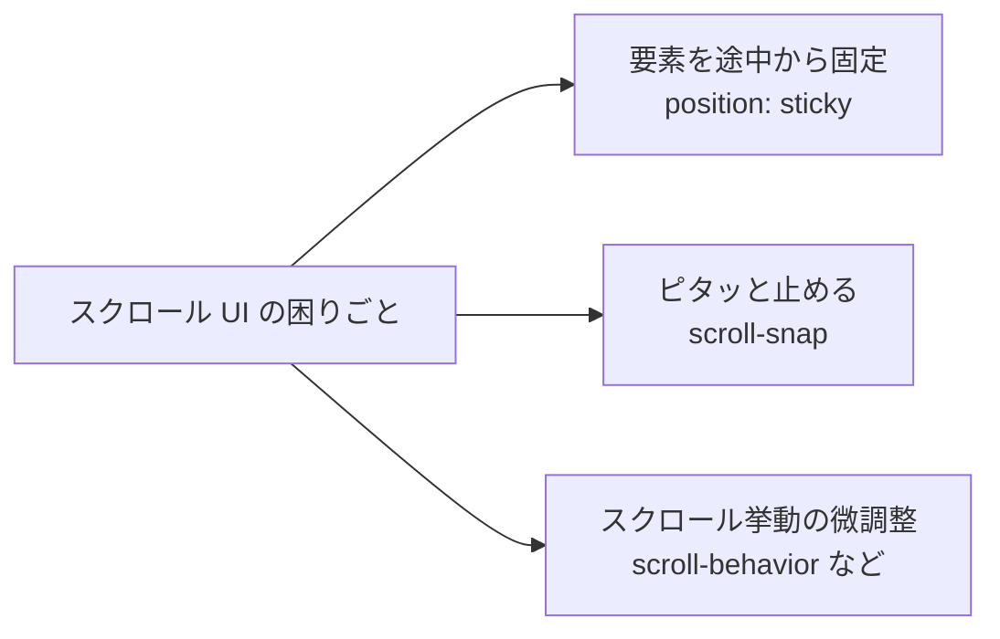

# スクロールで要素を固定したい — sticky と scroll-snap

## 今日のゴール

- `position: sticky` が「普通に流れる + 特定位置で固定」のハイブリッドだと理解する
- `scroll-snap` で横スワイプカルーセルやピタッと止まる挙動が CSS だけで作れると知る
- スクロールまわりの細かな調整（smooth、アンカーの着地位置、overscroll）の引き出しを持つ

## 「これ、どうやって作ってるんだろう？」

スマホで見るニュースサイトで、上にスクロールするとヘッダーが画面上に張り付く。Instagram や TikTok で横にスワイプすると、カードが中途半端な位置では止まらずピタッと次の1枚に吸着する。アプリの一覧画面で、セクションの見出しだけ画面上に残っていく。

どれも「よく見る UI」ですが、いざ自分で作ろうとすると「JavaScript でスクロール量を監視して…」と身構えてしまいがちです。

実はこれらは **CSS だけで** 実装できます。今日は3本の柱で、その引き出しを増やしていきます。



## 柱1: `position: sticky` — 流れるけど、止まる

### fixed との違いから理解する

`position: fixed` は「ビューポート（画面）基準で **常に** 固定」。スクロールに関係なく、ずっとその場所にいます。便利ですが、親要素の中で使いたいときには強すぎます。

`position: sticky` は **ハイブリッド** です。普段は普通の要素としてスクロールに合わせて流れていき、**指定した位置に到達したらそこで固定**、親要素を抜けるとまた流れていきます。

```css
.section-heading {
  position: sticky;
  top: 0; /* この位置に達したら貼り付く */
  background: white;
  color: #1e293b;
  padding: 0.5rem 1rem;
  z-index: 1;
}
```

`top: 0` は「ビューポート上端から 0px の位置で固定する」という意味です。`top: 4rem` にすれば、上から 4rem の位置で止まります。

### 実際に触ってみる

スクロールしてみてください。セクション見出しが上に張り付きます。

<div style="border:1px solid #cbd5e1;border-radius:8px;overflow:hidden;background:white;color:#1e293b;">
  <div style="height:220px;overflow-y:auto;padding:0;background:white;color:#1e293b;">
    <section>
      <h4 style="position:sticky;top:0;margin:0;padding:0.5rem 1rem;background:#0ea5e9;color:white;">A. フルーツ</h4>
      <ul style="margin:0;padding:0.75rem 1.5rem;background:white;color:#1e293b;"><li>りんご</li><li>みかん</li><li>ぶどう</li><li>いちご</li><li>バナナ</li></ul>
    </section>
    <section>
      <h4 style="position:sticky;top:0;margin:0;padding:0.5rem 1rem;background:#10b981;color:white;">B. 野菜</h4>
      <ul style="margin:0;padding:0.75rem 1.5rem;background:white;color:#1e293b;"><li>にんじん</li><li>じゃがいも</li><li>たまねぎ</li><li>キャベツ</li><li>トマト</li></ul>
    </section>
    <section>
      <h4 style="position:sticky;top:0;margin:0;padding:0.5rem 1rem;background:#f59e0b;color:white;">C. 魚</h4>
      <ul style="margin:0;padding:0.75rem 1.5rem;background:white;color:#1e293b;"><li>さば</li><li>あじ</li><li>さんま</li><li>まぐろ</li><li>いわし</li></ul>
    </section>
  </div>
</div>

### sticky の「効かない」3大原因

sticky はシンプルに見えて、ハマりどころがあります。

1. **`top`（`bottom`/`left`/`right`）を指定し忘れている** — どこで固定するかが決まらず、効かない
2. **親のどこかに `overflow: hidden` / `overflow: clip` / `overflow: auto` がある** — sticky は「最も近いスクロールコンテナ」に対して張り付く。親が別のスクロールコンテナになってしまうと、そちらが基準になる
3. **親の高さが足りない** — sticky は親の範囲を抜けたらスクロールする。親が要素と同じ高さだと、固定される余地がない

Tailwind なら `sticky top-0 z-10 bg-white` のように書けます。`z-10` を忘れると、下に流れてくる要素の陰に隠れて「貼り付いてるのにチラつく」ことがあります。

## 柱2: `scroll-snap` — 指定位置に吸着させる

Instagram のストーリーズや、横スワイプカルーセル。指を離すと「中途半端な位置」には止まらず、必ずどれか1枚がきれいに収まる場所で止まります。これを JS で作ろうとすると速度計算とアニメーションで大変ですが、CSS の `scroll-snap` なら数行です。

### 親と子で役割分担する

- 親（スクロールコンテナ）に `scroll-snap-type` を指定し「どの方向にスナップするか、どれくらい強制するか」を決める
- 子に `scroll-snap-align` を指定し「どの位置で止まるか（start / center / end）」を決める

```css
.carousel {
  display: flex;
  gap: 1rem;
  overflow-x: auto;
  scroll-snap-type: x mandatory; /* x 方向に必ずスナップ */
  scroll-padding: 1rem;          /* 先頭位置の基準を内側に寄せる */
}
.carousel > .card {
  flex: 0 0 80%;        /* カード幅 */
  scroll-snap-align: center;
}
```

- `mandatory` は「必ずスナップする」、`proximity` は「近ければスナップする」。多くの UI では `mandatory` が自然です
- `scroll-padding` は「スナップの基準線」を内側に寄せます。先頭カードの左に余白があるレイアウトで威力を発揮します

### 実際に触ってみる

横にスワイプ（またはドラッグ）すると、1枚ずつピタッと止まります。

<div style="display:flex;gap:1rem;overflow-x:auto;scroll-snap-type:x mandatory;scroll-padding:1rem;padding:1rem;background:#f8fafc;color:#1e293b;border-radius:8px;border:1px solid #cbd5e1;" role="region" aria-label="カルーセルのデモ" tabindex="0">
  <div style="flex:0 0 70%;scroll-snap-align:center;background:white;color:#1e293b;border-radius:8px;padding:1.5rem;border:1px solid #cbd5e1;">カード 1</div>
  <div style="flex:0 0 70%;scroll-snap-align:center;background:white;color:#1e293b;border-radius:8px;padding:1.5rem;border:1px solid #cbd5e1;">カード 2</div>
  <div style="flex:0 0 70%;scroll-snap-align:center;background:white;color:#1e293b;border-radius:8px;padding:1.5rem;border:1px solid #cbd5e1;">カード 3</div>
  <div style="flex:0 0 70%;scroll-snap-align:center;background:white;color:#1e293b;border-radius:8px;padding:1.5rem;border:1px solid #cbd5e1;">カード 4</div>
  <div style="flex:0 0 70%;scroll-snap-align:center;background:white;color:#1e293b;border-radius:8px;padding:1.5rem;border:1px solid #cbd5e1;">カード 5</div>
</div>

### アクセシビリティの配慮

横スクロール領域はキーボードや支援技術の利用者にとって見落としやすい UI です。`role="region"` と `aria-label`、`tabindex="0"` を付けることで、キーボードの左右キーで操作できるスクロール領域として認識されます。中のカードは `<article>` や `<li>` など意味のあるタグで書くと、スクリーンリーダーで「1/5」のように読み上げられやすくなります。

Tailwind なら `snap-x snap-mandatory` を親に、`snap-center` を子に書きます。

## 柱3: スクロール挙動の調整

sticky と scroll-snap だけでも十分ですが、もう少し気の利いた体験にするための小さな道具も覚えておきましょう。

### 滑らかに動かす `scroll-behavior`

ページ内リンク（`<a href="#section">`）を押すと、普通は **瞬間移動** します。これをスムーズスクロールにしたいとき、昔は JS で書いていましたが、今は CSS 1 行です。

```css
html {
  scroll-behavior: smooth;
}

@media (prefers-reduced-motion: reduce) {
  html { scroll-behavior: auto; }
}
```

`prefers-reduced-motion` は「OS 設定で動きを減らしたい人」の意思表示です。乗り物酔いや前庭障害のある人のために、スムーズスクロールをオフに戻す配慮を必ずセットにします。

### アンカー着地位置を直す `scroll-margin-top`

ヘッダーを `position: sticky; top: 0` で固定している状態で `#section` にジャンプすると、**固定ヘッダーの裏に見出しが隠れる** 問題が起きます。これは全サイトであるあるの不満点です。

```css
:target, [id] {
  scroll-margin-top: 5rem; /* ヘッダーの高さぶん手前で止める */
}
```

「着地点そのものをずらす」発想で、JS なしで直ります。

### 他にも覚えておくと効く小技

- `overscroll-behavior: contain` — モーダルや内側スクロール領域で、端までスクロールしても親ページまで動いてしまう「スクロール貫通」を止める
- `scrollbar-gutter: stable` — スクロールバーが出たり消えたりしてレイアウトが 1〜2px ずれるのを防ぐ
- `scroll-driven animations`（`animation-timeline: scroll()`）— スクロール量に連動するアニメーション。2024 年以降 Chrome/Edge で利用でき、Safari と Firefox（2026-04 時点）ではまだ実装中。使うときは従来の CSS トランジションで見栄えが壊れない形に留めるのが安全です

## まとめ

- `position: sticky` は「普通に流れる + 指定位置で固定」のハイブリッド。`top` と親の `overflow`・高さに注意
- `scroll-snap` は親に `scroll-snap-type`、子に `scroll-snap-align`。横スワイプカルーセルが CSS だけで作れる
- `scroll-behavior: smooth`、`scroll-margin-top`、`overscroll-behavior`、`scrollbar-gutter` の小技でスクロール体験が一段上がる
- スムーズスクロールは `prefers-reduced-motion` をセットに。固定ヘッダーには `scroll-margin-top` でアンカー着地を補正。これだけでアクセシビリティが段違いになる

「この挙動、JS なしで書けるかも？」と疑う引き出しが増えていれば、今日の収穫は十分です。
