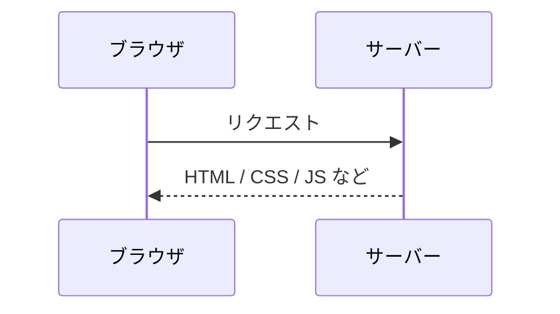

# はじめに

## このコンテンツの目的

あなたはこれから Next.js を使ったプロジェクトに参加します。このコンテンツは、そのために必要な Web フロントエンドの知識の引き出しを増やすためのものです。

ゴールは**コードが書ける**ことでも、すべてを**深く理解する**ことでもありません。AI ツールを使えば動くコードは作れます。このコンテンツで目指すのは、**「この話、どこかで聞いたな」と思い出せる引き出しを増やす**ことです。

AI に「ログイン画面を作って」と頼めば、それっぽい画面は出てきます。しかし引き出しがなければ、AI への指示が曖昧になり、返ってきたコードが妥当かどうかも判断できません。このコンテンツは、そのための土台を作るものです。

## Web の全体像

学習に入る前に、Web がどう動いているかの全体像を掴んでおきましょう。

Web は大きく分けて**サーバー**と**ブラウザ（クライアント）**の2つで成り立っています。

1. あなたがブラウザで URL にアクセスすると、ブラウザは**サーバーにリクエスト**を送ります
2. サーバーは HTML や CSS、JavaScript などのファイルを**レスポンス**として返します
3. ブラウザは受け取ったファイルを解釈して**画面を表示**します

このコンテンツで学ぶ HTML、CSS、JavaScript は、基本的に**ブラウザ側で動くもの**です。サーバーから受け取ったこれらのファイルをブラウザが読み取り、ページを組み立てて表示します。この「ブラウザ側の領域」のことを**フロントエンド**と呼びます。

後半で学ぶ Next.js では、一部の処理をサーバー側でも行うようになります（Server Components など）。そのとき、「どこで動いているのか」を意識することがとても重要になります。まずはブラウザ側の仕組みから見ていきましょう。

## なぜ基礎から学ぶのか

プロジェクトでは Next.js、React、TypeScript、Tailwind CSS といった技術を使います。これらはとても便利ですが、その便利さは素の HTML/CSS/JavaScript が抱える課題を解決することで成り立っています。

例えば:

- React のコンポーネントが便利なのは、素の JavaScript で画面を書き換える DOM 操作（HTML の要素を追加・変更・削除する処理）が煩雑だから
- Tailwind CSS や CSS Modules が使われるのは、素の CSS にはスタイルの適用範囲を限定する仕組みがなく、意図しない上書きが起きるから
- TypeScript が必要なのは、JavaScript だけでは実行するまでバグに気づけないから

こういった背景を知らずにフレームワークだけ触ると、「なんとなく動くが、なぜそう書くかわからない」状態になります。引き出しとして「素の技術の課題」を知っていれば、フレームワークの引き出しもずっと活きてきます。

## 進め方

- **1日1レッスン、15分程度**で読めるボリュームです
- **順番に進めてください**。前のレッスンの知識を前提にしています
- 暗記する必要はありません。「こういう概念があるんだな」くらいの感覚で大丈夫です
