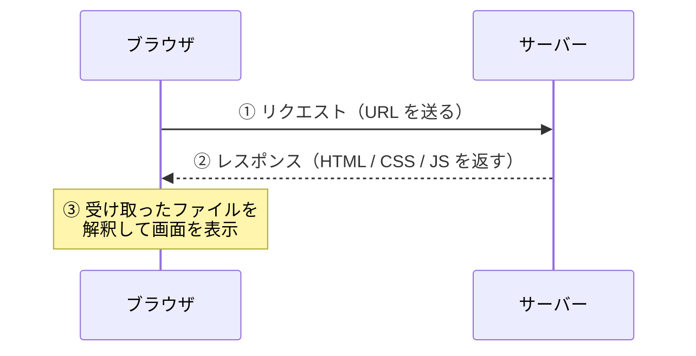

# Day 1: Web の仕組み — URL を入力してからページが表示されるまで

## 今日のゴール

- Web がブラウザとサーバーの2者で動いていることを知る
- URL を入力してからページが表示されるまでの流れを知る
- HTML / CSS / JavaScript の役割分担を知る

## ブラウザとサーバー

Web は大きく分けて **サーバー** と **ブラウザ（クライアント）** の2者で成り立っています。



1. ブラウザのアドレスバーに URL を入力すると、ブラウザは **サーバーにリクエスト** を送ります
2. サーバーは HTML、CSS、JavaScript などのファイルを **レスポンス** として返します
3. ブラウザは受け取ったファイルを解釈して **画面を組み立てて表示** します

## HTML / CSS / JavaScript の3つの役割

サーバーから返ってくるファイルは、主に3種類あります。

| 技術 | 役割 | 例え |
|------|------|------|
| HTML | 構造と意味 | 家の骨組み |
| CSS | 見た目 | 壁紙や塗装 |
| JavaScript | 動き | 照明のスイッチや自動ドア |

実際のファイルを見てみます。

```html
<!-- index.html -->
<!DOCTYPE html>
<html lang="ja">
  <head>
    <meta charset="UTF-8" />
    <link rel="stylesheet" href="main.css" />
  </head>
  <body>
    <h1>こんにちは</h1>
    <button id="btn">押してみて</button>
    <script src="main.js"></script>
  </body>
</html>
```

```css
/* main.css */
h1 {
  color: darkblue;
}

button {
  background-color: #0070f3;
  color: white;
  padding: 8px 16px;
  border: none;
  border-radius: 4px;
}
```

```javascript
// main.js
document.getElementById("btn").addEventListener("click", () => {
  alert("クリックされました");
});
```

今はコードの中身を読み解く必要はありません。ここで知っておきたいのは:

- **HTML** がページの骨組み（見出し、ボタン）を作っている
- **CSS** が見た目（色、余白、角丸）を指定している
- **JavaScript** が動き（ボタンを押したら何か起きる）を担当している
- HTML の中で CSS と JavaScript のファイルを読み込んでいる（`<link>` と `<script>`）

この3つが組み合わさって、ブラウザの画面が出来上がります。

## フロントエンドとは

ここまでの HTML、CSS、JavaScript は、基本的に **ブラウザ側で動くもの** です。この「ブラウザ側の領域」を **フロントエンド** と呼びます。

後半で学ぶ Next.js では、一部の処理をサーバー側でも行うようになります。そのとき、「今この処理はどこで動いているのか — ブラウザか、サーバーか」を意識することがとても重要になります。まずはブラウザ側の仕組みから見ていきます。

## まとめ

- Web はブラウザとサーバーのやり取りで動いている
- ブラウザが URL にアクセスすると、サーバーが HTML / CSS / JS を返し、ブラウザが画面を組み立てる
- HTML は構造と意味、CSS は見た目、JavaScript は動きを担当する
- ブラウザ側の領域をフロントエンドと呼ぶ

**次のレッスン**: [Day 2: リンクと画像](/lessons/day02/)
