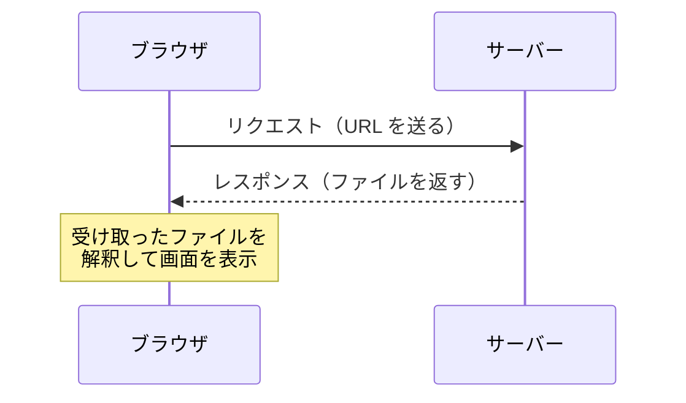

# Day 1: Web の仕組み — URL を入力してからページが表示されるまで

## 今日のゴール

- Web がブラウザとサーバーの2者で動いていることを知る
- URL を入力してからページが表示されるまでの流れを知る
- HTML / CSS / JavaScript の役割分担を知る

## ブラウザとサーバー

Web は大きく分けて **サーバー** と **ブラウザ（クライアント）** の2者で成り立っています。



1. ブラウザのアドレスバーに URL を入力すると、ブラウザは **サーバーにリクエスト** を送ります
2. サーバーはファイルを **レスポンス** として返します
3. ブラウザは受け取ったファイルを解釈して **画面を組み立てて表示** します

## ブラウザが画面を組み立てるまで

サーバーから受け取ったファイルを、ブラウザはどう処理するのでしょうか。ここで登場するのが **HTML**、**CSS**、**JavaScript** の3つです。

| 技術 | 役割 | 例え |
|------|------|------|
| HTML | 構造と意味 | 家の骨組み |
| CSS | 見た目 | 壁紙や塗装 |
| JavaScript | 動き | 照明のスイッチや自動ドア |

それぞれもう少し詳しく見ていきます。

### HTML — 構造

HTML（HyperText Markup Language）は、ページの **構造と意味** を記述します。

```html
<h1>お知らせ</h1>
<p>新機能をリリースしました。</p>
<button>詳しく見る</button>
```

「これは見出し」「これは段落」「これはボタン」という **意味づけ（マークアップ）** をするのが HTML の役割です。見た目をどうするかは HTML の仕事ではありません。

### CSS — 見た目

CSS（Cascading Style Sheets）は、HTML で作った構造に **見た目** を与えます。

```css
h1 {
  color: darkblue;
  font-size: 24px;
}

button {
  background-color: #0070f3;
  color: white;
  padding: 8px 16px;
  border: none;
  border-radius: 4px;
}
```

色、サイズ、配置、余白 — 画面の見た目に関することはすべて CSS が担当します。

### JavaScript — 動き

JavaScript は、ページに **動き（インタラクション）** を与えます。

```javascript
alert("ボタンがクリックされました");
```

ボタンをクリックしたら何か起きる、入力内容をチェックする、サーバーからデータを取得して表示する — こうした「動的な振る舞い」を JavaScript が担います。

## 3つを組み合わせたページ

実際の Web ページでは、この3つがファイルとして組み合わさっています。

```html
<!-- index.html -->
<!DOCTYPE html>
<html lang="ja">
  <head>
    <meta charset="UTF-8" />
    <link rel="stylesheet" href="main.css" />
  </head>
  <body>
    <h1>こんにちは</h1>
    <button id="btn">押してみて</button>
    <script src="main.js"></script>
  </body>
</html>
```

```css
/* main.css */
h1 {
  color: darkblue;
}

button {
  background-color: #0070f3;
  color: white;
  padding: 8px 16px;
  border: none;
  border-radius: 4px;
}
```

```javascript
// main.js
document.getElementById("btn").addEventListener("click", () => {
  alert("クリックされました");
});
```

今はコードの中身を読み解く必要はありません。ここで知っておきたいのは、ブラウザがファイルを取得する流れです。

1. ブラウザはまず **HTML** をサーバーから受け取る
2. HTML を読んでいく中で `<link rel="stylesheet" href="main.css">` を見つけると、**CSS を追加でサーバーに要求** する
3. 同様に `<script src="main.js">` を見つけると、**JavaScript を追加で要求** する

つまり HTML が起点となって、必要な CSS や JavaScript が芋づる式に取得され、3つが揃ってページが完成します。

## フロントエンドとは

ここまでの HTML、CSS、JavaScript は、基本的に **ブラウザ側で動くもの** です。この「ブラウザ側の領域」を **フロントエンド** と呼びます。

後半で学ぶ Next.js では、一部の処理をサーバー側でも行うようになります。そのとき、「今この処理はどこで動いているのか — ブラウザか、サーバーか」を意識することがとても重要になります。まずはブラウザ側の仕組みから見ていきます。

## まとめ

- Web はブラウザとサーバーのやり取りで動いている
- ブラウザが URL にアクセスすると、サーバーが HTML / CSS / JS を返し、ブラウザが画面を組み立てる
- HTML は構造と意味、CSS は見た目、JavaScript は動きを担当する
- ブラウザ側の領域をフロントエンドと呼ぶ

**次のレッスン**: [Day 2: セマンティック HTML](/lessons/day02/)
