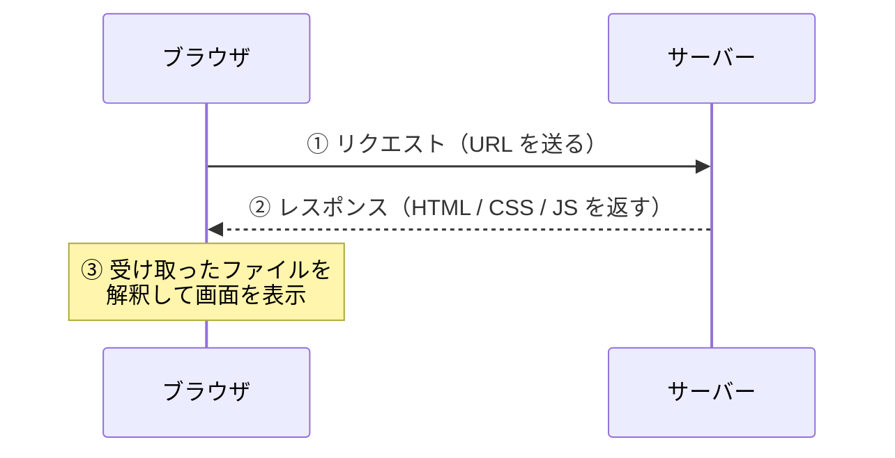

# Day 1: Web の仕組み — URL を入力してからページが表示されるまで

## 今日のゴール

- Web がブラウザとサーバーの2者で動いていることを知る
- URL を入力してからページが表示されるまでの流れを知る
- HTML / CSS / JavaScript の役割分担を知る

## ブラウザとサーバー

はじめに で触れたとおり、AI にコードを作らせることはできます。ではそのコードは最終的にどこで動くのでしょうか。

Web は大きく分けて **サーバー** と **ブラウザ（クライアント）** の2者で成り立っています。



1. ブラウザのアドレスバーに URL を入力すると、ブラウザは**サーバーにリクエスト**を送ります
2. サーバーは HTML、CSS、JavaScript などのファイルを**レスポンス**として返します
3. ブラウザは受け取ったファイルを解釈して**画面を組み立てて表示**します

AI が生成したコードも、最終的にはこの流れでブラウザに届けられ、ブラウザが画面にしています。

## ブラウザが画面を組み立てるまで

サーバーから受け取ったファイルを、ブラウザはどう処理するのでしょうか。ここで登場するのが **HTML**、**CSS**、**JavaScript** の3つです。

### HTML — 構造

HTML（HyperText Markup Language）は、ページの**構造と意味**を記述します。

```html
<h1>お知らせ</h1>
<p>新機能をリリースしました。</p>
<button>詳しく見る</button>
```

「これは見出し」「これは段落」「これはボタン」という **意味づけ（マークアップ）** をするのが HTML の役割です。見た目をどうするかは HTML の仕事ではありません。

### CSS — 見た目

CSS（Cascading Style Sheets）は、HTML で作った構造に**見た目**を与えます。

```css
h1 {
  color: darkblue;
  font-size: 24px;
}

button {
  background-color: #0070f3;
  color: white;
  padding: 8px 16px;
  border: none;
  border-radius: 4px;
}
```

色、サイズ、配置、余白 — 画面の見た目に関することはすべて CSS が担当します。

### JavaScript — 動き

JavaScript は、ページに **動き（インタラクション）** を与えます。

```javascript
alert("ボタンがクリックされました");
```

ボタンをクリックしたら何か起きる、入力内容をチェックする、サーバーからデータを取得して表示する — こうした「動的な振る舞い」を JavaScript が担います。具体的な書き方は Day 9 以降で見ていきます。

### 3つの役割分担

| 技術 | 役割 | 例え |
|------|------|------|
| HTML | 構造と意味 | 家の骨組み |
| CSS | 見た目 | 壁紙や塗装 |
| JavaScript | 動き | 照明のスイッチや自動ドア |

この3つが組み合わさって、ブラウザの画面が出来上がります。AI が生成するコードも、中身はこの3つの組み合わせです。

## なぜ基礎から学ぶのか

配属先で使う Next.js や React は、素の HTML/CSS/JavaScript が抱える課題を解決するために存在しています。

- React が便利なのは、素の JavaScript で画面を書き換える操作が煩雑だから
- Tailwind CSS が使われるのは、素の CSS ではスタイルの衝突を防ぐ運用が難しいから
- TypeScript が必要なのは、JavaScript だけでは実行するまでバグに気づけないから

素の技術の課題を知らずにフレームワークだけ触ると、「なんとなく動くが、なぜそう書くかわからない」状態になります。このコンテンツでは、まず素の技術に触れてから、フレームワークがそれをどう解決しているかを見ていきます。

## フロントエンドとは

ここまでの HTML、CSS、JavaScript は、基本的に**ブラウザ側で動くもの**です。この「ブラウザ側の領域」を**フロントエンド**と呼びます。

後半で学ぶ Next.js では、一部の処理をサーバー側でも行うようになります。そのとき、「今この処理はどこで動いているのか — ブラウザか、サーバーか」を意識することがとても重要になります。まずはブラウザ側の仕組みから見ていきましょう。

## まとめ

- Web はブラウザとサーバーのやり取りで動いている
- ブラウザが URL にアクセスすると、サーバーが HTML / CSS / JS を返し、ブラウザが画面を組み立てる
- HTML は構造と意味、CSS は見た目、JavaScript は動きを担当する
- フレームワーク（React、Next.js など）は素の技術の課題を解決するために存在する
- ブラウザ側の領域をフロントエンドと呼ぶ

**次のレッスン**: [Day 2: リンクと画像](/lessons/day02/)
