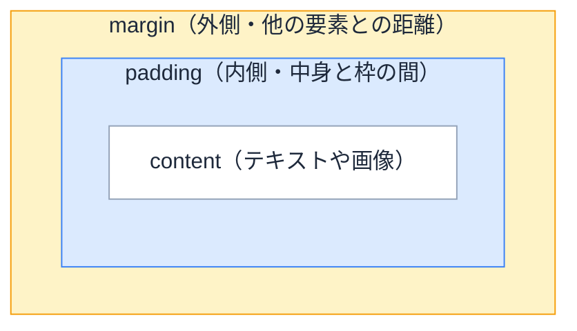

# Day 9: CSS の余白設計 — margin、padding、gap の使い分け

## 今日のゴール

- margin と padding の違いを知る
- margin の相殺という仕組みと、その回避策を知る
- コンポーネントに margin を持たせない設計と、gap による余白管理を知る

## margin と padding の違い

CSS で余白を作るプロパティは `margin` と `padding` の 2 つがあります。どちらも「スペースを空ける」ものですが、役割が違います。

```css
.card {
  padding: 16px;
  margin: 24px;
  background-color: #e8f0fe;
  border: 1px solid #93c5fd;
}
```

- **padding**: 要素の**内側**の余白。中身と枠の距離を決めます。要素自身の大きさに関わります
- **margin**: 要素の**外側**の余白。隣の要素との距離を決めます。要素の並び、つまりレイアウトに関わります



### padding を見てみる

6 つの箱を隙間なく敷き詰めました。すべて `padding: 0` です。テキストが枠線にぴったりくっついています。

右下の 1 つだけ `padding: 16px` を加えてみましょう。チェックを入れてください。

<div class="day09-padding-demo">
  <div class="day09-padding-grid">
    <div class="day09-padding-cell">テキスト</div>
    <div class="day09-padding-cell">テキスト</div>
    <div class="day09-padding-cell">テキスト</div>
    <div class="day09-padding-cell">テキスト</div>
    <div class="day09-padding-cell">テキスト</div>
    <div class="day09-padding-cell day09-padding-target" id="day09-padding-target">テキスト</div>
  </div>
  <label class="day09-toggle" style="margin-top:12px;display:flex;align-items:center;gap:8px;cursor:pointer;color:#1e293b">
    <input type="checkbox" id="day09-padding-toggle" style="width:18px;height:18px;cursor:pointer">
    <span>右下の箱に <code>padding: 16px</code> を付ける</span>
  </label>
</div>

テキストと枠線の間にスペースが生まれ、**箱自体のサイズが広がりました**。padding は要素の中の話なので、その要素だけで完結します。

### margin を見てみる

今度は 5 つの箱を縦に隙間なく積みました。すべて `margin: 0` です。

3 番目の箱だけ `margin-top: 16px` を加えてみましょう。

<div class="day09-margin-demo">
  <div class="day09-margin-stack">
    <div class="day09-margin-cell">1</div>
    <div class="day09-margin-cell">2</div>
    <div class="day09-margin-cell day09-margin-target" id="day09-margin-target">3</div>
    <div class="day09-margin-cell">4</div>
    <div class="day09-margin-cell">5</div>
  </div>
  <label class="day09-toggle" style="margin-top:12px;display:flex;align-items:center;gap:8px;cursor:pointer;color:#1e293b">
    <input type="checkbox" id="day09-margin-toggle" style="width:18px;height:18px;cursor:pointer">
    <span>3 番目の箱に <code>margin-top: 16px</code> を付ける</span>
  </label>
</div>

**箱自体のサイズは変わらず**、上の箱との距離が広がりました。margin は要素の中身には影響せず、周囲との位置関係が変わります。

padding は「自分の中をどう広げるか」という、要素自身の関心事です。一方 margin は「隣とどれだけ離れるか」という、要素の並べ方——レイアウトの関心事です。間隔を決めるのは、本来は要素を並べている親の役割です。この視点は、後で出てくる「コンポーネントに margin を持たせない」設計につながります。

<style>
.day09-padding-demo,
.day09-margin-demo {
  background: #f8fafc;
  color: #1e293b;
  border-radius: 8px;
  padding: 20px;
  margin: 16px 0;
}
.day09-padding-grid {
  display: grid;
  grid-template-columns: repeat(3, 1fr);
  border: 1px solid #cbd5e1;
}
.day09-padding-cell {
  background: #dbeafe;
  color: #1e293b;
  border: 1px solid #93c5fd;
  font-size: 14px;
  line-height: 1;
  padding: 0;
  transition: padding 0.3s, background-color 0.3s;
}
.day09-padding-target.day09-padding-on {
  padding: 16px;
  background: #bfdbfe;
}
.day09-margin-stack {
  display: flex;
  flex-direction: column;
  align-items: stretch;
  background: #e2e8f0;
  border-radius: 4px;
}
.day09-margin-cell {
  background: #dbeafe;
  color: #1e293b;
  border: 1px solid #93c5fd;
  padding: 8px 16px;
  font-size: 14px;
  text-align: center;
  margin: 0;
  transition: margin 0.3s, background-color 0.3s;
}
.day09-margin-target.day09-margin-on {
  margin-top: 16px;
  background: #bfdbfe;
}
</style>

<script setup>
import { onMounted } from 'vue'

onMounted(() => {
  document.getElementById('day09-padding-toggle')?.addEventListener('change', (e) => {
    document.getElementById('day09-padding-target')?.classList.toggle('day09-padding-on', e.target.checked)
  })
  document.getElementById('day09-margin-toggle')?.addEventListener('change', (e) => {
    document.getElementById('day09-margin-target')?.classList.toggle('day09-margin-on', e.target.checked)
  })
})
</script>

使い分けの基本はシンプルです。

| やりたいこと | 使うプロパティ |
|-------------|--------------|
| テキストが枠にくっつかないようにする | `padding` |
| 要素と要素の間に距離を作る | `margin`（または `gap`） |

## margin の相殺

margin には直感に反する仕組みがあります。

```html
<div style="margin-bottom: 24px;">上の要素</div>
<div style="margin-top: 24px;">下の要素</div>
```

上に `margin-bottom: 24px`、下に `margin-top: 24px` を付けたので、間は 48px 空きそうに思えます。しかし実際の間隔は **24px** です。

これを <strong>margin の相殺（margin collapsing）</strong> と呼びます。隣り合うブロック要素の上下の margin は、合算されるのではなく、大きい方だけが適用されます。

```css
.first  { margin-bottom: 30px; }
.second { margin-top: 20px; }
/* 間隔は 30 + 20 = 50px ではなく、大きい方の 30px */
```

相殺のルールは次のとおりです。

- **上下の margin だけ**で起きます。左右の margin は相殺されません
- **ブロック配置のときだけ**起きます。親が Flexbox や Grid のときは相殺されません
- **親子間でも起きます**。子の `margin-top` が親の上端からすり抜けて外に出ることがあります

相殺はレイアウトが意図どおりにならない原因になりがちです。

## margin は一方向に揃える

margin の相殺を避ける最もシンプルな方法は、**margin を付ける方向を片側に統一する**ことです。縦方向なら `margin-top`、横方向なら `margin-left`、つまり**上と左だけを使う**のが実務でよく使われるルールです。

```css
/* 縦並び: margin-top だけを使う */
.heading { margin-top: 16px; }
.paragraph { margin-top: 24px; }
```

これで兄弟要素同士で上下の margin がぶつかることがないので、相殺は起きません。

`bottom` / `right` ではなく `top` / `left` 側に寄せる理由は、**要素が「自分の前にあるもの」との距離だけを気にすればよい**形になるからです。先頭の要素だけ `:first-child { margin-top: 0 }` で margin を打ち消せばよく、途中に要素を挿入したり末尾に追加したりしても打ち消しの位置を変えずに済みます。`margin-bottom` 側に統一すると、末尾が変わるたびに `:last-child` の扱いを考え直す必要が出てきます。

::: info コラム: Every Layout の Stack
この「一方向の margin で縦に積む」パターンは、Heydon Pickering と Andy Bell の著書 *Every Layout*（[everylayout.dev](https://every-layout.dev/)）で **Stack** というレイアウトプリミティブとして体系化されています。

```css
.stack > * + * {
  margin-top: 1.5rem;
}
```

`> * + *` は「直接の子要素のうち、2 番目以降すべて」を意味します。先頭の要素には margin が付かず、2 番目以降に一律 `margin-top` が入ります。`:first-child` の打ち消しすら不要な書き方です。

`gap` が使える今では Flexbox + `gap` で同じことがより簡潔に書けますが、Stack の考え方——「縦に積むなら上方向だけに余白を持たせる」——は `gap` 以前から確立されていた設計原則で、余白の扱いを考えるうえで参考になる一冊です。
:::

## コンポーネントに margin を持たせない

React や Next.js では、UI をコンポーネント（再利用可能な部品）に分けて組み立てます。このとき、**コンポーネントのルート要素に margin を付けない**のが重要な設計原則です。

```tsx
// よくない例: コンポーネント自身が margin を持つ
function Card({ title }: { title: string }) {
  return (
    <article className="rounded-lg bg-white p-4 mt-4">
      <h2 className="text-lg font-bold">{title}</h2>
    </article>
  );
}
```

この `Card` は上に `mt-4`（`margin-top: 1rem`）を常に持っています。カードを横に並べたいとき、間隔を変えたいとき、先頭のカードだけ余白をなくしたいとき、どれもうまくいきません。

```tsx
// よい例: コンポーネントは margin を持たない
function Card({ title }: { title: string }) {
  return (
    <article className="rounded-lg bg-white p-4">
      <h2 className="text-lg font-bold">{title}</h2>
    </article>
  );
}
```

`padding` はコンポーネントの**内側**の話なので問題ありません。`margin` はコンポーネントの**外側**、つまり他の要素との関係の話です。外側の距離をコンポーネント自身が決めてしまうと、使う場所によって調整が効かなくなります。

コンポーネント同士の間隔は、親の `gap` で決めます。

## gap で親が間隔を決める

Flexbox や Grid で使える `gap` プロパティを親に指定すると、**子要素同士の間にだけ**間隔が入ります。

```tsx
function CardList() {
  return (
    <div className="flex flex-col gap-4">
      <Card title="1 件目" />
      <Card title="2 件目" />
      <Card title="3 件目" />
    </div>
  );
}
```

```css
/* gap の動きを CSS で書くとこうなります */
.card-list {
  display: flex;
  flex-direction: column;
  gap: 16px;
}
```

`gap` のメリットは明確です。

- **端に余白が付かない**: 最初と最後の要素の外側にはスペースが入りません。`margin` で書いた場合の `:last-child { margin-bottom: 0 }` のような後始末が不要です
- **相殺が起きない**: Flexbox / Grid 上では margin の相殺は発生しません。`gap` は margin とは別の仕組みなので、相殺の心配自体がありません
- **間隔の責任が親にある**: 子コンポーネントは自分の外側の余白を知りません。間隔を変えたければ親の `gap` を変えるだけです

### gap が使えないケース

`gap` は親が Flexbox か Grid のときだけ使えます。通常のブロック配置（`display: block`）では効きません。

また、子要素ごとに異なる間隔をつけたい場合（見出しの上は広く、段落の間は狭くしたいなど）には `gap` だけでは対応できません。その場合は、一方向に統一した `margin` を使います。

| 場面 | 使う方法 |
|------|---------|
| 同じ間隔で並べる（カード一覧、ボタン群など） | 親に `gap` |
| 要素ごとに異なる間隔が必要 | 一方向の `margin` |
| コンポーネント同士の間隔 | 親に `gap`（コンポーネント自身は margin を持たない） |

## まとめ

- `padding` は内側、`margin` は外側の余白
- 隣り合う上下 margin は相殺されるので、一方向に統一すると回避できる
- コンポーネント自体に margin を持たせず、親の `gap` や使う側で距離を決める
