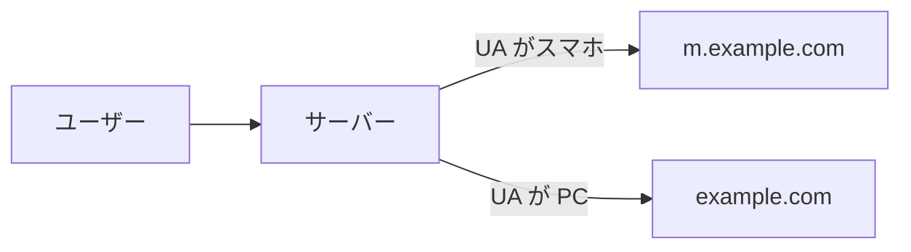
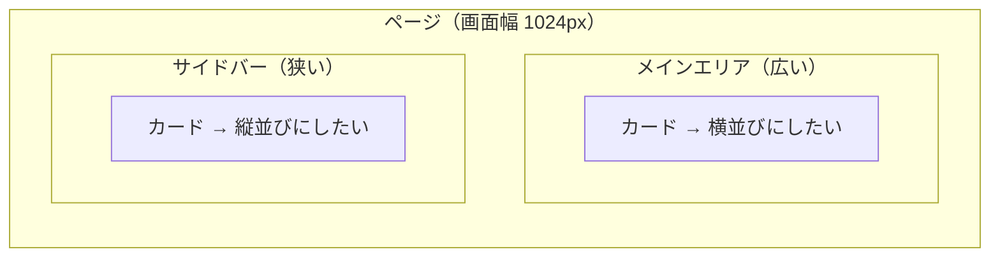
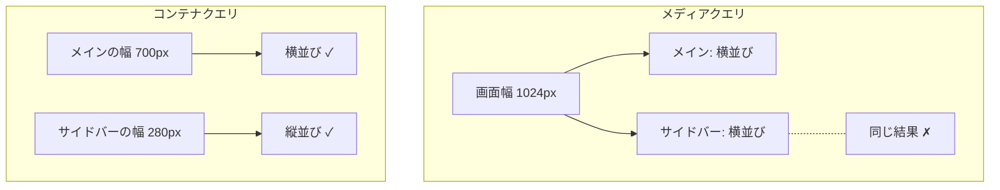

# Day 11: レスポンシブデザイン — 1 つの HTML をあらゆる画面に届ける

## 今日のゴール

- スマホと PC で見た目が変わる仕組みを知る
- メディアクエリの仕組みと、その限界を知る
- コンテナクエリや CSS 関数でブレークポイントに頼らないレスポンシブができることを知る

## かつてはページを丸ごと分けていた

スマホが普及し始めた頃、PC 向けとモバイル向けで別々のページを用意するのが一般的でした。PC では `example.com`、スマホでは `m.example.com` にリダイレクトする方法です。



サーバーはブラウザが送ってくる User-Agent（UA）という文字列を見て、スマホかどうかを判定していました。これを UA スニッフィングと呼びます。

下のデモで、今あなたのブラウザが送っている UA 文字列を確認できます。

<div class="c06-demo">
  <p class="c06-demo-label">あなたのブラウザの User-Agent:</p>
  <code class="c06-ua-text" id="c06-ua-text">---</code>
  <p class="c06-demo-note">サーバーはこの文字列の中に「iPhone」や「Android」が含まれるかどうかで判定していました。見慣れないブラウザ名が混じっているかもしれませんが、それは正常です。UA 文字列は歴史的な経緯で複数のブラウザ名が入り混じる構造になっています。</p>
</div>

::: details UA 文字列とプライバシー

UA 文字列には、ブラウザの種類やバージョン、OS の情報などが含まれています。

これだけでは個人を特定できませんが、画面の解像度、インストールされているフォント、言語設定など、ブラウザから取得できる他の情報と組み合わせると、ユーザーを高い精度で識別できてしまう場合があります。この手法はフィンガープリンティングと呼ばれます。

Cookie はユーザーが削除したり、ブラウザの設定でブロックしたりできます。しかしフィンガープリンティングはブラウザの基本情報を使うため、ユーザーが気づかないうちに追跡されてしまうのが厄介なところです。

この問題を受けて、Chrome は UA 文字列に含まれる情報を段階的に減らす方針（User-Agent Reduction）を進めています。たとえば OS の細かいバージョン番号を固定値にして、フィンガープリンティングに使いにくくしています。

UA スニッフィングが過去の手法になった理由は、端末の多様化で判定が難しくなっただけではありません。プライバシーの観点からも、UA 文字列に頼る設計自体が見直されているのです。
:::

この方法には大きな問題がありました。

- **2 つのコードベースを保守する必要がある**: PC 版を更新したらモバイル版も更新しなければならない。片方だけ古い状態になりがち
- **UA の判定が不完全**: 新しい端末が出るたびに判定ロジックを更新する必要がある。タブレットはどっちに振り分ける？
- **URL が 2 つになる**: 共有された URL がスマホ向けページだと、PC で開いたときにレイアウトが崩れる

## レスポンシブデザイン — 1 つの HTML で対応する

2010 年、Ethan Marcotte が「Responsive Web Design」という概念を提唱しました。**同じ HTML に対して、画面幅に応じて異なる CSS を適用する**ことで、1 つのページをあらゆる画面に対応させる考え方です。

ページを分けるのではなく、CSS を切り替える。これがレスポンシブデザインの核心です。

コードベースは 1 つで済み、URL も 1 つ。UA の判定も不要になります。

レスポンシブデザインを正しく動かすには、HTML の `<head>` に次の 1 行が必要です。

```html
<meta name="viewport" content="width=device-width, initial-scale=1.0" />
```

これがないと、スマホのブラウザは「このページは PC 向けだ」と判断して、画面を縮小表示します。メディアクエリもコンテナクエリも意図どおりに動きません。

## メディアクエリ — 画面幅で CSS を切り替える

レスポンシブデザインを実現する CSS の仕組みが `@media`（メディアクエリ）です。「この条件を満たすときだけ、このスタイルを適用する」というルールを書けます。

```css
/* ベース: 狭い画面 */
.card-list {
  display: grid;
  gap: 16px;
}

/* 768px 以上: 広い画面 */
@media (min-width: 768px) {
  .card-list {
    grid-template-columns: repeat(3, 1fr);
  }
}
```

- **画面幅が 768px 未満**: カードは縦に 1 列で並ぶ
- **画面幅が 768px 以上**: カードは 3 列で並ぶ

下のデモで実際に確認できます。ブラウザの幅を変えるか、スマホなら横に回転してみてください。

<div class="c06-demo">
  <p class="c06-demo-label">現在の画面幅: <strong id="c06-viewport-width">---</strong>px</p>
  <div class="c06-mq-cards">
    <div class="c06-mq-card">カード 1</div>
    <div class="c06-mq-card">カード 2</div>
    <div class="c06-mq-card">カード 3</div>
  </div>
  <p class="c06-demo-note" id="c06-mq-status">---</p>
</div>

`min-width`（〇〇px 以上のとき）でスマホをベースに書き、画面が広くなるにつれてスタイルを足していく書き方が定番です。これはモバイルファーストと呼ばれます。

### ブレークポイントと Tailwind

メディアクエリで指定する幅の値をブレークポイントと呼びます。Tailwind CSS では `md:` や `lg:` のプレフィックスがメディアクエリのショートカットになっています。

| Tailwind のクラス | メディアクエリ | 従来の目安 |
|------------------|-------------|-----------|
| `sm:` | `@media (min-width: 640px)` | スマホ横向き |
| `md:` | `@media (min-width: 768px)` | タブレット |
| `lg:` | `@media (min-width: 1024px)` | ノート PC |
| `xl:` | `@media (min-width: 1280px)` | デスクトップ |

値を覚える必要はありません。Tailwind の `md:grid-cols-3` は `@media (min-width: 768px) { grid-template-columns: repeat(3, 1fr) }` と同じ意味だと知っておけば十分です。

## メディアクエリの限界

メディアクエリには根本的な制約があります。<strong>見ているのは常に「画面全体の幅」</strong>だということです。

たとえば、カードコンポーネントを作ったとします。このカードをページの<strong>メインエリア（広い）</strong>に置いたときは横並び、<strong>サイドバー（狭い）</strong>に置いたときは縦並びにしたい。



メディアクエリでは、これがうまくいきません。`@media (min-width: 768px)` は「画面幅が 768px 以上か」を見ます。

画面幅が 1024px なら、メインエリアに置いてもサイドバーに置いても同じ条件で判定されます。コンポーネントの実際の表示幅は関係ないのです。

同じコンポーネントが置き場所によって違う幅になるのに、画面幅しか見られない。

UA スニッフィングが「端末を見て出し分ける」だったのに対し、メディアクエリは「画面幅を見て出し分ける」に進化しました。しかし「コンポーネントの幅を見る」にはまだ届いていなかったのです。

さらに、ブレークポイントの前提自体も揺らいでいます。

「768px ならタブレット」という分類は、画面サイズがある程度パターン化されていた時代のものです。折りたたみスマホ、縦横どちらでも使うタブレット、車載ディスプレイなど、端末のバリエーションが増えた今、固定のブレークポイントで端末を分類すること自体が難しくなっています。

## コンテナクエリ — 親要素の幅で切り替える

この限界を解決するのがコンテナクエリです。画面幅ではなく、コンポーネントが置かれている親要素の幅を条件にできます。

```css
/* 親をコンテナとして登録する */
.card-wrapper {
  container-type: inline-size;
}

/* カードのベーススタイル（狭いとき） */
.card {
  display: grid;
  gap: 8px;
}

/* 親の幅が 400px 以上なら横並びに */
@container (min-width: 400px) {
  .card {
    grid-template-columns: 200px 1fr;
  }
}
```

`@media` が `@container` に変わっただけのように見えますが、根本的に違います。

| | メディアクエリ | コンテナクエリ |
|---|---|---|
| 何の幅を見るか | 画面全体 | 親要素 |
| 同じコンポーネントの使い回し | 置き場所を区別できない | 置き場所に応じて変わる |
| 必要な準備 | なし | 親に `container-type` を指定 |



下のデモではスライダーで親の幅を変えられます。同じカードコンポーネントが、親の幅に応じて縦並び ↔ 横並びに切り替わるのを確認してください。

<div class="c06-demo">
  <p class="c06-demo-label">親の幅: <strong id="c06-cq-width-label">500</strong>px <span id="c06-cq-status" class="c06-demo-note" style="margin:0"></span></p>
  <input type="range" id="c06-cq-slider" min="200" max="600" value="500" style="width:100%;cursor:pointer">
  <div class="c06-cq-wrapper" id="c06-cq-wrapper" style="width:500px">
    <div class="c06-cq-card" id="c06-cq-card">
      <div class="c06-cq-thumb"></div>
      <div class="c06-cq-body">
        <div class="c06-cq-title">カードタイトル</div>
        <div class="c06-cq-text">親の幅が 400px 以上なら横並び、未満なら縦並びになります。</div>
      </div>
    </div>
  </div>
</div>

コンテナクエリを使えば、同じカードコンポーネントがメインエリアでは横並び、サイドバーでは縦並びになります。コンポーネント自身が「自分がどのくらいの幅で表示されているか」を知って、見た目を切り替えるのです。

2026 年 5 月時点で、コンテナクエリは Chrome・Safari・Edge・Firefox の主要ブラウザすべてで対応しており、実用できる段階にあります。

## ブレークポイントに頼らないレスポンシブ

コンテナクエリは「何の幅を見るか」を進化させました。もう 1 つの流れは、そもそもブレークポイントで切り替えること自体を減らすアプローチです。

CSS には `clamp()` や `min()` といった関数があり、「最小値と最大値の間で滑らかに変化する」指定ができます。

たとえばフォントサイズを `clamp()` で指定すると、画面幅に応じて段階的に切り替えるのではなく、滑らかに変化します。メディアクエリでブレークポイントを書く必要がありません。

Grid の `auto-fit` と `minmax()` を組み合わせれば、カード一覧の列数も画面幅に応じて自動で変わります。「3 列にしたいからブレークポイントで切り替える」のではなく、「最低 250px、余裕があれば広がる」と宣言するだけです。

こうした仕組みを使うと、メディアクエリの出番は「サイドバーの有無を切り替える」「ナビゲーションをハンバーガーメニューに変える」といった、大きなレイアウト変更だけになります。

| やりたいこと | 今の手法 |
|-------------|--------|
| フォントサイズを画面幅に応じて変える | `clamp()` |
| カードの列数を画面幅に応じて変える | Grid の `auto-fit` + `minmax()` |
| コンポーネントの見た目を親の幅で変える | コンテナクエリ |
| サイドバーの有無など大きなレイアウト変更 | メディアクエリ |

## まとめ

- **レスポンシブデザイン**は 1 つの HTML に CSS を切り替えて画面ごとの表示を実現する
- **メディアクエリ**は画面幅、**コンテナクエリ**は親要素の幅で切り替える
- `clamp()` や `auto-fit` でブレークポイント不要のレスポンシブもできる

<style>
.c06-demo {
  background: #f8fafc;
  color: #1e293b;
  border-radius: 8px;
  padding: 16px;
  margin: 16px 0;
}
.c06-demo-label {
  margin: 0 0 8px;
  font-weight: bold;
  color: #1e293b;
}
.c06-demo-note {
  margin: 8px 0 0;
  font-size: 14px;
  color: #64748b;
}

/* メディアクエリデモ */
.c06-mq-cards {
  display: grid;
  gap: 8px;
}
@media (min-width: 768px) {
  .c06-mq-cards {
    grid-template-columns: repeat(3, 1fr);
  }
}
.c06-mq-card {
  background: #dbeafe;
  color: #1e293b;
  border: 1px solid #93c5fd;
  padding: 16px;
  border-radius: 4px;
  text-align: center;
}

/* UA デモ */
.c06-ua-text {
  display: block;
  background: white;
  color: #1e293b;
  padding: 12px;
  border-radius: 4px;
  border: 1px solid #e2e8f0;
  font-size: 12px;
  word-break: break-all;
  line-height: 1.6;
}

/* コンテナクエリデモ */
.c06-cq-wrapper {
  container-type: inline-size;
  container-name: c06-card-container;
  border: 2px dashed #93c5fd;
  padding: 12px;
  border-radius: 8px;
  overflow: hidden;
}
.c06-cq-card {
  display: grid;
  gap: 12px;
  background: white;
  border: 1px solid #e2e8f0;
  border-radius: 8px;
  overflow: hidden;
}
.c06-cq-thumb {
  height: 80px;
  background: #dbeafe;
}
.c06-cq-body {
  padding: 0 12px 12px;
}
.c06-cq-title {
  font-weight: bold;
  color: #1e293b;
  margin-bottom: 4px;
}
.c06-cq-text {
  font-size: 14px;
  color: #475569;
}
@container c06-card-container (min-width: 400px) {
  .c06-cq-card {
    grid-template-columns: 120px 1fr;
  }
  .c06-cq-thumb {
    height: auto;
    min-height: 100px;
  }
  .c06-cq-body {
    padding: 12px 12px 12px 0;
  }
}
</style>

<script setup>
import { onMounted } from 'vue'

onMounted(() => {
  const uaText = document.getElementById('c06-ua-text')
  if (uaText) uaText.textContent = navigator.userAgent

  const vpWidth = document.getElementById('c06-viewport-width')
  const mqStatus = document.getElementById('c06-mq-status')
  if (vpWidth) {
    const update = () => {
      const w = window.innerWidth
      vpWidth.textContent = w
      if (mqStatus) {
        mqStatus.textContent = w >= 768
          ? '768px 以上 → 3 列で表示中'
          : '768px 未満 → 1 列で表示中'
      }
    }
    update()
    window.addEventListener('resize', update)
  }

  const slider = document.getElementById('c06-cq-slider')
  const wrapper = document.getElementById('c06-cq-wrapper')
  const label = document.getElementById('c06-cq-width-label')
  const cqStatus = document.getElementById('c06-cq-status')
  if (slider && wrapper) {
    slider.addEventListener('input', (e) => {
      const v = e.target.value
      wrapper.style.width = v + 'px'
      if (label) label.textContent = v
      if (cqStatus) cqStatus.textContent = Number(v) >= 400 ? '→ 横並び' : '→ 縦並び'
    })
  }
})
</script>
