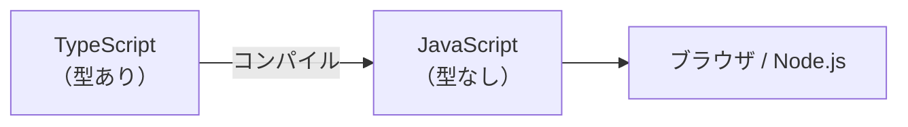

# Day 14: 動的型付けと TypeScript — 変数に型を宣言するということ

## 今日のゴール

- JavaScript にも型はあるが、変数に型を宣言しないことを知る
- 型を宣言しないとどんな問題が起きるかを知る
- TypeScript が何を解決しているかを知る

## JavaScript にも型はある

JavaScript の値には型があります。

| 値 | 型 |
|---|---|
| `1`, `3.14` | 数値（number） |
| `"hello"`, `"東京"` | 文字列（string） |
| `true`, `false` | 真偽値（boolean） |
| `null` | null |
| `undefined` | undefined |
| `{ name: "田中" }` | オブジェクト（object） |
| `[1, 2, 3]` | 配列（object の一種） |

`1` は数値であり、`"hello"` は文字列です。これは JavaScript でも変わりません。

ただし、JavaScript では変数に型を宣言しません。

```javascript
let x = 1;        // x は数値
x = "hello";      // x を文字列に入れ替えられる。エラーにならない
x = true;         // さらに真偽値にもできる
```

変数 `x` にはどんな型の値でも入ります。何が入っているかは実行してみないとわかりません。これを<strong>動的型付け</strong>と呼びます。「型がない」のではなく、「型を変数に縛りつけない」のです。

::: details 静的型付けと動的型付け
プログラミング言語は、型の扱い方で大きく 2 つに分かれます。

| | 静的型付け | 動的型付け |
|---|---|---|
| 型をいつ決めるか | コードを書くとき | 実行するとき |
| 変数に型を宣言するか | する | しない |
| 間違いに気づくタイミング | 実行前 | 実行中 |
| 例 | TypeScript, Java, Go | JavaScript, Python, Ruby |

動的型付けは手軽に書ける反面、実行してみないと型の間違いに気づけません。
:::

## 型を宣言しないと何が起きるか

小さなスクリプトなら問題になりません。しかしコードが増えると、型を宣言しないことが具体的な問題を引き起こします。

### コードを読んだだけでは何が入っているかわからない

```javascript
function formatUser(user) {
  return user.name + "（" + user.age + "歳）";
}
```

この `user` には何を渡せばいいのでしょうか。`name` と `age` があるオブジェクト？ `email` は？ `age` は数値？ 文字列？ コードを読むだけではわかりません。関数の実装を全部読むか、実際に動かしてみるしかありません。

### 間違えても実行するまで気づけない

```javascript
function double(n) {
  return n * 2;
}

double("hello");  // NaN が返る。エラーにはならない
```

数値を想定した関数に文字列を渡しても、JavaScript はエラーを出しません。`"hello" * 2` は `NaN`（Not a Number）という値になり、そのまま処理が続きます。バグが静かに広がっていきます。

### 暗黙の型変換と `==` vs `===`

JavaScript は型が合わないとき、自動的に変換しようとします。これを暗黙の型変換と呼びます。

```javascript
1 + "2"     // "12"（数値が文字列に変換されて結合）
"5" - 1     // 4（文字列が数値に変換されて計算）
```

比較にも影響します。`==` は暗黙の型変換をしてから比較します。

```javascript
0 == ""     // true（どちらも「空」として一致扱い）
0 == false  // true（どちらも「偽」として一致扱い）
1 == "1"    // true（文字列が数値に変換されて比較）
```

`===` は型変換をせず、型が違えば即座に `false` を返します。

```javascript
0 === ""    // false
0 === false // false
1 === "1"   // false
```

JavaScript では `===` を使うのが基本です。`==` は暗黙の型変換で予想外の結果になるため、意図的に使う場面はほとんどありません。TypeScript を使っていても、この暗黙の型変換は JavaScript の仕様として残っています。

### チーム開発で問題が大きくなる

自分が書いたコードなら「この変数には何が入るか」を覚えているかもしれません。でもチームで開発すると、他の人が書いた関数を使う場面が増えます。AI が生成したコードも同じです。型の情報がなければ、毎回コードを読んで推測するしかありません。

## TypeScript が解決すること

TypeScript は JavaScript に型の宣言を追加した言語です。

```typescript
function double(n: number): number {
  return n * 2;
}

double("hello");  // エラー: string は number に渡せない
```

`: number` が型の宣言です。「この引数は数値しか受け取らない」「この関数は数値を返す」とコードに書いてあるので、文字列を渡そうとするとエディタが赤線で教えてくれます。実行する前に間違いに気づけます。

さっきの `formatUser` も、TypeScript ならこう書きます。

```typescript
type User = {
  name: string;
  age: number;
};

function formatUser(user: User): string {
  return user.name + "（" + user.age + "歳）";
}
```

関数の定義を見るだけで「`name` は文字列、`age` は数値のオブジェクトを渡す」とわかります。型がドキュメントの役割を果たしています。

| | JavaScript | TypeScript |
|---|---|---|
| 変数の中身 | 実行しないとわからない | コードに書いてある |
| 間違いに気づくタイミング | 実行中（バグとして発覚） | 実行前（エディタが検出） |
| 関数の使い方 | 実装を読んで推測 | 型の宣言を見ればわかる |

## TypeScript は JavaScript に型を「足す」もの

TypeScript は新しい言語というより、JavaScript に型の仕組みを足したものです。



TypeScript のコードはそのまま実行されるわけではありません。実行前に JavaScript に変換（コンパイル）されます。この変換のとき、型の記述はすべて消えます。

```typescript
// TypeScript（開発時に書く）
const greeting: string = "こんにちは";
```

```javascript
// JavaScript（実行時に動く）
const greeting = "こんにちは";
```

型はあくまで「開発時の安全装置」です。実行時には普通の JavaScript として動きます。

::: tip JavaScript のコードはそのまま TypeScript として動く
TypeScript は JavaScript の上位互換です。JavaScript のコードは、型の宣言がなくてもそのまま TypeScript として有効です。既存の JavaScript プロジェクトに少しずつ型を追加していくことができます。

型のエラーがどう表示されるか試してみたい場合は、[TypeScript Playground](https://www.typescriptlang.org/play/) でブラウザ上から試せます。
:::

::: info 型と AI によるコード生成
AI にコードを生成させたとき、そのコードが正しいかどうかを人間がすべて目で確認するのは大変です。特に経験が浅いうちは、コードを読んでも間違いに気づけないことがあります。

TypeScript のプロジェクトでは、AI が生成したコードが型の宣言と矛盾していれば、ビルド時に TypeScript がエラーとして検出します。人間がコードを読んで確認しなくても、型のチェックが機械的に不整合を見つけてくれます。型は、AI の生成物に対する自動レビューのような役割を果たします。
:::

## まとめ

- JavaScript は変数に型を宣言しない（動的型付け）
- 型宣言がないと、関数の使い方がわからず間違いにも気づけない
- TypeScript は型宣言を追加し、実行前にエディタが間違いを検出する
- TypeScript は実行前に JavaScript に変換され、型は実行時に消える
