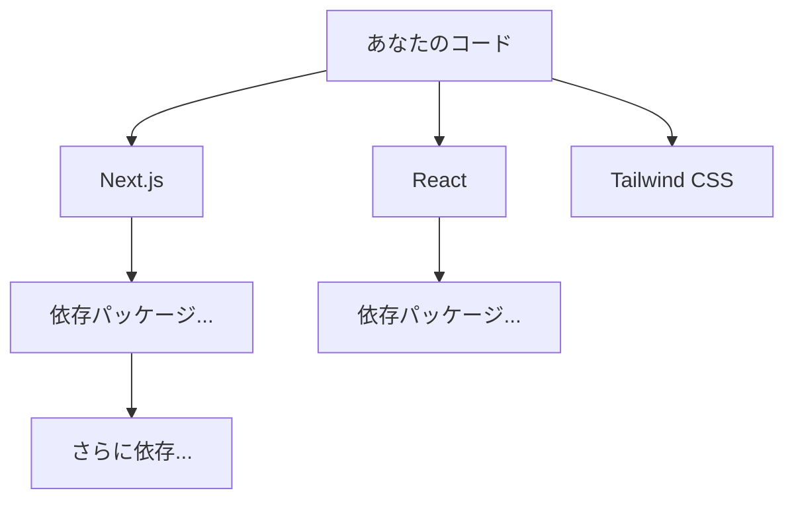

# Day 17: パッケージとバージョン — 他人のコードに乗っかるということ

## 今日のゴール

- 自分のプロジェクトが大量の「他人のコード」の上に成り立っていることを知る
- バージョン番号の 3 つの数字が何を意味するかを知る
- パッケージマネージャごとに依存解決の方法が異なることを知る

## あなたのアプリは他人のコードでできている

Next.js のプロジェクトで `node_modules` フォルダを開いたことはあるでしょうか。

大量のフォルダが並んでいます。package.json に書いたのは数個なのに、何百ものフォルダがある。

これらはすべて<strong>パッケージ</strong>と呼ばれる「他の人が書いて公開したコード」です。React も Next.js も TypeScript も Tailwind CSS も、誰かが作ったパッケージです。



パッケージはさらに別のパッケージに依存し、その連鎖で node_modules は膨らんでいきます。実際のプロジェクトでは、数百から数千のパッケージの上にアプリが成り立っています。

パッケージのダウンロードや管理を行うツールを<strong>パッケージマネージャ</strong>と呼びます。`npm install` の `npm` がそれです。

| ツール | 特徴 |
|-------|------|
| npm | Node.js に付属。最も広く使われている |
| yarn | npm の速度やセキュリティを改善するために Meta が開発 |
| pnpm | ディスク使用量を節約する仕組みを持つ。node_modules の構造が npm/yarn と異なる |

どれも同じレジストリ（[npmjs.com](https://www.npmjs.com/)）からパッケージをダウンロードしますが、依存関係の解決方法が異なります。

npm と yarn は依存をフラットに展開するのに対し、pnpm はシンボリックリンクを使って厳密に分離します。そのため、同じ package.json でもツールによって node_modules の中身の構造が変わります。

ロックファイル（実際にインストールされた正確なバージョンを記録するファイル）もツールごとに異なります。

| パッケージマネージャ | ロックファイル |
|-------------------|-------------|
| npm | `package-lock.json` |
| yarn | `yarn.lock` |
| pnpm | `pnpm-lock.yaml` |

ロックファイルは Git に含めることで、チーム全員が同じバージョンのパッケージを使えるようにします。チームによって使うツールが異なるので、「npm 以外にも yarn や pnpm がある」「ロックファイルの名前でどのツールを使っているかわかる」と知っておけば会話についていけます。

## バージョン番号の読み方

package.json を開くとこのような記述があります。

```json
{
  "dependencies": {
    "next": "^16.0.0",
    "react": "^19.1.0",
    "react-dom": "^19.1.0"
  }
}
```

`16.0.0` や `19.1.0` のような 3 つの数字は<strong>セマンティックバージョニング（semver）</strong>と呼ばれるルールに従っています。

| 位置 | 名前 | 上がるとき | 例（Next.js） |
|------|------|----------|-------------|
| **16**.0.0 | メジャー | 互換性が壊れる大きな変更 | 15 → 16 で書き方が変わった |
| 16.**1**.0 | マイナー | 互換性を保った機能追加 | 新機能が増えたが既存コードは動く |
| 16.0.**1** | パッチ | バグ修正 | 不具合が直っただけ |

重要なのは<strong>メジャーバージョン</strong>です。

メジャーバージョンが上がると、それまでの書き方が動かなくなることがあります。これを<strong>破壊的変更（breaking change）</strong>と呼びます。

### 実際に起きること

Next.js 15 と 16 では、キャッシュの扱いが変わりました。15 の書き方のまま 16 に上げると、意図しない動作になることがあります。

React も 18 → 19 で新しい仕組みが入りました。

メジャーバージョンが変わる = 書き方が変わるかもしれない。これを知っているだけで「バージョン上げたら動かなくなった」が想定内になります。

## `^` と `~` — バージョンの範囲指定

package.json のバージョンには `^` や `~` が付いていることがあります。

| 記号 | 意味 | 例 |
|------|------|-----|
| `^19.1.0` | メジャーが同じ範囲（19.x.x） | 19.1.0 〜 19.x.x |
| `~19.1.0` | マイナーが同じ範囲（19.1.x） | 19.1.0 〜 19.1.x |
| `19.1.0` | 完全固定 | 19.1.0 のみ |

`^` は `npm install` で追加したときに自動で付きます。「メジャーが変わらない範囲で最新を使う」という意味です。

`^` が付いているとバージョンに範囲があるため、インストールするタイミングによって微妙に違うバージョンが入る可能性があります。

これを防ぐのがロックファイルです。ロックファイルに「実際にインストールされた正確なバージョン」が記録されているので、チーム全員が同じバージョンを使えます。

## チームの会話で出てくる言葉

バージョンと依存に関わる会話は日常的に発生します。

| チームで聞く言葉 | 意味 |
|---------------|------|
| 「Next.js 16 に上げよう」 | メジャーバージョンを上げる。breaking change がある可能性 |
| 「マイナーアップデートだから大丈夫」 | 互換性は保たれている想定 |
| 「依存関係を更新して」 | package.json のパッケージを新しいバージョンにする |
| 「この脆弱性、パッチ出てる？」 | バグ修正版がリリースされたか確認 |

## 他人のコードに依存するリスク

パッケージは便利ですが、他人のコードに依存するということはリスクでもあります。

**2026 年 3 月、axios が乗っ取られました。** axios は週 1 億回以上ダウンロードされている HTTP 通信ライブラリです。攻撃者がメンテナーのアカウントを乗っ取り、悪意あるコードを仕込んだバージョンを公開しました。3 時間で削除されましたが、その間に `npm install` した人は全員影響を受けた可能性があります。

2025 年 9 月には、debug や chalk といったほぼすべての Node.js プロジェクトに入っている基盤パッケージが同様の手口で乗っ取られています。

あなたが `npm install` するとき、数百のパッケージの作者全員を信頼していることになります。このリスクを<strong>サプライチェーン</strong>（供給網）リスクと呼びます。

| リスク | 実際に起きたこと |
|-------|--------------|
| アカウント乗っ取り | axios のメンテナーが侵害され、悪意あるバージョンが公開された（2026年3月） |
| 基盤パッケージの汚染 | debug, chalk など広く使われるパッケージが乗っ取られた（2025年9月） |
| 自動伝播するワーム | Shai-Hulud と呼ばれるワームが npm トークンを盗み、次々とパッケージを汚染（2025〜2026年） |

だからこそ、チームでは「どのパッケージを使うか」を慎重に判断し、依存関係のアップデートを定期的に確認します。GitHub が依存パッケージの脆弱性を自動で通知してくれる仕組み（Dependabot）も、このリスクに対応するためのものです。

## まとめ

- プロジェクトは数百のパッケージ（他人のコード）の上に成り立っている
- バージョンはメジャー・マイナー・パッチで、メジャーが上がると破壊的変更の可能性
- `^` / `~` はバージョンの範囲指定で、ロックファイルで固定する
- npm / yarn / pnpm はロックファイルや依存解決の方法が異なる
- 他人のコードへの依存はサプライチェーンリスクを伴う
