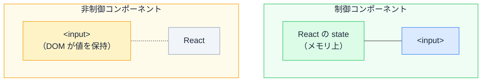
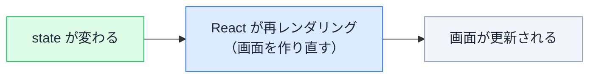
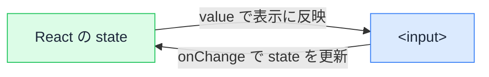
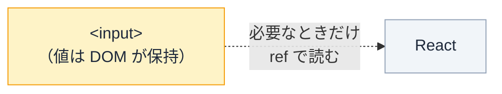

# Day 21: 制御と非制御コンポーネント

## 今日のゴール

- フォームの入力値の持ち主が「React の state」か「ブラウザ（DOM）」かの 2 通りあることを知る
- それぞれの仕組みと、なぜ 2 通りあるのかを知る
- どちらをいつ選ぶか、判断の軸を持つ

## フォームの値は誰が持つか

素の HTML では、`<input>` を置くだけで文字が打てます。

```html
<label for="name">名前</label>
<input id="name" type="text" />
```

値はブラウザが覚えてくれます。JavaScript を 1 行も書かなくても、入力できて、送信時にはその値が送られます。

つまり素の HTML では、**値の持ち主はブラウザ**です。

React では、ここにもう一つの選択肢が加わります。**値を React の state で持つ**というやり方です。

- 値の持ち主を **React の state** にする → **制御コンポーネント**
- 値の持ち主を **ブラウザ（DOM）** のままにする → **非制御コンポーネント**



制御では値が React のメモリ上（state）にあり、input と常に同期します。非制御では値は DOM の中にあり、React は必要なときだけ読みに行きます。

state で持つ選択肢がある理由は、React の画面更新の仕組みに関係しています。

このあと何度も出てくる **state（ステート）** とは、React が画面のために覚えておく値のことです（後で出てくる `useState` で作ります）。「今の入力文字」「今のカウント数」など、画面に映る素になるデータと考えてください。

> **React の画面が更新されるのは、state が変わったときだけ。**



逆に言うと、**入力しただけでは、state が変わらない限り React は画面を作り直しません**。

だから入力値を使って画面の別の場所を変えたければ、入力値を state に入れる必要があります。これが、制御コンポーネントが存在する理由です。

## 制御コンポーネント — 値を state で持つ

入力値を React の state で持つやり方です。



- `value={text}` … state の値を input の表示に反映する（state → input）
- `onChange` … 入力されるたびに state を更新する（input → state）

```tsx
import { useState } from "react";

export default function NameField() {
  const [text, setText] = useState("");

  return (
    <>
      <label htmlFor="name">名前</label>
      <input
        id="name"
        type="text"
        value={text}                              // state → input
        onChange={(e) => setText(e.target.value)} // input → state
      />
      <p>入力中の文字数: {text.length}</p>
    </>
  );
}
```

`useState` は「今の値（`text`）」と「それを更新する関数（`setText`）」のペアを返します。

`onChange` の `e.target.value` が、いま入力された文字列です。それを `setText` に渡して state を更新しています。

### デモ

<div class="day21-demo" id="day21-ctrl-demo">
  <label class="day21-label" for="day21-ctrl-input">制御された入力欄</label>
  <input class="day21-input" id="day21-ctrl-input" type="text" placeholder="ここに入力" oninput="
    var v = this.value;
    document.getElementById('day21-ctrl-state').textContent = v === '' ? '(空)' : v;
    document.getElementById('day21-ctrl-count').textContent = v.length;
  " />
  <div class="day21-readout">
    <div>state の中身: <span class="day21-badge" id="day21-ctrl-state">(空)</span></div>
    <div>文字数: <span class="day21-badge" id="day21-ctrl-count">0</span></div>
  </div>
  <p class="day21-note">打つたびに state が書き換わり、その state から文字数が計算し直されます（React の動きを再現したものです）。</p>
</div>

値が state にあるので、入力に合わせて画面の別の場所を変えられます。

- 入力欄の下に「あと 10 文字」をリアルタイム表示
- メールとパスワードが埋まるまでボタンをグレーアウト
- 電話番号を打つと `090-1234-5678` に自動整形
- 検索欄に打つたびに候補を絞り込み

これらはすべて、**入力値が state にあるから実現できる**挙動です。

### `onChange` が無いと入力が固まる

`value` だけ書いて `onChange` を書かないと、**入力しても文字が変わりません**。

```tsx
// onChange が無い → 打っても変わらない
<input value={text} />
```

React は input の表示を、常に `value`（つまり state の値）に**固定します**。

`onChange` で state を更新していないので、state はずっと空のまま。だから何を打っても、表示は空に固定されたまま変わりません。

<div class="day21-demo" id="day21-frozen-demo">
  <label class="day21-label" for="day21-frozen-input">value だけ・onChange なし</label>
  <input class="day21-input" id="day21-frozen-input" type="text" value="編集できない" oninput="this.value='編集できない';" />
  <p class="day21-note">実際の React では、再レンダリング時に state の値で表示が上書きされるため入力が固まります。上のデモはその挙動を簡易的に模したものです。</p>
</div>

**React が `value` を握ると、入力欄の表示を完全に支配する**。だから `value` と `onChange` はセットで要るのです。

## 非制御コンポーネント — 値を DOM に任せる

入力値を state で持たず、ブラウザ（DOM）に任せるやり方です。

**DOM** とは、ブラウザが画面を組み立てるために内部で持っている要素の集まりのことです。`<input>` もその一つで、入力された文字を自分で覚えています。

このやり方では React は入力値を追いかけません。必要になったとき（多くは送信時）に、`ref` 経由で読みに行きます。



- `defaultValue` … 初期値だけ渡す（その後は DOM に任せる）
- `ref` … input 要素そのものに触れるための「取っ手」。`inputRef.current` がその input を指し、`.value` で今の入力値を読める

```tsx
import { useRef, type FormEvent } from "react";

export default function NameForm() {
  // <HTMLInputElement> は「この ref が指す先は input 要素」という型指定
  const inputRef = useRef<HTMLInputElement>(null);

  function handleSubmit(e: FormEvent<HTMLFormElement>) {
    e.preventDefault();
    // 送信時に値を読む
    alert(inputRef.current?.value);
  }

  return (
    <form onSubmit={handleSubmit}>
      <label htmlFor="name">名前</label>
      <input id="name" type="text" defaultValue="" ref={inputRef} />
      <button type="submit">送信</button>
    </form>
  );
}
```

### デモ

入力中、React はこの値を知りません。「読む」を押した瞬間に、初めて DOM から取り出します。

<div class="day21-demo" id="day21-unctrl-demo">
  <label class="day21-label" for="day21-unctrl-input">非制御の入力欄</label>
  <input class="day21-input" id="day21-unctrl-input" type="text" placeholder="自由に入力" />
  <div class="day21-readout">
    <button type="button" class="day21-btn" onclick="
      var v = document.getElementById('day21-unctrl-input').value;
      document.getElementById('day21-unctrl-read').textContent = v === '' ? '(空)' : v;
    ">読む（送信のイメージ）</button>
    <div>読み取った値: <span class="day21-badge" id="day21-unctrl-read">(まだ読んでいない)</span></div>
  </div>
  <p class="day21-note">入力中は React に値が伝わりません。ボタンを押した瞬間だけ、DOM から取り出します。</p>
</div>

### 非制御の制約

非制御では、**入力に合わせて画面の別の場所を変えることができません**。

文字数のリアルタイム表示、ボタンの活性化、入力値の自動整形。制御セクションで挙げた挙動は、どれも非制御では実現できません。

理由は大前提に戻ります。

1. 打つ → 変わるのは **DOM の中の値だけ**
2. **state は変わっていない**
3. state が変わらない → **再レンダリングが起きない**
4. 再レンダリングが起きない → **画面の他の場所は作り直されない**

ただし、入力欄に文字が表示されること自体は非制御でも起きます。これはブラウザの標準機能であり、React の再レンダリングとは別の話です。

| 何が変わるか | 担当 | 非制御で変わる？ |
|---|---|---|
| 入力欄そのものの文字 | ブラウザの標準機能 | **変わる** |
| 画面の他の場所（文字数・ボタン・別の欄） | React の再レンダリング | **変わらない** |

## 使い分けの基準

どちらが正解ということはありません。判断の軸は一つです。

> **入力に合わせて、画面の別の場所を変えたいか？**

- 検索ボックスで打つたびに候補を出す → 画面が変わる → **制御**
- 名前と住所を入力して送るだけ → 画面を変える必要がない → **非制御でも足りる**

実務では、フォームを `useState` で 1 つずつ組むことは少なく、**React Hook Form** のようなフォームライブラリを使うのが一般的です。フォームには値の管理以外にもやることが多く（入力チェック、エラー表示、送信中の状態、多数の欄のとりまとめ）、ライブラリがそれらをまとめて引き受けてくれます。

React Hook Form の内部は、ここで学んだ知識でそのまま理解できます。

`register` は input を非制御的に登録し（ref で値を集める）、`Controller` は特定の欄だけ制御的に扱います。**基本を非制御にして再レンダリングを抑えつつ、必要な欄だけ制御にする**という使い分けを、ライブラリが内部でやっています。

## まとめ

- 制御: 値を state で持つ（`value` + `onChange`）
- 非制御: 値を DOM に任せる（`defaultValue` + `ref`）
- 非制御で文字が出るのはブラウザの標準機能で、画面の他の場所は変わらない
- 使い分けは「入力に合わせて画面を変えるか」で決める

<style>
.day21-demo {
  border: 1px solid #e2e8f0;
  border-radius: 10px;
  padding: 16px;
  margin: 1.2em 0;
  background: #f8fafc;
  color: #1e293b;
}
.day21-label {
  display: block;
  font-size: 13px;
  font-weight: 700;
  color: #475569;
  margin-bottom: 6px;
}
.day21-input {
  width: 100%;
  max-width: 360px;
  box-sizing: border-box;
  padding: 8px 12px;
  font-size: 15px;
  border: 1px solid #cbd5e1;
  border-radius: 6px;
  background: #ffffff;
  color: #1e293b;
}
.day21-input:focus {
  outline: 2px solid #3b82f6;
  outline-offset: 1px;
  border-color: #3b82f6;
}
.day21-readout {
  display: flex;
  flex-wrap: wrap;
  align-items: center;
  gap: 12px;
  margin-top: 12px;
  font-size: 14px;
  color: #1e293b;
}
.day21-badge {
  display: inline-block;
  padding: 2px 8px;
  border-radius: 4px;
  background: #dcfce7;
  color: #166534;
  font-family: monospace;
  font-weight: 600;
}
.day21-btn {
  padding: 6px 14px;
  font-size: 14px;
  border: none;
  border-radius: 6px;
  background: #3b82f6;
  color: #ffffff;
  cursor: pointer;
}
.day21-btn:hover { background: #2563eb; }
.day21-note {
  font-size: 13px;
  color: #475569;
  margin: 10px 0 0;
}
</style>
