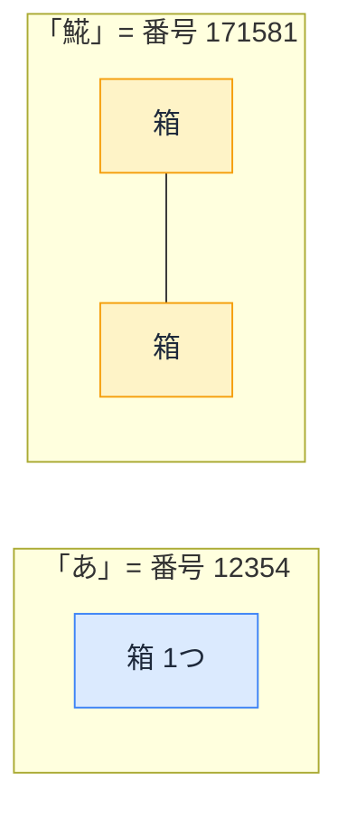

# Day 22: 文字数カウントの罠 — `"👍🏽".length` が 4 になる理由

## 今日のゴール

- `.length` が「見た目の文字数」と一致しない場合があることを知る
- 自由入力か形式固定かで、対応が必要な場面を判断できる
- AI に的確に指示し、返ってきたコードの違和感に気づける

## 「残り 140 文字」表示の裏側

X（旧 Twitter）などで投稿するとき、入力欄の隅に「残り 140」のような文字数の表示が出るのを見たことがあるはずです。絵文字をいくつか入れたら、思ったより一気に減った、という経験はないでしょうか。

あの「文字を数える」処理を、いざ自分（や AI）が作るとどうなるか。AI に「入力を 10 文字以内に制限して」と頼むと、こんなコードが返ってきます。

```typescript
if (text.length > 10) {
  alert("10文字以内で入力してください");
}
```

一見、正しそうです。ところが、次のような入力では意図どおりに動きません。

```typescript
"👍🏽".length      // → 1 ...ではなく 4
"𩸽定食".length     // → 3 ...ではなく 4
```

見た目は 1 つの「いいね」絵文字が 4、見た目 3 文字の「𩸽（ほっけ）定食」が 4。`.length` は、あなたが思う「文字数」を数えていません。

なぜこうなるのか。その答えは、コンピュータが文字をどう扱っているかにあります。

::: tip 普通の日本語や英数字なら問題ない
先に安心してほしいのですが、「あいうえお」や「Hello」のような普通のテキストでは `.length` はちゃんと見た目どおりの数を返します。ズレるのは一部の漢字や絵文字だけです。「`.length` が壊れている」わけではありません。
:::

## 文字の正体は「番号」

コンピュータは、文字を直接理解しません。内部では、すべての文字に**番号**を振って管理しています。

| 文字 | 番号 |
|---|---|
| A | 65 |
| a | 97 |
| あ | 12354 |
| 𩸽 | 171581 |
| 🍣 | 127843 |

この「どの文字にどの番号を振るか」を決めた世界共通の表が **Unicode（ユニコード）** です。日本語、中国語、アラビア文字、絵文字まで、約 16 万の文字に番号が割り当てられています。

## `.length` が数えるのは「箱の数」

番号が決まったとして、その番号をコンピュータのメモリにどう保存するか。JavaScript は内部で **UTF-16** という方式を使っています。

UTF-16 の仕組みはシンプルです。

- 基本単位は「**箱**」（16 ビット。16 ビットで表せる最大値が 65535 なので、1 つの箱には **0〜65535** の番号が入る）
- 番号が 65535 以下の文字 → **箱 1 つ**で収まる
- 番号が 65535 を超える文字 → **箱 2 つ**で表す（この 2 つ組を**サロゲートペア**と呼ぶ）



そして `.length` は、**この箱の数**を返します。見た目の文字数ではありません。

| 文字 | 見た目 | 箱の数 | `.length` |
|---|---|---|---|
| `"abc"` | 3 文字 | 3 | 3 |
| `"あいう"` | 3 文字 | 3 | 3 |
| `"𩸽"` | 1 文字 | **2**（サロゲートペア） | **2** |
| `"𩸽定食"` | 3 文字 | 2 + 1 + 1 = **4** | **4** |

「あ」(番号 12354) は 65535 以下なので箱 1 つ。`.length` も 1。ズレません。「𩸽」(番号 171581) は 65535 を超えるので箱 2 つ。`.length` は 2。ここでズレます。

**普通の日本語（ひらがな・カタカナ・常用漢字）と英数字はすべて 65535 以下** なので、箱 1 つに収まります。`.length` で困ることはまずありません。

ズレるのは、**絵文字**や「𠮷」のような一部の珍しい漢字です。

- 「﨑」「髙」のような旧字体は 65535 以下なのでズレない
- 旧字体だから危険なのではなく、番号が大きい文字だけが危険

## さらにズレる絵文字

絵文字は、見た目 1 つでも箱がどんどん増えます。3 段階で見てみましょう。

**① 単体の絵文字 → 箱 2 つ**

🍣 も 😀 も 👍 も、**多くの絵文字は番号が 65535 を超える**ため、単体でも箱 2 つ（サロゲートペア）です。SNS やチャットで絵文字が当たり前に使われる今、サロゲートペアは「珍しい特殊ケース」ではありません。

**② 肌の色付き 👍🏽 → 箱 4 つ**

肌の色を変えた絵文字は、**絵文字本体（👍）＋肌色の指定（🏽）** という 2 つの文字でできています。どちらも箱 2 つなので、合計 4。

```typescript
"👍🏽".length  // → 4  (👍 の箱2 + 🏽 の箱2)
```

見た目は 1 つの「いいね」なのに、`.length` は 4。フラグ絵文字（🇯🇵 など）も 2 つの文字の組み合わせで、同じく箱 4 つです。

**③ 家族の絵文字 👨‍👩‍👧‍👦 → 箱 11 個**

家族のような複合絵文字は、**複数の絵文字を見えない接着文字（ZWJ）でくっつけた**ものです。

```
👨 + 接着 + 👩 + 接着 + 👧 + 接着 + 👦
```

各絵文字が箱 2 つ、接着文字が箱 1 つ。合計すると:

```typescript
"👨‍👩‍👧‍👦".length  // → 11  (2+1+2+1+2+1+2)
```

見た目は 1 つなのに `.length` は 11。絵文字は組み立て方によって、箱の数がここまで膨らみます。

## どんな場面で問題になるか

`.length` のズレが実際にバグになるのは、**ユーザーが自由に文字を入力できるフィールド**で文字数に関わる処理をしているときです。自由入力には絵文字だけでなく、旧字体・異体字（サロゲートペアの漢字）も入ってきます。自由入力なら対応は基本必須、と考えてください。

### 問題になる場面

- **文字数制限**（`maxlength` 属性や JavaScript のバリデーション）で、絵文字を入力すると見た目より多く消費してしまう（`maxlength` も `.length` と同じ UTF-16 単位で数えるので、両者は一貫している）
- **文字列の切り取り**（`slice` / `substring`）で、サロゲートペアの途中で切ると文字化けする

```typescript
const name = "𩸽定食";
name.slice(0, 1)  // → "�" (壊れた文字。サロゲートペアの片割れ)
```

これを正しく切る方法は、次の「正しく数える方法」で扱います。

### 問題にならない場面

- 入力の**形式が固定**されているフィールド（電話番号・郵便番号＝数字、社員番号＝英数字、数量・金額＝数値、選択式・ドロップダウン）
- 文字数を数える必要がない処理

**ポイントは「自由入力かどうか」です。**

- 氏名・住所・コメント・プロフィールのような自由入力は、絵文字や「𠮷」のようなサロゲートペアの漢字が来うるので対応が必要
- 数字や選択肢しか入らない形式固定のフィールドは気にしなくて OK

「住所は普通の日本語だから安全」という思い込みが、まれな漢字や絵文字で足をすくいます。

## 正しく数える方法

数え方には段階があります。**箱を数える**（`.length`）、**番号を数える**（スプレッド構文）、**見た目のまとまりを数える**（`Intl.Segmenter`）の 3 つです。見た目どおりに数えたいなら、答えは最後の `Intl.Segmenter` です。

### Intl.Segmenter（見た目どおりに数える）

人間が 1 文字と感じるまとまり（**書記素**、grapheme と呼びます）で分割します。

```typescript
const segmenter = new Intl.Segmenter("ja", { granularity: "grapheme" });
const count = [...segmenter.segment("👨‍👩‍👧‍👦")].length;
// → 1 ✓
```

ZWJ 絵文字も正しく 1 として数えます。現在のモダンブラウザと Node.js で利用できます。

### スプレッド構文（サロゲートペアだけ直す）

```typescript
[..."𩸽定食"].length        // → 3 ✓
[..."👨‍👩‍👧‍👦"].length        // → 7 （ZWJ 絵文字は分かれてしまう）
```

`[...str]` や `Array.from()` は、Unicode の番号 1 つを 1 要素として数えます（箱 2 つを番号 1 つに戻すイメージ）。サロゲートペアのズレは直りますが、ZWJ 絵文字は見た目どおりにはなりません。

先ほどの「`slice` で文字化け」も、いったん配列にしてから切れば壊れません。

```typescript
[..."𩸽定食"].slice(0, 1).join("")  // → "𩸽" ✓ (途中で壊れない)
```

| 方法 | 数えるもの | `"𩸽"` | `"👍🏽"` | `"👨‍👩‍👧‍👦"` | 使いどころ |
|---|---|---|---|---|---|
| `.length` | 箱の数 | 2 | 4 | 11 | 普通の日本語・英数字なら十分 |
| `[...str].length` | 番号の数 | 1 | 2 | 7 | サロゲートペア対応が必要なとき |
| `Intl.Segmenter` | 見た目のまとまり | 1 | 1 | 1 | 絵文字を含む厳密な文字数制限 |

なお、見た目の文字数が常に正解とは限りません。サーバーやデータベースが別の単位で制限している場合は、フロントもそれに揃えるのが安全です。分からなければ「文字数制限の単位は何ですか？」とチームに確認しましょう。

## AI のコードのチェックリスト

AI に文字数に関わるコードを頼んだとき、このチェックリストで判断できます。

**1. そのフィールドは自由入力か？**

- 氏名、住所、コメント、プロフィール（自由入力）→ **絵文字も旧字体も来る。対応必須**
- 電話番号、社員番号、数量、選択式（形式が固定）→ **来ない。`.length` で OK**

**2. 自由入力なら、AI にこう伝える**

> 「文字数を見た目どおりに数えて。絵文字やサロゲートペアを考慮して」

この一言で、AI は `Intl.Segmenter` やスプレッド構文を使ったコードを返してくれます。

**3. AI のコードのここを見る**

- `.length` で直接バリデーション → 自由入力フィールドなら要注意
- `.slice()` や `.substring()` で文字列を切っている → サロゲートペアの途中で切れる可能性
- `Intl.Segmenter` やスプレッド構文を使っている → 絵文字対応済み

「何がズレるか」「サロゲートペアという名前」を知っていれば、AI への指示が一言で的確になります。

## まとめ

- **`.length` は見た目の文字数ではなく、箱（UTF-16 の単位）の数**
- ズレるのは絵文字や一部の漢字（𠮷 など）、普通の日本語・英数字は箱 1 つ
- `slice` もズレるので、配列にしてから切る
- 見た目どおり数えるなら `Intl.Segmenter`（書記素単位）
- 自由入力は対応必須、AI には「絵文字やサロゲートペアを考慮して」と伝える
