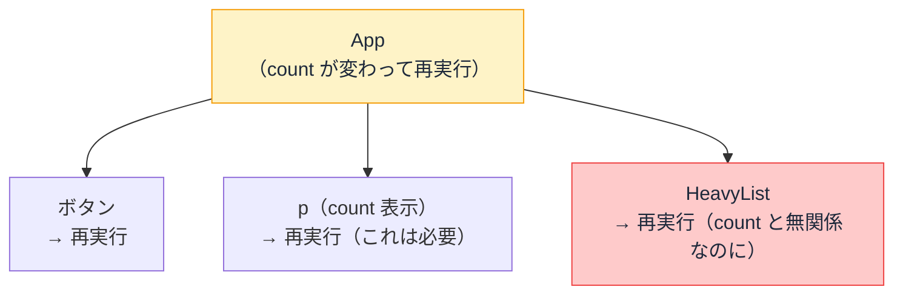
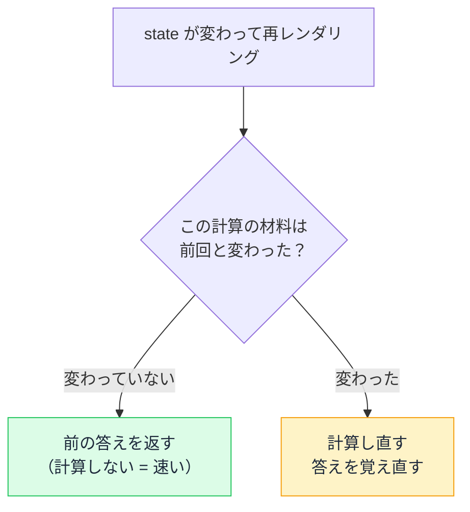

# Day 23: 再レンダリングと手動メモ化 — useMemo / useCallback / React.memo

## 今日のゴール

- 再レンダリングの連鎖で不要な再計算が起きる仕組みを知る
- useMemo / useCallback / React.memo の役割の違いを知る
- useCallback は React.memo とセットで効くという関係を知る

## useMemo / useCallback とは何か

React のコードを見ていると、`useMemo` や `useCallback` という API が出てきます。これらはすべて**メモ化**（前と同じ材料なら計算をやり直さない仕組み）のための、パフォーマンス最適化の道具です。

先に結論を言うと、**普段のコードで多用するものではありません**。React の再レンダリングは十分に速く、メモ化なしでも普通に動きます。

ただし、コードに出てきたときに「何をしているか」が読めないと困るので、仕組みを理解しておく価値があります。

まず、そもそもなぜこんな道具が存在するのか。React の**再レンダリング**の仕組みから見ていきます。

## 再レンダリングの連鎖

React のコンポーネントの実体は関数です。

React は状態（state）が変わるとコンポーネント関数を再実行して、新しい画面を組み立てます。この再実行を**再レンダリング**と呼びます。

```tsx
import { useState } from "react";

function App() {
  const [count, setCount] = useState(0);

  return (
    <div>
      <button onClick={() => setCount(count + 1)}>+1</button>
      <p>{count}</p>
      {/* HeavyList は重い処理をする一覧コンポーネントとする */}
      <HeavyList />
    </div>
  );
}
```

`count` が変わると `App` が再レンダリングされます。問題は `<HeavyList />`。

`count` とは無関係なのに、親である `App` が再レンダリングされるたびに一緒に再レンダリングされます。

**親が再レンダリングされると、子も全部再レンダリングされる**。これが**再レンダリングの連鎖**です。



ここで「再レンダリング」の意味を正確にしておきます。

React の再レンダリングとは、**コンポーネント関数を再実行して、新しい画面の設計図（JSX）を作り直すこと**です。作り直した設計図を前回の設計図と比べて、**変わった部分だけを実際のブラウザの画面に反映する**のは、その次のステップです。

つまり、再レンダリングされても最終的な画面の書き換えは最小限で済みます。しかし、コンポーネント関数の再実行そのものにはコストがかかります。

関数の中に重い計算があれば、設計図を作るたびにその計算が走る。コンポーネントが多ければ、「どこが変わったか」の比較自体にも時間がかかります。

## 再レンダリングで何が無駄になるか

### 無関係な計算の繰り返し

```tsx
import { useState } from "react";

type Product = { id: number; name: string; price: number };

function Dashboard({ items }: { items: Product[] }) {
  const [selectedId, setSelectedId] = useState<number | null>(null);

  // selectedId が変わるだけで、合計金額の計算も毎回やり直しになる
  const totalPrice = items.reduce((sum, item) => sum + item.price, 0);

  return (
    <div>
      <p>合計: ¥{totalPrice.toLocaleString()}</p>
      <ul>
        {items.map(item => (
          <li
            key={item.id}
            onClick={() => setSelectedId(item.id)}
            style={{ fontWeight: selectedId === item.id ? "bold" : "normal" }}
          >
            {item.name}
          </li>
        ))}
      </ul>
    </div>
  );
}
```

一覧の中から 1 つを選ぶだけで `selectedId` が変わって再レンダリングが起き、**合計金額の計算まで毎回やり直し**になります。

選択と合計金額は無関係なのに、関数の中にあるというだけで巻き込まれる。データが数万件あれば、1 クリックのたびに数万件の合計を再計算することになります。

### 無関係な子コンポーネントの巻き込み

もう 1 つの無駄は、子コンポーネントの巻き込みです。

```tsx
function App() {
  const [count, setCount] = useState(0);

  return (
    <div>
      <button onClick={() => setCount(count + 1)}>+1</button>
      <p>{count}</p>
      <HeavyList />
    </div>
  );
}

function HeavyList() {
  // 数千件のデータを整形して表示する重い処理
  return <ul>{/* ... */}</ul>;
}
```

`count` を +1 するたびに `App` が再レンダリングされます。

このとき、**`App` の関数が再実行される = 関数の中身がすべて再評価される = `<HeavyList />` の呼び出しも再実行される**。`HeavyList` は `count` を一切使っていないのに、親の関数の中にいるというだけで毎回巻き込まれます。

React は「この子は親の state を使っていないから省略しよう」という判断を、既定では**しません**。

親が再レンダリングされたら子も全部再レンダリングする。それが既定の動作です。

この 2 種類の無駄を解決するのが**メモ化**です。

## メモ化 — 前と同じならやり直さない

メモ化は、一言で言うと「**前と同じ材料なら、計算し直さずに前の答えをそのまま返す**」仕組みです。

合計金額の例で言えば、計算の材料は `items` だけです。

`selectedId` が変わっても `items` が変わっていないなら、**合計金額の答えは前と同じ**。だったら計算し直す必要はありません。



React はこの仕組みを 3 つの API で提供しています。

| API | 何をメモ化するか | やること |
|-----|----------------|---------|
| `useMemo` | **計算結果** | 依存配列が変わらなければ前回の値を返す |
| `useCallback` | **関数** | 依存配列が変わらなければ前回の関数を返す |
| `React.memo` | **コンポーネント** | props が変わらなければ再レンダリングをスキップ |

表の中の **props** は、親から子コンポーネントに渡される値のことです。

## useMemo: 重い計算をキャッシュ

第 2 引数の配列（**依存配列**）に「この値が変わったら再計算する」という条件を指定します。先ほどの合計金額の例なら、こう変わります。

```tsx
// items が変わったときだけ合計を計算し直す。selectedId の変化では再計算しない
const totalPrice = useMemo(
  () => items.reduce((sum, item) => sum + item.price, 0),
  [items],
);
```

これで一覧の項目を選択しても、合計金額の計算は再実行されなくなります。

## React.memo: 子の再レンダリングをスキップ

コンポーネントを `memo` で包むと、親が再レンダリングされても「props が前回と同じなら、自分の再レンダリングをスキップする」ようになります。

```tsx
import { useState, memo } from "react";

// props の items が前回と同じなら再レンダリングしない
const HeavyList = memo(function HeavyList({ items }: { items: string[] }) {
  return (
    <ul>
      {items.map(item => (
        <li key={item}>{item}</li>
      ))}
    </ul>
  );
});

function App({ items }: { items: string[] }) {
  const [count, setCount] = useState(0);

  return (
    <div>
      <button onClick={() => setCount(count + 1)}>+1</button>
      <p>{count}</p>
      <HeavyList items={items} />
    </div>
  );
}
```

これで `count` が変わっても `HeavyList` は再レンダリングされなくなります。

`React.memo` が見るのは props だけなので、仮に `HeavyList` の中で `useState` を使っていても問題ありません。自分の state が変わったときは通常どおり再レンダリングされ、親から巻き込まれる再レンダリングだけがスキップされます。

## useCallback: React.memo を関数で壊さないため

`React.memo` には注意点があります。props に関数を渡すと、メモ化が効かなくなるのです。

```tsx
function App({ items }: { items: string[] }) {
  const [count, setCount] = useState(0);

  // 再レンダリングのたびに「新しい関数」が作られる
  const handleSelect = (id: string) => {
    console.log(id);
  };

  return (
    <div>
      <button onClick={() => setCount(count + 1)}>+1</button>
      <HeavyList items={items} onSelect={handleSelect} />
    </div>
  );
}
```

（`HeavyList` は先ほどの `memo` 版に、`onSelect` という関数の props を追加したものとします）

JavaScript では、関数は作るたびに別のオブジェクトになります。中身が同じでも `前回の handleSelect === 今回の handleSelect` は `false` です。

`React.memo` は props を前回と比較して判断するので、「props が変わった」と見なされ、メモ化が無効になります。

これを防ぐのが `useCallback` です。依存配列が変わらない限り、前回と同じ関数を返し続けます。

```tsx
const handleSelect = useCallback((id: string) => {
  console.log(id);
}, []);
```

つまり `useCallback` は単体で再レンダリングを減らすものではなく、**`React.memo` とセットで初めて効果が出ます**。この関係を知らずに `useCallback` だけ書いても、何も速くなりません。

## メモ化は「まず計測してから」の道具

ここまでメモ化の仕組みを見てきましたが、最も大事なことを最後に伝えます。**手動メモ化は、多用するものではありません**。

React の再レンダリングは十分に速く設計されています。普通のアプリでは、メモ化なしでも問題なく動きます。

`useMemo` や `useCallback` を予防的にあちこちに入れると、コードが複雑になるだけで、かえって読みにくくなります。

React の公式ドキュメントも「useMemo をどこにでも入れるべきか？」に対して**明確に No** と答えています。使うべきタイミングは 1 つだけです。

> **実際に画面が遅いと感じたら、計測して、遅い箇所にだけ入れる。**

開発者ツールの Profiler で「どのコンポーネントの再レンダリングに何ミリ秒かかっているか」を計測し、**1ms 以上かかっている計算**を見つけたときに初めて `useMemo` を検討する。それが React 公式の推奨する使い方です。

なお、React Compiler（次回のテーマ）が導入されれば、この判断自体が不要になります。コンパイラが必要な箇所を自動で見つけてメモ化するので、手動で書く場面はさらに減っていきます。

## まとめ

- 親の再レンダリングは子に連鎖し、関数の中のすべての処理が再実行される
- `useMemo` は計算、`useCallback` は関数、`React.memo` はコンポーネントのキャッシュ
- `useCallback` は `React.memo` とセットで初めて効く
- **手動メモ化はマイクロチューニング**で、計測して遅い箇所にだけ入れる道具であり、予防的に多用しない
