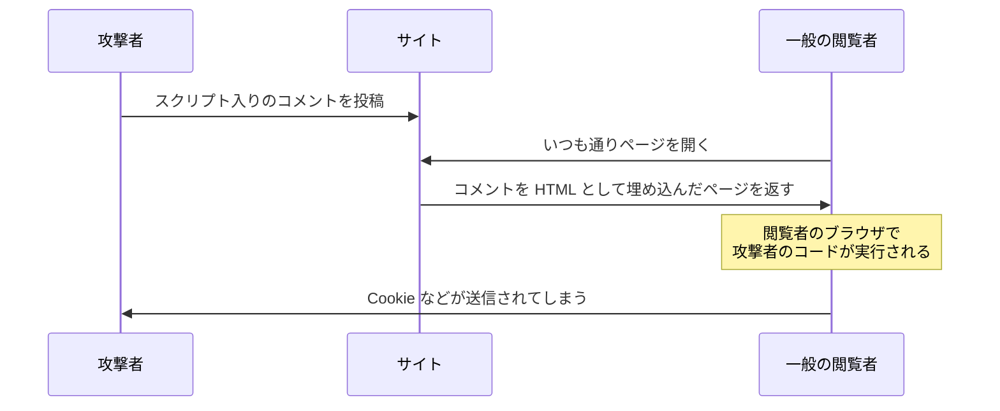

# Day 26: XSS — 入力欄に書いた文字がコードになる

## 今日のゴール

- XSS が「ユーザーの入力が他人のブラウザでコードとして動く」事故だと知る
- エスケープが防御の基本であり、React はそれを自動でやっていると知る
- 自動の防御が効かなくなる書き方を認識できるようになる

## 1 行のコメントでアカウントが乗っ取られる

コメント欄のあるサイトを想像してください。ある日、こんなコメントが投稿されます。

```html
いい記事ですね！
```

一見すると感想の後ろに `` タグが付いているだけです。しかしサイト側がこの文字列を**そのまま HTML として**ページに埋め込むと、恐ろしいことが起きます。

1. ブラウザが `` を読み、画像 `x` を取りにいく
2. `x` は存在しないので読み込みエラーになる
3. `onerror` が発火し、中に書かれた JavaScript が**閲覧者のブラウザで実行される**
4. `document.cookie`（ログイン情報を含む）が攻撃者のサーバーに送られる

このコメントを表示した**すべての閲覧者**が被害を受けます。怪しいサイトを踏んだわけでもなく、いつものサイトでコメントを 1 件見ただけで、ログイン状態が盗まれる。これが **XSS**（クロスサイトスクリプティング）です。

XSS には攻撃コードの経路によって 3 つの型があります。

| 型 | 経路 |
|---|---|
| **格納型**（Stored） | 攻撃コードがサーバーに保存され、閲覧者が見るたびに実行される |
| **反射型**（Reflected） | 攻撃コードが URL のパラメータに仕込まれ、サーバーがそのまま返すと実行される |
| **DOM 型**（DOM-based） | サーバーを経由せず、クライアントの JavaScript がユーザー入力を HTML に書き込んで発生する |

冒頭の例は格納型で、最も危険です。どの型でも原因は同じです。ユーザー入力が HTML や JavaScript として解釈されてしまうことです。



## なぜ「文字」が「コード」になるのか

根本の原因は、**HTML がデータと命令を同じ文字列で表現している**ことです。

```html
<p>こんにちは</p>
```

この中の「こんにちは」はデータ（表示するテキスト）で、`<p>` は命令（段落にせよ）です。ブラウザは `<` を見たら命令の始まりだと解釈します。

ユーザーの入力に `<script>` や `` が含まれていて、それがそのまま HTML に埋め込まれると、ブラウザはデータのつもりで受け取った文字列を**命令として解釈してしまう**。これが XSS の本質です。

## エスケープによる防御

対策もシンプルです。`<` を `&lt;` に、`>` を `&gt;` に変換すれば、ブラウザは命令ではなくただの文字として表示します。この変換を**エスケープ**と呼びます。

```
入力: 
↓ エスケープ
出力: &lt;img src=&quot;x&quot; onerror=&quot;alert(1)&quot;&gt;
```

画面には `` という**文字がそのまま見える**だけで、タグとしては解釈されません。

フレームワークを使わない素の HTML では、出力するすべての場所で開発者が自分でエスケープする必要がありました。1 か所でも漏れれば XSS が成立します。

## React の自動エスケープ

React はこの問題を、**デフォルトで全部エスケープする**という設計で解決しました。

```tsx
// comment.body に  が入っていても安全
<p>{comment.body}</p>
```

JSX の `{}` に入れた文字列は、React が必ずテキストとして描画します。タグとして解釈されることはありません。開発者がエスケープを意識しなくても、普通に書いている限り XSS はほぼ成立しません。

## 自動の防御が効かなくなる書き方

逆に危ないのは、**この防御を自分で外す瞬間**です。

### 1. dangerouslySetInnerHTML

React には、エスケープせずに HTML として挿入する API があります。

```tsx
// ❌ comment.body にユーザー入力が混ざるなら、XSS がそのまま成立する
<div dangerouslySetInnerHTML={{ __html: comment.body }} />
```

名前が `dangerously`（危険を承知で）と付いているのは、**React の防御の外に出る**からです。AI も Markdown の表示や CMS の記事埋め込みで、この API を使ってきます。

正当な用途もあります。自分たちで管理している CMS の記事など、**出どころが信頼できる HTML** を埋め込む場合です。その場合も、**サニタイズ**を通してから渡すのが定石です。エスケープは特殊文字をすべて無害な文字に置き換えます。サニタイズは HTML の構造は残しつつ、`<script>` や `onerror` など危険な部分だけを除去します。

```tsx
import DOMPurify from "dompurify";

<div dangerouslySetInnerHTML={{ __html: DOMPurify.sanitize(article.html) }} />
```

### 2. href に入るユーザー入力

もう 1 つ見落としがちなのが、リンク先です。

```tsx
// ❌ url がユーザー入力なら、"javascript:悪意あるコード" を仕込める
<a href={user.websiteUrl}>ウェブサイト</a>
```

`javascript:` で始まる URL は、クリックした瞬間にコードとして実行されます。タグを挿入していないのにスクリプトが動く、エスケープでは防げない経路です。ユーザー入力を `href` に使うなら、「`https://` で始まるものだけ許可する」という検証が必要です。

## まとめ

- XSS = ユーザー入力がそのまま HTML に埋め込まれ、他人のブラウザでコードとして動く事故
- 原因は HTML がデータと命令を同じ文字列で表現していること。防御の基本はエスケープ
- React は自動エスケープで守っている。危ないのは dangerouslySetInnerHTML と href のユーザー入力
