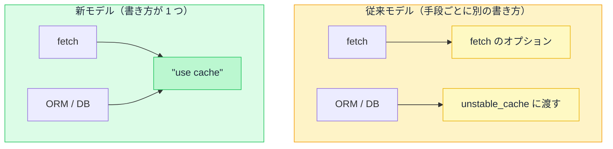

# Day 28: キャッシュの全体像 — 4 種類のキャッシュと 2 つのモデル

## 今日のゴール

- Next.js のキャッシュが 4 種類あると知る
- 制御モデルに従来と新の 2 つがあり、コードを読み分けられる
- 新モデルの背景に「ページ単位からコンポーネント単位へ」という流れがあると知る

## 4 種類のキャッシュ

Next.js のキャッシュは、役割の違う 4 種類に分かれています。まず、それぞれが何を保存するのかを見ておきます。

| キャッシュ | 何を保存するか | どこにあるか |
|-----------|--------------|------------|
| **Request Memoization** | 同じ取得の重複を 1 回にまとめた結果 | サーバー（1 リクエスト限り） |
| **Data Cache** | 取得したデータ | サーバー（永続） |
| **Full Route Cache** | データで組み立てた HTML | サーバー（永続） |
| **Router Cache** | 画面遷移用の表示データ | ブラウザ |

::: details 4 つの名前がピンとこないとき
- **Request Memoization**: 1 枚の画面を作る間に、同じ取得が何度も走らないよう 1 回にまとめる
- **Data Cache**: 取ってきたデータを保存して、次のアクセスでも使い回す
- **Full Route Cache**: 出来上がったページの HTML をまるごと保存しておく
- **Router Cache**: 一度開いたページの表示をブラウザが手元に持っておく（戻る・進むが速い）
:::

この 4 つは順番につながっています。データを取り、それを使って HTML を組み立て、できた画面をブラウザが持つ、という流れです。

前の段階が古ければ、その後ろも古くなります。

Request Memoization だけは 1 回の表示が終わると消えるので、古くなる心配がありません。残りの 3 つが、古くなったら捨てて取り直す対象になります。

## 従来モデルと新モデル

このうちサーバー側のキャッシュ（Data Cache と Full Route Cache）について、書き方の考え方が違う 2 つのモデルがあります（Next.js 16 時点）。どちらで動くかは、`next.config.ts` の 1 行で決まります。

```ts
// next.config.ts
import type { NextConfig } from "next";

const nextConfig: NextConfig = {
  cacheComponents: true, // true: 新モデル / false: 従来モデル（既定）
};

export default nextConfig;
```

`true` にするのは、機能を足すだけのスイッチではありません。`false` のときの仕組みの一部が、別の仕組みに置き換わります。

たとえば、`false` では Next.js が条件に応じてページを自動で静的化していましたが、`true` ではその自動判断はなくなり、`"use cache"` で明示する形に変わります。

::: details 「静的」「動的」とは
ページの HTML を作ることを**レンダリング**と呼びます。これをいつやるかで 2 つに分かれます。

- **静的**: あらかじめ 1 回だけ作っておき、できた HTML を全員に使い回す。速いが、内容は作った時点で固定される
- **動的**: アクセスのたびに作る。常に最新にできるが、毎回サーバーが処理するぶん重い
:::

この 2 つは対等ではありません。Next.js は従来モデルを「Caching (Previous Model)」と呼び、新しいモデルへ移ることをすすめています。

とはいえ従来モデルがなくなる時期は決まっておらず、今動いているプロジェクトの多くは従来モデルのままです。AI が生成するコードもどちらの書き方かはまちまちなので、両方を読めるようにしておきます。

## 何も指定しないときの挙動

まず、何も指定しないときにキャッシュされるかどうかが違います。

- **従来モデル**: Next.js が自動で判断する部分が残っています。条件がそろえばページを自動で静的化するなど、書かなくてもキャッシュが効くことがあります
- **新モデル**: 自動では何もキャッシュしません。`"use cache"` と書いたものだけがキャッシュされます

新モデルは「書かないかぎりキャッシュしない」をはっきりさせて、知らないうちにキャッシュが効いて困る、という事態を防いでいます。

## キャッシュの指示をどこに書くか

もう 1 つは、キャッシュの指示をどこに書くかです。同じ「商品一覧をキャッシュする」を、両モデルの最小のコードで並べてみます。

```tsx
// 従来モデル: fetch のオプションでキャッシュを指定する
async function getProducts() {
  const res = await fetch("https://api.example.com/products", {
    next: { revalidate: 3600 }, // 1 時間キャッシュ
  });
  return res.json();
}
```

```tsx
// 新モデル: 関数の先頭で "use cache" を宣言する
import { cacheLife } from "next/cache";

async function getProducts() {
  "use cache";
  cacheLife("hours"); // 鮮度は「時間」単位
  const res = await fetch("https://api.example.com/products");
  return res.json();
}
```

キャッシュの指示が、`fetch` のオプションから関数の先頭へ移っています。

従来モデルはキャッシュを `fetch` の呼び出し単位で指定するので、`fetch` を使わない取得（データベースに直接つなぐ ORM など）には `unstable_cache` という別の仕組みが必要でした。新モデルは関数やコンポーネントに付けるので、`fetch` でもデータベースでも同じ `"use cache"` で書けます。



## ページ単位からコンポーネント単位へ

新モデルの変更は、キャッシュだけの話ではありません。根っこにあるのは、**速い遅いやキャッシュする・しないを決める単位が、ページ全体から個々のコンポーネントへ小さくなった**ことです。

商品ページを例にします。1 枚のページに、性質の違う部分が混ざっています。

- ヘッダーや商品説明: 誰が見ても同じで、めったに変わらない
- 在庫数: 今この瞬間の値がほしい
- おすすめ商品: ログインしている人によって変わる

以前は、レンダリング方式を**ページごとに 1 つ**選んでいました。だから「在庫数だけは最新がほしい」だけでも、ページ全体を動的にするしかなく、使い回せるはずのヘッダーや商品説明まで毎回作り直していました。

1 つの動的な部分のために、ページ全体の速さを諦めていたわけです。

今は、**同じページの中で部分ごとに分けられます**。ヘッダーや商品説明は静的にして即座に返し、在庫数やおすすめだけを動的に後から届けられます。

どこを動的にするかは、`<Suspense>`（用意できるまで仮の表示を出して待つ React の仕組み）で囲んだ範囲で決めます。これがコンポーネント単位です。

```tsx
export default function ProductPage() {
  return (
    <main>
      <ProductDescription /> {/* 静的: すぐ表示される */}
      <Suspense fallback={<p>在庫を確認中…</p>}>
        <StockCount /> {/* 動的: 用意できたら差し替わる */}
      </Suspense>
    </main>
  );
}
```

ここで `ProductDescription` が静的なのは、非同期データを使っていないからです。だから `"use cache"` も `<Suspense>` も要りません。

在庫数のように非同期で取りに行く部分だけを `<Suspense>` で囲み、用意できるまで `fallback` を見せます。

`"use cache"`（前のセクションで見たキャッシュの宣言）も、この `<Suspense>` も、単位はコンポーネントです。ただし役割は別で、`"use cache"` は「結果をキャッシュして使い回すか」、`<Suspense>` は「用意できるまで何を見せるか」を決めます。

新モデルでは、すぐに用意できない非同期データを表示する部分は `<Suspense>` で囲むのが基本です。これはキャッシュを使うかどうかと関係なく、キャッシュを全く使わないプロジェクトでも必要になります。

## 再検証の流れは共通

モデルが違っても、再検証（キャッシュを捨てて新しく取り直させること）の流れは同じです。データを更新したあと、キャッシュを捨てる関数を呼びます。

関数や引数はモデルで多少違いますが（新モデルには即時反映の `updateTag` などが加わりました）、「更新したら捨てる」という組み立てはどちらも変わりません。

## まとめ

- キャッシュは 4 種類ある（Memoization / Data / Full Route / Router）
- 従来モデルは `fetch` ごとに指定、新モデルは `"use cache"` に統一（`cacheComponents` の 1 行で切替）
- 新モデルの背景は「ページ単位からコンポーネント単位へ」。キャッシュしない非同期データは `<Suspense>` で囲む
