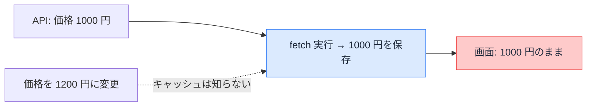

# Day 30: データキャッシュ — 取得したデータを使い回す

## 今日のゴール

- データキャッシュが「取得結果をサーバーに保存する仕組み」だと知る
- `fetch` のオプションでキャッシュを宣言することを知る
- 再検証でキャッシュを消すと、次のアクセスで取り直されると知る

::: info このレッスンは従来モデル
`cacheComponents` を有効にしていない従来モデルの書き方です。新モデル（`cacheComponents: true`）では `"use cache"` に置き換わります（別レッスンで扱います）。
:::

## 毎回データを取りに行くページ

商品一覧のように、外部の API からデータを取って表示するページを考えます。素直に書くと、こうなります。

```tsx
// app/products/page.tsx
export default async function ProductsPage() {
  const res = await fetch("https://api.example.com/products");
  const products = await res.json();
  return <ProductList products={products} />;
}
```

このページは**アクセスのたびに毎回 API を叩きます**。表示は常に最新ですが、見る人が増えるほど API へのリクエストも増えます。

人気のページほど、データ元への負荷が積み上がります。

データが頻繁には変わらないのに毎回取りに行くのは無駄です。ここで使うのが**キャッシュ**、「一度取った結果を保存して使い回す」仕組みです。

## fetch のオプションでキャッシュする

Next.js は `fetch` を拡張していて、キャッシュの指定を**オプションで宣言**できます。`fetch` はデフォルトではキャッシュされないので、キャッシュしたいときに明示します。

先ほどのページから取得部分を `lib/products.ts` に切り出し、そこにキャッシュの指定を足します。

```tsx
// lib/products.ts
export async function getProducts() {
  // 1 時間は保存した結果を使い回す
  const res = await fetch("https://api.example.com/products", {
    next: { revalidate: 3600 },
  });
  if (!res.ok) throw new Error("取得に失敗しました");
  return res.json();
}
```

ページ側は、この `getProducts()` を呼ぶだけになります。

```tsx
// app/products/page.tsx
import { getProducts } from "@/lib/products";

export default async function ProductsPage() {
  const products = await getProducts();
  return <ProductList products={products} />;
}
```

`next: { revalidate: 3600 }` は「この結果は 3600 秒（1 時間）使い回してよい」という宣言です。

最初の 1 回だけ API を叩き、その結果を**サーバーに保存**します。次からは保存した結果を返し、1 時間たったら次のアクセスで取り直します。

時間で区切らず、再検証するまでずっと使い回したいときは `cache: "force-cache"` を指定します。`force-cache` は明示的に消すまで更新されず、同じ結果を返し続けます。

```tsx
const res = await fetch("https://api.example.com/products", {
  cache: "force-cache",
});
```

データキャッシュに保存されるのは、ある時点で取得した結果のスナップショットです。

このキャッシュは **`fetch` の URL とオプションをキー**にして保存されます。だから同じ `fetch` なら、**リクエストやページ、そしてユーザーもまたいで同じキャッシュが共有**されます（ページやユーザーごとに別々には持ちません）。URL やオプションが違えば、別のキャッシュになります。

全員で共有されるので、**ログイン後のマイページのようなユーザー固有のデータをキャッシュすると、別のユーザーに他人のデータが表示されます**。個人向けのデータはキャッシュしない（既定のままにする）のが安全です。

2 回目以降は API を経由しないので、ページは速くなり、データ元の負荷も減ります。

## キャッシュは古くなる

保存した結果はスナップショットなので、元のデータが変わっても古いまま返り続けます。`next: { revalidate: 3600 }` の商品一覧で価格を変更しても、**最悪 1 時間、古い価格が表示され続けます**。



「更新したのに画面が変わらない」が起きるのはこの状態です。データ元は新しくなっているのに、保存済みのスナップショットが古いまま返り続けています。

## 再検証 — 変えた瞬間に消す

時間切れを待たず、**データを変えた側からキャッシュを消して取り直させる**のが**再検証**（revalidation）です。まず取得側のキャッシュにタグを付けます。

```tsx
// lib/products.ts
export async function getProducts() {
  const res = await fetch("https://api.example.com/products", {
    next: { tags: ["products"] }, // この結果に「products」というタグを付ける
  });
  if (!res.ok) throw new Error("取得に失敗しました");
  return res.json();
}
```

価格を更新する処理（Server Action、サーバー側で動く関数）の中で、そのタグのキャッシュを消します。

```ts
// app/admin/actions.ts
"use server";

import { revalidateTag } from "next/cache";

export async function updatePrice(formData: FormData) {
  await fetch("https://api.example.com/products/price", {
    method: "POST",
    body: formData,
  });

  revalidateTag("products", "max"); // タグ「products」を無効化（v16 は第 2 引数が必須）
}
```

`revalidateTag("products", "max")` で、そのタグの付いたキャッシュが無効になります。次にそのデータが必要になったとき、`getProducts()` が実行し直され、新しい価格で保存し直されます。

時間切れを待つ必要はありません。

v16 では `revalidateTag` に第 2 引数（`"max"` などの鮮度プロファイル）が必須で、引数なしは非推奨になりました。自分が加えた変更をその場で反映したいときは、Server Action 専用の `updateTag("products")` を使うと、次のアクセスで必ず最新を返します。

データキャッシュは `fetch` ごとに保存場所が 1 つしかない共有のものです。だからどこか 1 か所で消せば、その `fetch` を使う箇所は次の取得から最新になります。

タグではなくパスで消す `revalidatePath("/products")` もあります。「このページのキャッシュをまとめて消したい」ときに使い、タグの設計が不要な分、手軽です。

> `fetch` を通らない取得（データベース直結の ORM、Redis、gRPC など）では、`fetch` のオプションが使えません。従来モデルでは取得処理を `unstable_cache` に渡してキャッシュします（役割は同じで、保存と再検証ができます）。
>
> 名前のとおり `unstable_` が付いた古い API で、新モデルではこの役割も `"use cache"` に統合されました。`unstable_cache` を使ったコードを見たら、従来モデル向けの書き方です。

::: details unstable_cache の実装例
取得関数を `unstable_cache` に渡します。第 2 引数はキャッシュを識別するキー、第 3 引数で鮮度（`revalidate`）とタグ（`tags`）を指定します。

```ts
// lib/products.ts
import { unstable_cache } from "next/cache";
import { db } from "@/lib/db";

export const getProducts = unstable_cache(
  async () => {
    return db.product.findMany();
  },
  ["products"], // キャッシュを識別するキー
  { revalidate: 3600, tags: ["products"] }, // 鮮度とタグ
);
```

`fetch` のときと同じく、更新側で `revalidateTag("products", "max")` を呼べば無効化できます。`fetch` のオプションが「取得処理を `unstable_cache` に渡す形」に変わっただけで、保存と再検証のしくみは同じです。
:::

## 書き方ごとの違い

`fetch` にどう書くかで、鮮度と速さがどう変わるかを並べます。

| `fetch` の書き方 | 動き | データの新しさ（最大でどれくらい古いか） | 速さ |
|------|------|------|------|
| 指定なし `fetch(url)` | 毎回 API を叩く | 古くならない | 遅い・負荷大 |
| `next: { revalidate: 秒数 }` | 結果を保存し、指定時間で取り直す | 最大で指定時間ぶん古い | 速い |
| `cache: "force-cache"` | 消すまで保存した結果を使い回す | 消すまでずっと古いまま | 速い |
| `next: { tags }` と `revalidateTag` | 変更時に消して取り直す | 変更すればすぐ最新 | 速い |

下 3 つはどれも「保存して使い回す」点は同じで、いつ消すか（時間・手動・変更時）が違うだけです。「速さ」と「新しさ」は引っ張り合いなので、キャッシュで速くした分を、再検証で「変わったときだけ最新に戻す」のが基本の組み立てです。

ここで扱ったのは「取得したデータ」のキャッシュです。組み立てた HTML の保存や、ブラウザ側の保存は、これとは別のキャッシュです。

## まとめ

- データキャッシュは取得結果のスナップショットをサーバーに保存する仕組み
- `fetch` のオプション（`revalidate` / `force-cache` / `tags`）でキャッシュを宣言する
- `revalidateTag` / `revalidatePath` で変えた瞬間に消し、速さと新しさを両立する
- 全ユーザーで共有されるので、個人向けデータはキャッシュしない
