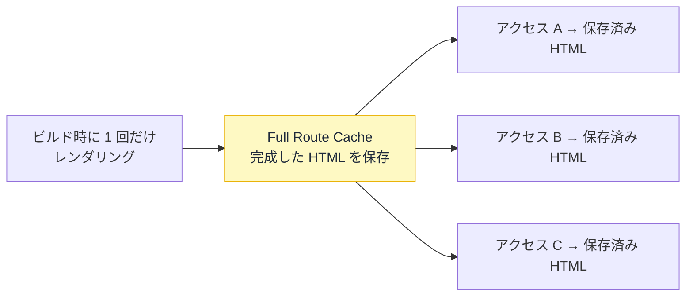
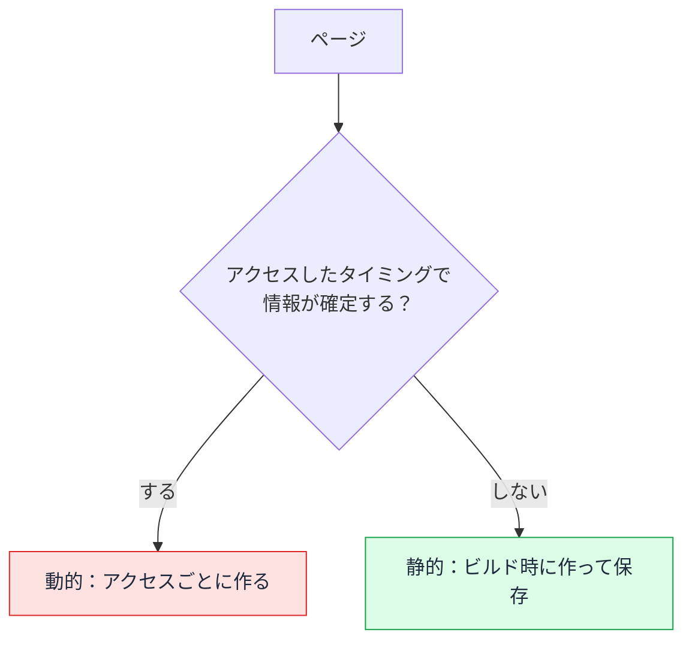
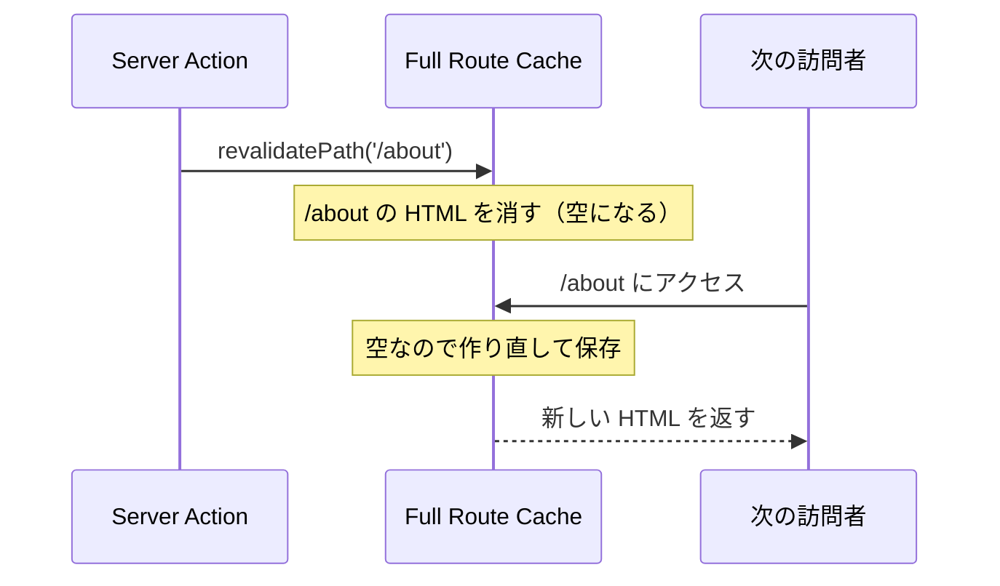

# Day 31: Full Route Cache — 組み立てた HTML を使い回す

## 今日のゴール

- Full Route Cache が「ページの HTML をサーバーに保存する仕組み」だと知る
- 静的レンダリングと動的レンダリングの違いを知る
- 保存した HTML を再検証で作り直せることを知る

::: info このレッスンは従来モデル
`cacheComponents` を有効にしていない従来モデルの書き方です。有効にした新モデルでは、ページの自動静的化はなくなり、`"use cache"` で明示する形に変わります。これは別レッスンで扱います。
:::

## ページの HTML はどう作られるか

サーバーは、リクエストを受けるとデータを取り、コンポーネントを実行して、最終的な HTML を組み立てて返します。この「組み立て」を**レンダリング**と呼びます。

```tsx
// app/about/page.tsx
export default async function AboutPage() {
  const res = await fetch("https://api.example.com/company");
  const company = await res.json();
  return (
    <main>
      <h1>{company.name}</h1>
      <p>{company.description}</p>
    </main>
  );
}
```

問題は、この組み立てを**いつやるか**です。アクセスのたびに毎回やるのか、一度だけやって結果を使い回すのか。

ここを決めるのが Full Route Cache です。

## 静的 — 一度組み立てて保存する

中身が誰に対しても同じなら、毎回組み立てる必要はありません。**ビルド時に一度だけレンダリングして、できた HTML を保存し、全員に使い回す**のが**静的レンダリング**です。

この保存先が **Full Route Cache** です。



会社概要やブログ記事のように「誰が見ても同じ」ページは、静的にして保存した HTML を返すだけにできます。サーバーは毎回組み立てないので、非常に速く、負荷も小さくなります。

## 動的 — 毎回組み立てる

一方、アクセスのたびに毎回レンダリングして HTML を作るのが**動的レンダリング**です。

- 毎回最新のデータで作られる
- アクセスのたびにサーバーが計算するので、コストがかかる

ログイン中のユーザー名を出すページのように、見る人やそのときの状況で中身が変わるものは、動的でなければなりません。保存して使い回すと、別の人に他人の名前が出てしまうからです。

## 静的か動的かは Next.js が決める

静的にするか動的にするかは、開発者が指定するのではなく、Next.js が自動で判定します。どう見分けているかを知ると、なぜそうなるかが腑に落ちます。

カギは、ビルドの時点では**まだ誰もそのページを見に来ていない**ことです。誰がログインしているかも、URL にどんな検索ワードが付くかも、まだ確定していません。

Next.js はページを先に作ろうとします。そのとき、コードが「アクセス時に確定する情報」を使っていると、ビルド時にはまだ確定していないので先に作れません。だから動的になります。

- アクセス時に確定する情報（ログイン中のユーザー、URL の検索ワードなど）を使っている → ビルド時には確定していないので先に作れず、動的。アクセスごとに組み立てる
- 使っていない → 先に作って保存できるので静的



コードの上でその「アクセス時に確定する情報」にあたるのが、`cookies()`（ログイン情報）、`headers()`、`searchParams`（URL の検索ワード）です。これらを使っていれば動的、使っていなければ静的、と判定されます。

さきほどの `/about` は、こうした情報を使っていないので、先に作れるとみなされて静的になります。

`fetch` の `cache` や `revalidate` の指定は、取ってきたデータをどれだけ新しく保つかを決めるもので、静的か動的かの判定には関係しません。ここは混同しやすいところです。

::: tip 認証のあるページは？
ページの中で `cookies()`（ログイン情報）を読むと動的になります。ただし内容が全員同じなら、ログインの確認をページの外（`proxy.ts` などのミドルウェア）に任せ、ページ本体で `cookies()` を読まなければ静的に保てます。判定はあくまで「その HTML が全員同じか」で決まり、認証の有無とは別です。
:::

## 動的にしたいとき

デフォルトは静的なので、毎回最新の状態を見せたいページは、自分で動的に切り替えます。デフォルトが静的になったぶん、これは覚えておくべき操作です。

`cookies()` のようなリクエスト依存の情報を使えば自然に動的になりますが、そういう入力がなくても毎回作り直したいことがあります。常に最新のデータを取りに行きたいときなどです。そのときは `connection()` を使います。

```tsx
// app/dashboard/page.tsx
import { connection } from "next/server";

export default async function DashboardPage() {
  await connection(); // ここから先はアクセスが来てから実行する
  const res = await fetch("https://api.example.com/stats");
  const stats = await res.json();
  return (
    <main>
      <h1>ダッシュボード</h1>
      <p>現在の閲覧数: {stats.views}</p>
    </main>
  );
}
```

`connection()` は「ここから先はビルド時に先取りせず、アクセスが来てから実行する」という合図です。これでそのページは動的になり、毎回サーバーで組み立て直されます。

## 再検証 — 保存した HTML を作り直す

静的化すると速いですが、保存した HTML はビルドした時点のものなので、後でデータが変わっても古いままです。これを作り直すのが**再検証**です。

データを更新する Server Action の中で `revalidatePath` を呼びます。Server Action は、サーバー側で動く関数です。

```ts
// app/admin/actions.ts
"use server";

import { revalidatePath } from "next/cache";

export async function updateCompany(formData: FormData) {
  await fetch("https://api.example.com/company", {
    method: "POST",
    body: formData,
  });

  revalidatePath("/about"); // /about の保存済み HTML を消す
}
```

`revalidatePath("/about")` で、保存していた `/about` の HTML が消されます。次に誰かが `/about` を開いたとき、レンダリングし直され、新しい HTML が保存し直されます。

`revalidatePath` がするのは、Full Route Cache という保存場所から `/about` の HTML を消すことだけです。新しい HTML は、次に誰かがアクセスしたときに作られて、また同じ場所に保存されます。時間の流れで見ると次のようになります。



## 書き方ごとの違い

ページの書き方で、静的か動的か、そして速さと鮮度がどう変わるかを並べます。

| ページの書き方 | レンダリング | 速さ | 鮮度 |
|------|------------|------|------|
| cookies など、リクエストで変わる情報を使う | 動的（毎回組み立てる） | その都度かかる | 常に最新 |
| リクエストで変わる情報を使わない（デフォルト） | 静的（保存した HTML を返す） | 速い | ビルド時のまま |
| 静的なページに `revalidate` や `revalidatePath` を足す | 静的のまま作り直す | 速い | 時間ごと・変更後に最新 |

「誰が見ても同じページ」なら静的にして速くできます。人によって変わるページや常に最新が要るページは、動的が正しい選択です。どちらかが偉いのではなく、ページの性質で選びます。

ここで保存しているのは、組み立てた HTML です。その手前で取得したデータの保存や、ブラウザ側の保存は、これとは別のキャッシュです。

## まとめ

- Full Route Cache はレンダリング済みの HTML をサーバーに保存する仕組み
- 中身が共通なら静的化して使い回せる。動的は毎回組み立てる
- デフォルトは静的。`cookies` などリクエスト依存のものを使うと動的になる
- `revalidatePath` で、保存した HTML を作り直せる
