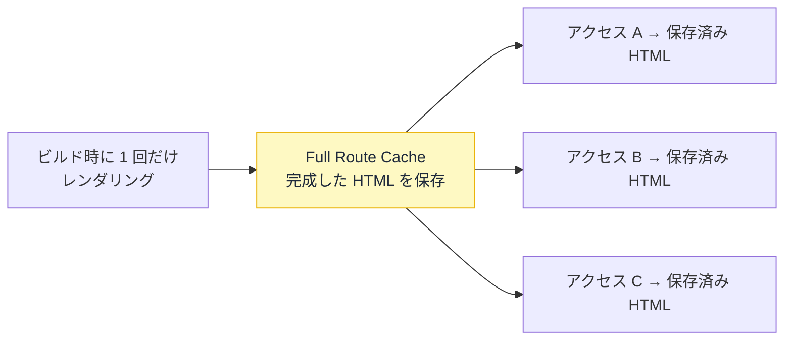

# Day 31: Full Route Cache — 組み立てた HTML を使い回す

## 今日のゴール

- Full Route Cache が「ページの HTML をサーバーに保存する仕組み」だと知る
- 静的（事前生成）と動的（毎回生成）の違いを知る
- `no-store` と動的化の関係を知り、再検証で作り直せることを知る

::: info このレッスンは従来モデル
`cacheComponents` を有効にしていない従来モデルの書き方です。新モデル（`cacheComponents: true`）では、ページの自動静的化はなくなり `"use cache"` で明示する形に変わります（別レッスンで扱います）。
:::

## ページの HTML はどう作られるか

サーバーは、リクエストを受けるとデータを取り、コンポーネントを実行して、最終的な HTML を組み立てて返します。この「組み立て」を**レンダリング**と呼びます。

```tsx
// app/about/page.tsx
export default async function AboutPage() {
  const res = await fetch("https://api.example.com/company");
  const company = await res.json();
  return (
    <main>
      <h1>{company.name}</h1>
      <p>{company.description}</p>
    </main>
  );
}
```

問題は、この組み立てを**いつやるか**です。アクセスのたびに毎回やるのか、一度だけやって結果を使い回すのか。

ここを決めるのが Full Route Cache です。

## 動的 — 毎回組み立てる

リクエストごとに毎回レンダリングして HTML を作るのが**動的レンダリング**です。

- 毎回最新のデータで作られる
- リクエストのたびにサーバーが計算する（コストがかかる）

ログイン中のユーザー名を出すページのように、「人によって・その瞬間によって中身が変わる」ものは動的でなければなりません。

## 静的 — 一度組み立てて保存する

中身が誰に対しても同じなら、毎回組み立てる必要はありません。**ビルド時に一度だけレンダリングして、できた HTML を保存し、全員に使い回す**のが**静的レンダリング**です。

この保存先が **Full Route Cache** です。



会社概要やブログ記事のように「誰が見ても同じ」ページは、静的にして保存した HTML を返すだけにできます。サーバーは毎回組み立てないので、非常に速く、負荷も小さくなります。

Next.js は、`fetch` にキャッシュ指定（`revalidate` / `force-cache`）があり、ユーザーごとに変わる要素（`cookies()` など）を使っていないページを**自動で静的化**しようとします。`fetch` は指定がなければキャッシュされないので、指定なしの `fetch` があるだけでそのページは動的になります。

## `no-store` と動的化

`fetch` はキャッシュ指定がなければキャッシュされないので、**何もしなければページは動的**です。

それでも `cache: "no-store"`（キャッシュしないという明示）を付けたコードは少なくありません。`no-store` を付けると、そのページは**必ず動的レンダリングになります**。

```tsx
// このページは毎回サーバーで組み立て直される（静的化されない）
export default async function AboutPage() {
  const res = await fetch("https://api.example.com/company", {
    cache: "no-store",
  });
  const company = await res.json();
  return (
    <main>
      <h1>{company.name}</h1>
      <p>{company.description}</p>
    </main>
  );
}
```

`no-store` は「このデータは毎回新しく取れ」という指示です。毎回取りに行く以上、ビルド時に固められず、ページ全体が動的になります。

動的レンダリング自体は悪ではありません。ログイン後のダッシュボード、在庫やレートのようなリアルタイムの数値など、毎回最新を作るのが正しいページはたくさんあります。「このページは本当に毎回最新が要るか」で決めます。

ただし従来モデルでは、`fetch` の既定がすでに「キャッシュしない＝動的」です。そのため「常に最新にしたい」という理由で付ける `no-store` は、動きを変えずにコードを増やしているだけのことが多くあります。さらに、静的で十分なページにまで付けると、静的化できたはずのページを動的にしてしまい、速さを手放すことになります。

## 再検証 — 保存した HTML を作り直す

静的化すると速いですが、保存した HTML はビルド時点の写し（スナップショット）なので、後でデータが変わっても古いままです。これを作り直すのが**再検証**です。

データを更新する処理（Server Action、サーバー側で動く関数）の中で `revalidatePath` を呼びます。

```ts
// app/admin/actions.ts
"use server";

import { revalidatePath } from "next/cache";

export async function updateCompany(formData: FormData) {
  await fetch("https://api.example.com/company", {
    method: "POST",
    body: formData,
  });

  revalidatePath("/about"); // /about の保存済み HTML を消す
}
```

`revalidatePath("/about")` で、保存していた `/about` の HTML が消されます。次に誰かが `/about` を開いたとき、レンダリングし直され、新しい HTML が保存し直されます。

## page と layout — どこまで作り直すか

`revalidatePath` には第 2 引数があります。

```ts
revalidatePath(path: string, type?: "page" | "layout"): void
```

| 指定 | 作り直す範囲 |
|------|------------|
| `"page"`（既定） | そのページの HTML だけ |
| `"layout"` | そのレイアウト + **配下の全ページ**の HTML |

ヘッダーやナビゲーションのように、**レイアウトに置かれていて全ページで共通の表示**を更新したいときは `"layout"` を使います。たとえばヘッダーのカート件数バッヂを更新したいなら、こうします。

```ts
revalidatePath("/", "layout"); // ルートレイアウト配下すべてを作り直す
```

`"page"` で 1 ページだけ作り直しても、レイアウト共有の表示は別ページに移ると古いままです。共有部分はレイアウト単位で作り直す必要があります。

> パスに動的な部分（`/blog/[slug]` など）を含む場合、第 2 引数は必須です。実際の値ではなく `/blog/[slug]` という**ルートの形**を渡すため、ページ単位かレイアウト単位かを Next.js が判断できないからです。

## 書き方ごとの違い

ページの書き方で、レンダリングと鮮度・速さがどう変わるかを並べます。行は「保存あり/なし」という状態ではなく、実際にコードに書く指定です。

| ページの書き方 | レンダリング | 速さ | 鮮度 |
|------|------------|------|------|
| 指定なし / `cache: "no-store"` | 動的（毎回組み立てる） | 遅い | 常に最新 |
| `next: { revalidate }` / `force-cache` | 静的（保存した HTML を使い回す） | 速い | 時間または手動で更新 |
| 上記 ＋ `revalidatePath` | 静的のまま、変更時に作り直す | 速い | 変えた後に最新へ |

「誰が見ても同じページ」なら静的にして速くできます。人によって変わるページや常に最新が要るページは、動的が正しい選択です。どちらかが偉いのではなく、ページの性質で選びます。

なお、ここで保存しているのは「組み立てた HTML」です。その手前の「取得したデータ」の保存や、ブラウザ側の保存は、別の段階のキャッシュで、このレッスンでは扱いません。

## まとめ

- Full Route Cache はレンダリング済みの HTML をサーバーに保存する仕組み
- 中身が共通なら静的化して使い回せる。動的は毎回組み立てる
- 既定では動的。静的にするには `fetch` にキャッシュ指定が要る
- `revalidatePath` で保存した HTML を作り直す。共有部分は `"layout"` で
