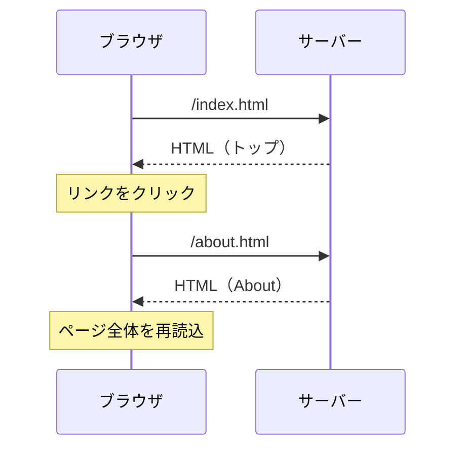
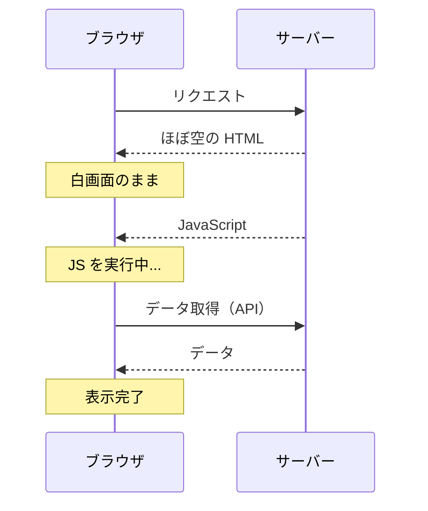
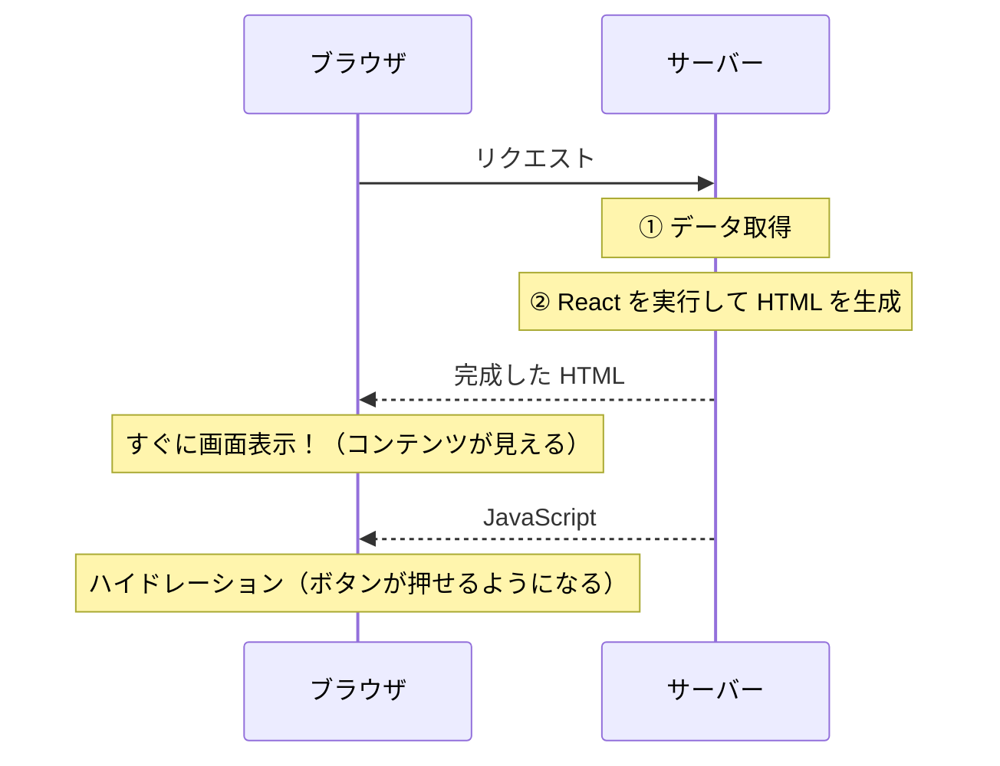
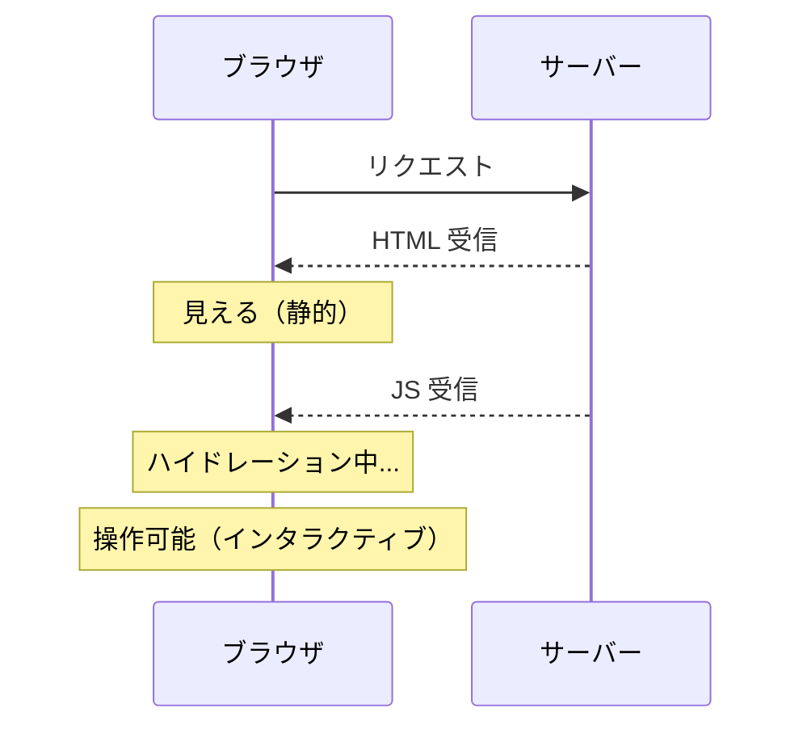

# Day 31: SPA・CSR・SSR — レンダリング戦略を理解する

## 今日のゴール

- SPA（Single Page Application）の仕組みと特徴を知る
- CSR（Client-Side Rendering）と SSR（Server-Side Rendering）の違いを知る
- それぞれの方式のメリット・デメリットを知る
- Next.js がこれらの課題をどう解決するか概要を知る

## React アプリの動き方を振り返る

Day 21〜30 で React の基礎を学びました。React でアプリを作ると、ブラウザで動くのは次のような仕組みです。

1. ブラウザがサーバーに HTML をリクエストする
2. サーバーが**ほぼ空の HTML** と **JavaScript ファイル**を返す
3. ブラウザが JavaScript をダウンロード・実行する
4. JavaScript が DOM を組み立てて画面を表示する

この「JavaScript がブラウザ上で画面を組み立てる」方式を **CSR（Client-Side Rendering）** と呼びます。「Client」とはブラウザのことです。

## SPA とは何か

React で作ったアプリは **SPA（Single Page Application）** です。名前の通り「ページが 1 つだけ」のアプリケーションです。

従来の Web サイトでは、ページごとに HTML ファイルが存在し、リンクをクリックするたびにサーバーから新しい HTML を取得していました。

**従来の Web サイト（MPA: Multi Page Application）:**



SPA では、最初に 1 つの HTML と JavaScript を読み込み、以降のページ遷移は **JavaScript が画面を書き換えるだけ**で実現します。サーバーへの HTML リクエストは最初の 1 回だけです。

```
SPA（Single Page Application）:

ブラウザ            サーバー
  │  / (最初のリクエスト)  │
  │ ──────────────→    │
  │  空の HTML + JS    │
  │ ←──────────────    │
  │                    │
  │  JS が画面を構築    │
  │                    │
  │  「About」をクリック  │
  │  → JS が画面を書換  │  ← サーバーへのリクエストなし！
  │  （URLも変わる）    │
```

ページ遷移のたびにサーバーと通信する必要がないため、**画面の切り替えが非常に高速**です。ネイティブアプリのようなスムーズな操作感が得られます。

## CSR の仕組みをもう少し詳しく

SPA は通常 CSR で動作します。サーバーが返す HTML の中身は次のようになっています。

```html
<!DOCTYPE html>
<html>
<head>
  <title>My App</title>
</head>
<body>
  <!-- ここはほぼ空っぽ -->
  <div id="root"></div>
  <script src="/bundle.js"></script>
</body>
</html>
```

`<div id="root"></div>` — たったこれだけです。React の `createRoot` がこの空の `<div>` の中に UI を構築します。つまり、**JavaScript が実行されるまで画面には何も表示されません**。



## CSR の弱点

CSR には大きく 2 つの弱点があります。

### 1. 初期表示が遅い

JavaScript のダウンロードと実行が終わるまで、ユーザーには**白画面**が表示されます。アプリが大きくなるほど JavaScript ファイルも大きくなり、初期表示はさらに遅くなります。

特にモバイル回線や低スペックなデバイスでは、この遅延が顕著です。

### 2. SEO に弱い場合がある

**SEO（Search Engine Optimization）** とは、Google などの検索エンジンにページの内容を正しく認識してもらうための取り組みです。

検索エンジンの**クローラー**（Web ページの内容を自動で読み取るプログラム）が HTML を取得すると、`<div id="root"></div>` しかありません。JavaScript を実行しなければ中身がわからないため、ページの内容を正しくインデックスできない場合があります。

> **補足**: Google のクローラーは JavaScript を実行する能力がありますが、すべてのクローラーがそうとは限りません。また、JavaScript の実行にはコストがかかるため、クローリングの効率も下がります。

## SSR — サーバーで HTML を作る

**SSR（Server-Side Rendering）** は、CSR の弱点を解決するアプローチです。

CSR がブラウザで HTML を組み立てるのに対し、SSR は**サーバー側で HTML を組み立ててからブラウザに送ります**。



### SSR のメリット

1. **初期表示が速い** — ブラウザは完成した HTML を受け取るので、すぐに画面を表示できる
2. **SEO に強い** — クローラーが完成した HTML を読めるので、内容を正しくインデックスできる
3. **データ取得が速い** — サーバーは DB や API に近い場所にあるため、データ取得のネットワーク遅延が小さい

### ハイドレーション

SSR で送られた HTML は、最初は**静的な HTML**です。ボタンをクリックしても何も起きません。JavaScript が読み込まれた後、React がこの HTML に**イベントハンドラーを結びつけて**、インタラクティブにします。

この「静的な HTML を動的にする」プロセスを**ハイドレーション（hydration）**と呼びます。「乾いた HTML に水を注いで生き返らせる」というイメージです。



CSR と比べて、「画面が見える」タイミングが大幅に早くなっている点がポイントです。

## SSG — ビルド時に HTML を生成する

もう 1 つの方式として **SSG（Static Site Generation）** があります。SSR がリクエストのたびにサーバーで HTML を生成するのに対し、SSG は**ビルド時（デプロイ前）にあらかじめ HTML を生成**しておきます。

```
SSG の流れ:

ビルド時:
  React コンポーネント → HTML ファイルを生成 → サーバーに配置

リクエスト時:
  ブラウザ → 生成済みの HTML をそのまま返すだけ（超高速）
```

SSG はページの内容がほとんど変わらないサイト（ブログ、ドキュメントサイトなど）に適しています。実はこの研修サイト自体も SSG で構築されています（VitePress という SSG ツールを使っています）。

ただし、ユーザーごとに異なる内容を表示するページ（マイページ、ダッシュボードなど）には向きません。配属先のプロジェクトでは主に SSR を使うため、SSG の詳細は省略します。

## 比較まとめ

| 方式 | HTML の生成タイミング | 初期表示 | SEO | 向いているケース |
|------|---------------------|---------|-----|----------------|
| CSR | ブラウザで実行時 | 遅い | 弱い場合がある | 管理画面、ログイン後の画面 |
| SSR | サーバーでリクエスト時 | 速い | 強い | ほとんどのページ |
| SSG | ビルド時（事前生成） | 最速 | 強い | ブログ、ドキュメント |

## Next.js はこれらをどう解決するか

React 単体では CSR（SPA）しかできません。SSR を自分で実装しようとすると、サーバーの構築、ルーティング、データ取得のタイミング制御など、非常に多くの設定が必要になります。

**Next.js** は、これらの複雑さを隠蔽し、SSR・SSG を簡単に使えるようにしたフレームワークです。さらに、Next.js の **Server Components** は SSR の考え方をコンポーネント単位に細かく適用できるようにしたもので、Day 33 で詳しく学びます。

Day 32 では、Next.js のプロジェクト構成を見ていきます。

## まとめ

- **SPA** は 1 つの HTML で動くアプリ。ページ遷移が高速だが、初期表示は JavaScript に依存する
- **CSR** はブラウザで HTML を組み立てる方式。初期表示が遅く、SEO に弱い場合がある
- **SSR** はサーバーで HTML を組み立てる方式。初期表示が速く、SEO に強い
- **ハイドレーション**により、SSR で送られた静的 HTML がインタラクティブになる
- **SSG** はビルド時に HTML を生成する方式。静的サイトに最適
- Next.js はこれらのレンダリング戦略を簡単に扱えるフレームワーク

**次のレッスン**: [Day 32: Next.js の概要とプロジェクト構成](/lessons/day32/)
