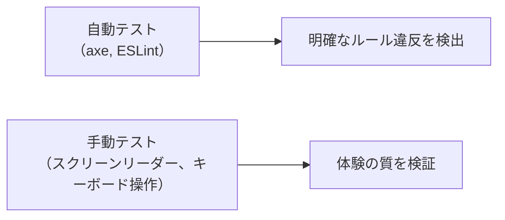
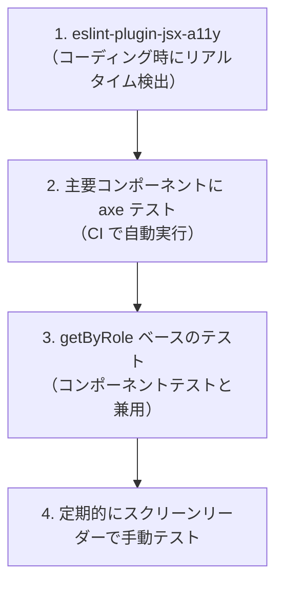

# Day 45: アクセシビリティとテスト

## 今日のゴール

- axe を使ったアクセシビリティの自動テストの仕組みを知る
- ESLint プラグインでコーディング中にもアクセシビリティ問題を検出できることを知る
- 自動チェックでカバーできる範囲とできない範囲を知る

## 自動テストでアクセシビリティを守る

Day 44 でアクセシビリティの基本を学びました。しかし、すべてのルールを常に覚えて手動で確認するのは現実的ではありません。そこで活躍するのが自動テストと静的解析です。

アクセシビリティの自動チェックには主に 2 つのアプローチがあります。

- **axe**（アクス）: レンダリング済みの HTML をスキャンして WCAG（Web Content Accessibility Guidelines、アクセシビリティの国際ガイドライン）違反を検出するテストエンジン
- **eslint-plugin-jsx-a11y**: JSX を書いている段階でアクセシビリティ問題を指摘する ESLint プラグイン

axe はテスト実行時に問題を発見し、eslint-plugin-jsx-a11y はコーディング中にリアルタイムで問題を発見します。どちらも `vitest-axe` や `eslint-plugin-jsx-a11y` パッケージとして導入でき、ESLint は Flat Config で `jsxA11y.flatConfigs.recommended` を追加するだけで使い始められます。

## axe によるテストのパターン

axe のテストは非常にシンプルです。コンポーネントをレンダリングして、`axe()` に渡すだけです。

```tsx
// src/components/article-card.test.tsx
import { describe, it, expect } from "vitest";
import { render } from "@testing-library/react";
import { axe } from "vitest-axe";

function ArticleCard() {
  return (
    <article>
      <h2>記事タイトル</h2>
      <p>記事の説明文がここに入ります。</p>
      <a href="/blog/article-1">続きを読む</a>
    </article>
  );
}

describe("ArticleCard", () => {
  it("アクセシビリティ違反がない", async () => {
    const { container } = render(<ArticleCard />);
    const results = await axe(container);

    expect(results).toHaveNoViolations();
  });
});
```

`toHaveNoViolations()` は、axe が検出した違反が 0 件であることを確認します。違反があると、どの要素がどのルールに違反しているか（例: `image-alt: Images must have alternate text`）と影響度（critical / serious など）が報告されます。

既存プロジェクトに導入する場合、すべてのルールを一度に適用するのが難しければ、`rules` オプションで対象を絞ることもできます。

## eslint-plugin-jsx-a11y が検出する問題

eslint-plugin-jsx-a11y はテスト実行を待たず、コードを書いている段階で問題を指摘してくれます。

```tsx
// ❌ eslint-plugin-jsx-a11y が警告する例

// alt 属性がない画像

// → jsx-a11y/alt-text: img elements must have an alt prop

// onClick があるのに role がない div
<div onClick={handleClick}>クリック</div>
// → jsx-a11y/click-events-have-key-events
// → jsx-a11y/no-static-element-interactions

// 空のリンク
<a href="#">リンク</a>
// → jsx-a11y/anchor-is-valid
```

```tsx
// ✅ 修正後


<button onClick={handleClick} type="button">クリック</button>

<a href="/about">About</a>
```

## Testing Library と アクセシビリティ

Day 43 で学んだ Testing Library の `getByRole` は、実はアクセシビリティのテストにもなっています。

```tsx
// この検索が成功すること自体が、
// アクセシビリティが正しいことの証明

// ボタンにアクセシブルな名前がある
screen.getByRole("button", { name: "送信" });

// 見出しが正しく使われている
screen.getByRole("heading", { name: "記事タイトル" });

// フォームにラベルがある
screen.getByLabelText("メールアドレス");

// ナビゲーションにラベルがある
screen.getByRole("navigation", { name: "メインナビゲーション" });
```

`getByRole` で要素が見つからないということは、スクリーンリーダーもその要素を適切に認識できないということです。

## 自動チェックの限界

ここが今日最も重要なポイントです。**自動チェックでカバーできるのは、アクセシビリティの問題全体の約 30〜40% と言われています**。

### 自動でカバーできるもの

| チェック項目 | ツール |
|------------|-------|
| 画像に alt がある | axe, ESLint |
| フォームに label がある | axe, ESLint |
| 色のコントラスト比が十分 | axe |
| 見出しレベルが連続している | axe |
| ARIA 属性が正しい構文 | axe, ESLint |
| フォーカス可能な要素がある | axe |
| lang 属性が設定されている | axe |

### 自動ではカバーできないもの

| チェック項目 | なぜ自動で検出できないか |
|------------|---------------------|
| alt テキストが適切な内容か | 「画像」と書かれていても、機械には妥当性が判断できない |
| Tab 順序が論理的か | 正しい順序は文脈に依存する |
| モーダルのフォーカストラップ | 操作シナリオのテストが必要 |
| 読み上げ内容が理解可能か | 人間が聞いて判断する必要がある |
| キーボード操作が直感的か | ユーザーの期待と合っているかは主観的 |
| 動画に字幕があるか | コンテンツの中身は機械では判断困難 |

### だから両方が必要



自動テストは「最低限の品質」を保証するセーフティネットです。その上で、定期的にスクリーンリーダーやキーボードだけでの操作テストを行うことが理想です。

## テスト戦略の全体像



すべてを一度に完璧にする必要はありません。まず ESLint プラグインで日常的にキャッチし、主要コンポーネントに axe テストを追加して CI で回す。それでもカバーできない残り 60〜70% は、定期的な手動テストで補います。

## まとめ

- axe はレンダリングされた HTML をスキャンして WCAG 違反を検出する
- eslint-plugin-jsx-a11y はコーディング中にアクセシビリティ問題を指摘する
- Testing Library の `getByRole` は、暗黙的にアクセシビリティのテストにもなっている
- 自動チェックでカバーできるのはアクセシビリティ問題の約 30〜40%
- 自動テストは最低限の品質を保証するセーフティネット。手動テストと組み合わせて初めて十分になる

**次のレッスン**: [Day 46: Web パフォーマンス基礎](/lessons/day46/)
