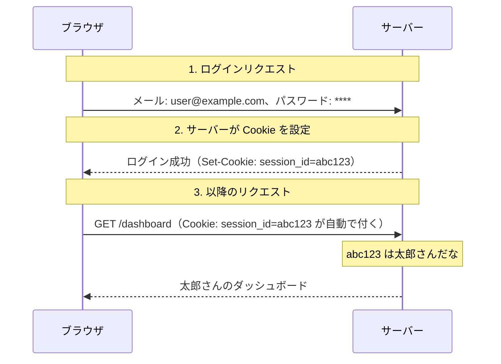
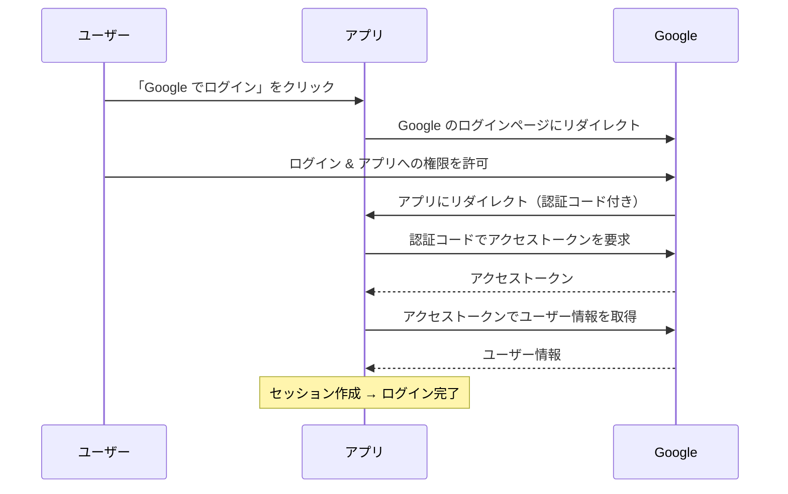

# Day 48: 認証の基礎

## 今日のゴール

- 認証と認可の違いを知る
- Cookie / Session / JWT の仕組みを知る
- OAuth の概念を知る
- Next.js での認証フロー（Auth.js）の全体像を知る

## 認証と認可

まず、よく混同される 2 つの概念を明確にします。

- **認証（Authentication）** — 「あなたは誰ですか？」を確認すること。ログイン処理
- **認可（Authorization）** — 「あなたにはその操作の権限がありますか？」を確認すること。アクセス制御

```
例: 会社のオフィスビル
- 認証 = 社員証で入館ゲートを通る（本人確認）
- 認可 = 社員証のランクで入れるフロアが決まる（権限確認）
```

Web アプリケーションでは、まず認証（ログイン）でユーザーを識別し、次に認可でそのユーザーの権限に基づいてアクセスを制御します。

## HTTP はステートレス

Web の通信プロトコルである HTTP は**ステートレス**（stateless）です。つまり、サーバーは 1 つのリクエストが終わると、次のリクエストが同じユーザーかどうかわかりません。

```
リクエスト1: GET /dashboard → サーバー:「誰？」
リクエスト2: GET /settings  → サーバー:「誰？」（同じ人かわからない）
```

これでは、ページを移動するたびにログインが必要になってしまいます。この問題を解決するのが Cookie と Session です。

## Cookie

**Cookie** は、ブラウザに保存される小さなデータです。サーバーがレスポンスで「この情報を保存しておいて」とブラウザに指示し、ブラウザは次のリクエストからその情報を自動的に送ります。



### Cookie のセキュリティ属性

```
Set-Cookie: session_id=abc123; HttpOnly; Secure; SameSite=Strict; Path=/; Max-Age=86400
```

`Set-Cookie` はサーバーがレスポンスに含める HTTP ヘッダーで、ブラウザに Cookie の保存を指示します。

| 属性 | 意味 |
|------|------|
| `HttpOnly` | JavaScript からアクセスできない（XSS（悪意あるスクリプト注入）対策） |
| `Secure` | HTTPS（HTTP の暗号化版）でのみ送信される |
| `SameSite=Strict` | 同一サイトからのリクエストでのみ送信される（CSRF（別サイトからの偽リクエスト）対策） |
| `Path=/` | Cookie が有効なパス |
| `Max-Age=86400` | 有効期限（秒）。86400 = 24 時間 |

## Session（セッション）

**Session** は、サーバー側でユーザーの状態を管理する仕組みです。

```
サーバーのセッションストア:
{
  "abc123": { userId: 1, name: "太郎", role: "admin" },
  "def456": { userId: 2, name: "花子", role: "user" }
}
```

ブラウザから送られる Cookie のセッション ID（`abc123`）をキーにして、サーバーがユーザー情報を参照します。ユーザー情報はサーバー側にあるため、ブラウザからは改ざんできません。

## JWT（JSON Web Token）

**JWT** はもう 1 つのアプローチで、ユーザー情報をトークン（署名された文字列）自体に含めます。

```
eyJhbGciOiJIUzI1NiJ9.eyJ1c2VySWQiOjEsIm5hbWUiOiLlpKrpg44iLCJyb2xlIjoiYWRtaW4ifQ.xxxxx
```

この文字列は 3 つのパートから成り、ドット（`.`）で区切られています。

```
ヘッダー.ペイロード.署名

ヘッダー: 使用しているアルゴリズム
ペイロード: ユーザー情報（userId, name, role など）
署名: 改ざん検知用（サーバーの秘密鍵で生成）
```

> **重要**: JWT のペイロードは Base64Url エンコード（バイナリデータを URL で安全に使える文字列に変換する方式）されているだけで、誰でもデコードして内容を読めます。JWT は改ざんを検知するための「署名」であり、内容を隠すための「暗号化」ではありません。パスワードなどの機密情報は JWT に含めないでください。

### Session vs JWT

| 特徴 | Session | JWT |
|------|---------|-----|
| ユーザー情報の保存場所 | サーバー | トークン自体 |
| スケーラビリティ | サーバー間で共有が必要 | サーバー間共有不要 |
| 無効化 | 即座にログアウト可能 | 有効期限まで無効化が難しい |
| サイズ | Cookie は小さい（ID のみ） | トークンが大きくなりがち |

どちらが優れているかは状況次第です。Auth.js は Session ベースをデフォルトとしています。

## OAuth

**OAuth**（Open Authorization）は、外部サービス（Google、GitHub など）のアカウントでログインする仕組みです。「Google でログイン」ボタンが OAuth の典型的な例です。

### OAuth のフロー（簡略版）



OAuth の重要な点は、**ユーザーのパスワードがアプリに渡らない**ことです。パスワードは Google（認証プロバイダ）だけが知っています。

## Auth.js（NextAuth v5）による認証

**Auth.js**（旧 NextAuth.js、現在 v5）は、Next.js で認証を実装するためのライブラリです。OAuth プロバイダとの連携、Session 管理、JWT 処理などをまとめて扱えます。

Auth.js の中心となるのは設定ファイルです。ここで「どの OAuth プロバイダを使うか」を定義し、認証に必要な関数をエクスポートします。

```ts
// src/auth.ts
import NextAuth from "next-auth";
import GitHub from "next-auth/providers/github";

export const { handlers, signIn, signOut, auth } = NextAuth({
  providers: [
    GitHub({
      clientId: process.env.AUTH_GITHUB_ID!,
      clientSecret: process.env.AUTH_GITHUB_SECRET!,
    }),
  ],
});
```

この設定から得られる `handlers` を Route Handler（Day 36 参照）でエクスポートすると、ログイン・ログアウト・コールバックなどの認証エンドポイントが自動的に生成されます。

認証後のセッション情報は `auth()` 関数で取得できます。Server Component でもServer Action でも使えるのが特徴です。

```tsx
// src/app/dashboard/page.tsx
import { auth } from "@/auth";
import { redirect } from "next/navigation";

export default async function DashboardPage() {
  const session = await auth();

  if (!session) {
    redirect("/api/auth/signin");
  }

  return (
    <main>
      <h1>ダッシュボード</h1>
      <p>ようこそ、{session.user?.name} さん</p>
    </main>
  );
}
```

ログイン・ログアウトのボタンは、Server Action として `signIn("github")` / `signOut()` を呼ぶ `<form>` として実装します。Day 38 で学んだ Middleware を使えば、複数のページをまとめて保護することもできます。

## まとめ

- 認証は「誰か」を確認、認可は「権限があるか」を確認する仕組み
- Cookie と Session でステートレスな HTTP に状態を持たせる
- JWT はトークン自体にユーザー情報を含める方式
- OAuth は外部サービスのアカウントでログインする仕組み。パスワードがアプリに渡らない
- Auth.js（NextAuth v5）を使うと、Next.js で OAuth やセッション管理を簡単に実装できる

**次のレッスン**: [Day 49: Web セキュリティ](/lessons/day49/)
