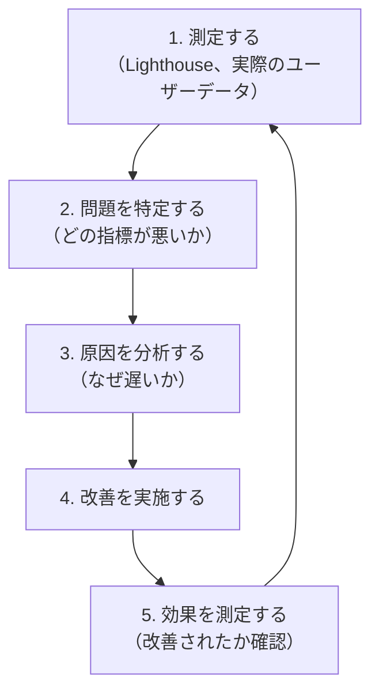

# Day 48: Web パフォーマンス基礎

## 今日のゴール

- Core Web Vitals（LCP / CLS / INP）の意味と改善方法を知る
- Lighthouse を使ったパフォーマンス測定の方法を知る
- パフォーマンス改善の基本的なサイクルという考え方を知る

## なぜパフォーマンスが重要か

Web ページの表示速度は、ユーザー体験とビジネス成果に直結します。

- ページ表示が **1 秒遅れる**と、コンバージョン率（購入や申し込みの割合）が **7% 低下**するという調査がある
- Google は検索ランキングにページ速度を考慮している
- モバイル環境では通信速度やデバイス性能が限られるため、パフォーマンスの影響がさらに大きい

「速いサイト」は良い UX の基本です。

## Core Web Vitals

**Core Web Vitals** は Google が定めた 3 つのパフォーマンス指標です。「ユーザーにとって良い体験か」を数値で表します。

### LCP（Largest Contentful Paint）

**最も大きなコンテンツが表示されるまでの時間**です。ユーザーが「ページが表示された」と感じるタイミングに近い指標です。

| 評価 | 時間 |
|------|------|
| 良い | 2.5 秒以下 |
| 改善が必要 | 2.5〜4.0 秒 |
| 悪い | 4.0 秒超 |

LCP の対象になるのは、画像、`<video>` のポスター画像、背景画像、テキストブロックなどです。

#### LCP を改善する方法

```tsx
import Image from "next/image";

// ✅ ファーストビューの画像に priority を付ける（Day 42 で学習）
<Image src="/hero.jpg" alt="ヒーロー画像" fill priority />

// ✅ Server Components でデータ取得（Day 37 で学習）
// → データを含んだ HTML が最初から送られるため、表示が速い

// ✅ フォントの最適化（Day 42 で学習）
// → next/font でフォントをビルド時に取得しておく
```

- サーバーのレスポンス時間を短縮する
- レンダリングをブロックする CSS/JavaScript を減らす
- 画像を最適化する（`next/image` が自動で対応）

### CLS（Cumulative Layout Shift）

**ページの読み込み中にレイアウトがどれだけずれるか**の指標です。読んでいたテキストが突然ずれて別の場所をクリックしてしまった、という経験はないでしょうか。それが CLS です。

| 評価 | スコア |
|------|-------|
| 良い | 0.1 以下 |
| 改善が必要 | 0.1〜0.25 |
| 悪い | 0.25 超 |

#### CLS を改善する方法

```tsx
// ✅ 画像にサイズを指定する
<Image src="/photo.jpg" alt="写真" width={600} height={400} />

// ❌ サイズなしの img はレイアウトシフトの原因

```

- 画像や動画に `width`/`height` を指定する（スペースが事前に確保される）
- Web フォントの読み込みでレイアウトがずれないようにする（`next/font` が自動で対応）
- 動的にコンテンツを挿入しない（広告バナーなどは事前にスペースを確保）

### INP（Interaction to Next Paint）

**ユーザーの操作（クリック、タップ、キー入力）から画面が更新されるまでの時間**です。ボタンをクリックしてから画面が反応するまでの体感的な速さを測ります。

| 評価 | 時間 |
|------|------|
| 良い | 200ms 以下 |
| 改善が必要 | 200〜500ms |
| 悪い | 500ms 超 |

#### INP を改善する方法

- メインスレッド（ブラウザが UI を処理するスレッド）を長時間ブロックする処理を避ける
- 重い計算は Web Worker に移す
- イベントハンドラを軽くする
- 不要な再レンダリングを避ける（`React.memo` など）

## Lighthouse の使い方

**Lighthouse** は Google が提供するパフォーマンス測定ツールです。Chrome の開発者ツールに組み込まれています。

### 測定手順

1. Chrome で測定したいページを開く
2. 開発者ツールを開く（`F12` または `Cmd + Option + I`）
3. **Lighthouse** タブを選択
4. 「Analyze page load」をクリック

数秒〜数十秒で結果が表示されます。

### 結果の読み方

Lighthouse は以下の 5 つのカテゴリでスコアを表示します。

| カテゴリ | 内容 |
|---------|------|
| Performance | ページの表示速度 |
| Accessibility | アクセシビリティ（Day 46-45 で学習） |
| Best Practices | Web 開発のベストプラクティス |
| SEO | 検索エンジン最適化（Day 41 で学習） |
| PWA | Progressive Web App 対応 |

Performance スコアの内訳として、LCP / CLS / INP などの Core Web Vitals の値が表示されます。各指標の横に具体的な改善提案も表示されるので、それに従って改善します。

### 注意点

Lighthouse のスコアは測定のたびに変動します。以下の点に注意が必要です。

- **シークレットモードで測定する** — ブラウザ拡張機能がスコアに影響する
- **複数回測定する** — 1 回の結果を鵜呑みにしない
- **本番環境で測定する** — 開発環境は最適化されていないため、スコアが低く出る
- **モバイルで測定する** — Lighthouse はデフォルトでモバイル環境をシミュレートする

## パフォーマンス改善のサイクル

パフォーマンス改善は、一度やって終わりではありません。以下のサイクルを回します。



### 重要: 推測で最適化しない

```
❌ 「たぶんここが遅いだろう」→ 最適化 → 効果なし → 時間の無駄

✅ 測定 → 「LCP が 4.2 秒で、ヒーロー画像の読み込みが原因」
   → 画像を最適化 → LCP が 2.1 秒に改善
```

必ず測定してボトルネック（最も遅い箇所）を特定してから改善に取りかかることが重要です。

## 実際のユーザーデータ

Lighthouse はラボデータ（シミュレーション環境での測定）です。実際のユーザーの体験を測定するには **RUM（Real User Monitoring）** が必要です。

Next.js では `reportWebVitals` を使って実際のユーザーの Core Web Vitals を収集できます。

```tsx
// src/app/layout.tsx
import { WebVitals } from "./web-vitals";

export default function RootLayout({
  children,
}: {
  children: React.ReactNode;
}) {
  return (
    <html lang="ja">
      <body>
        <WebVitals />
        {children}
      </body>
    </html>
  );
}
```

```tsx
// src/app/web-vitals.tsx
"use client";

import { useReportWebVitals } from "next/web-vitals";

export function WebVitals() {
  useReportWebVitals((metric) => {
    // アナリティクスサービスに送信
    console.log(metric.name, metric.value);
  });

  return null;
}
```

これにより LCP、CLS、INP などの実際のユーザーデータが収集できます。

## まとめ

- Core Web Vitals は LCP（表示速度）、CLS（レイアウトのずれ）、INP（操作の応答性）の 3 指標
- Lighthouse で測定できるが、結果は毎回変動するため複数回の測定が重要
- パフォーマンス改善は「測定 → 特定 → 改善 → 再測定」のサイクルで行う
- 推測ではなく、必ずデータに基づいて改善する
- Next.js の `next/image`、`next/font`、Server Components は多くのパフォーマンス最適化を自動で行ってくれる

**次のレッスン**: [Day 49: Web パフォーマンス応用](/lessons/day49/)
