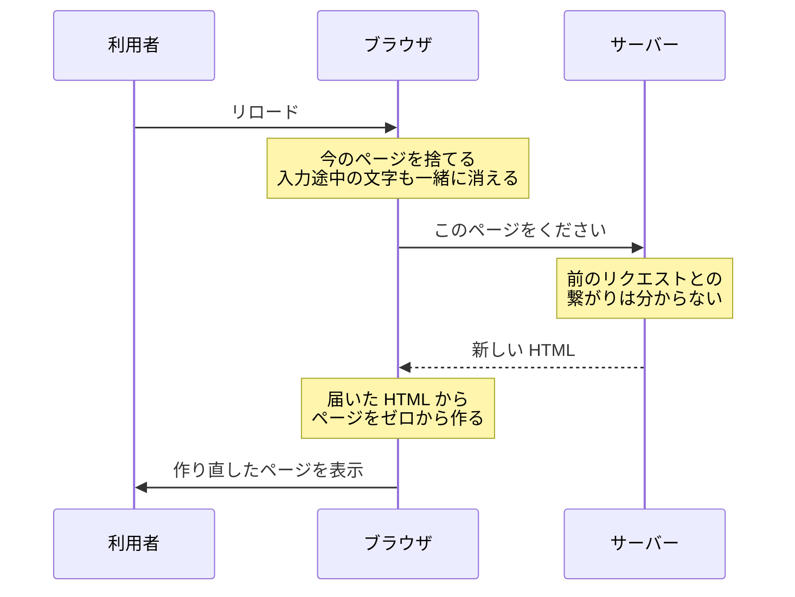

# Day 48: Web はステートレス — リロードすると消えるものと消えないもの

## 今日のゴール

- リロードで消えるものと残るものを、保存されているかどうかで見分けられる
- サーバーもブラウザも、何もしなければ前の状態を持たないと分かる
- 覚えていないサーバーで「ログイン中」が続く仕組みを知る
- 残したいものには保存する処理が要ると分かる

## リロードで消えるものと残るもの

通販サイトでリロードすると、同じ画面の中で消えるものと残るものに分かれます。

消えるもの:

- 書きかけの文章
- 選んでいたサイズや数量
- 出ていたエラーメッセージ

残るもの:

- ログイン状態
- カゴの中身
- 投稿済みのレビュー

書きかけの文章は消えるのに、投稿したレビューは残ります。同じ自分が打った文字なのに、扱いが分かれています。

この違いはどこから来るのでしょうか。

## サーバーは前のリクエストを覚えていない

リロードは、ブラウザがサーバーへ「このページをもう一度ください」と頼み直す操作です。

頼まれたサーバーは、届いたリクエストを見て返事を作り、返したらそのやりとりを覚えていません。次のリクエストが来たとき、それがさっきの続きなのか、別の誰かなのかを知りません。

HTTP は、リクエスト1回とレスポンス1回で完結するように作られています。前のやりとりを引き継がないこの性質を、**ステートレス**（状態を持たない）と言います。

だからサーバーから見ると、リロードして来た人も初めて来た人も区別がつきません。毎回が初対面です。

サーバーが覚えていないなら、ブラウザが覚えていればよさそうです。ところがブラウザも、リロードのときに今のページを持ち続けません。

## ブラウザはページを捨てて作り直す

リロードすると、ブラウザは今表示しているページをいったん閉じて、サーバーから届いた HTML でページを新しく作り直します。今のページを直すのではなく、捨ててゼロから作ります。

書きかけの文章も、選んでいたサイズも、出ていたエラーメッセージも、今のページの上にあったものです。ページを捨てるとき、一緒に捨てられます。

ページの上で動いていた JavaScript も終了し、変数に入れていた値もこのとき消えます。

```mermaid
sequenceDiagram
  participant U as 利用者
  participant B as ブラウザ
  participant S as サーバー
  U->>B: リロード
  Note over B: 今のページを捨てる<br/>入力途中の文字も一緒に消える
  B->>S: このページをください
  Note over S: 前のリクエストとの<br/>繋がりは分からない
  S-->>B: 新しい HTML
  Note over B: 届いた HTML から<br/>ページをゼロから作る
  B->>U: 作り直したページを表示
```

つまり、サーバーは覚えておらず、ブラウザもページごと捨てます。**何もしなければ、リロードのたびに全部消える**のが Web の素の動きです。

それでも、カゴの中身とログインは残っていました。ページと一緒には捨てられない場所に置かれているからです。

## 残っているものには保存先がある

カゴに商品を入れた瞬間、その情報はサーバーのデータベースに書き込まれています。投稿したレビューも、注文の履歴も同じです。

リロードで届く新しい HTML は、サーバーがこの保存された内容をもとに作ったものです。カゴの中身はページの上で生き残ったのではなく、**保存された内容から毎回作り直されています**。

書きかけの文章が消えて、投稿済みのレビューが残るのも同じ理由です。投稿ボタンを押した文字はサーバーに保存されていて、押していない文字はページの上にしかありません。

ログインが残るのは、もう1つの保存場所があるからです。ブラウザには、ページを捨てても消えない置き場が別にあります。

ログインに成功すると、サーバーは「この人はログイン済みです」という印になる値を発行して、ブラウザに渡します。ブラウザはそれを保存しておきます。

以降のリクエストには、この値が毎回添えられます。サーバーは届いた値を見て、前のやりとりを覚えていなくても「ログイン済みの人からのリクエストだ」と分かります。

この印の置き場に使われるのが **Cookie** です。リクエストに自動で添えられる仕組みがあるので、毎回持っていく値に向いています。

ブラウザにはもう1つ **localStorage** という置き場もあります。下書きのように、サーバーへ送る必要がなくてブラウザの中だけで使うものはこちらです。

リロードは同じ URL を頼み直す操作なので、URL に書いてあるものは何もしなくても残ります。`?sort=price&page=2` の `?` 以降を**クエリパラメータ**と呼び、並び順やページ番号はここで伝えられています。

リンクを送れば、相手も同じ画面を開けます。

どこに置くかで、いつまで残るかが変わります。

| 置き場所 | 何が残るか | いつまで残るか |
|---|---|---|
| サーバー（データベース） | カゴの中身、投稿、注文履歴 | 消すまで。別の端末から開いても残る |
| ブラウザ（Cookie、localStorage） | ログイン済みの印、下書き | 期限が来るか消すまで。その端末の中だけ |
| URL（クエリパラメータ） | 並び順、ページ番号、絞り込み | その URL を開いている間。人にも送れる |
| どこにも置かない | 書きかけの文章、選んでいたサイズ | リロードすると消える |

画面に出ているものは、放っておけば消えます。残っているものは、誰かがどこかに保存しています。

カゴの中身が残るのは当たり前ではなく、残るように作った人がいるからです。

## ログイン済みの印は盗まれると成りすまされる

残す工夫の中で、いちばん扱いに気を使うのがログイン済みの印です。この値を添えてリクエストすれば、サーバーはログイン済みの人として扱います。

裏を返すと、値を手に入れた人は誰でも本人になりすませます。パスワードを知らなくても、印さえ送ればカゴの中身も注文履歴も見られます。

しかも印は毎回のリクエストに添えられるので、盗む機会も毎回あります。だから Cookie には、通信の途中でのぞき見られたり、ページの中の JavaScript から読み取られたりするのを防ぐ指定が用意されています。

指定の名前まで覚える必要はありません。印の値そのものが本人の証明になるので、値を守る仕組みとセットで使うのが前提です。

## サーバーは印を見て誰か分かる

印にはもう1つ引っかかる点があります。サーバーは前のやりとりを覚えていないはずなのに、届いた値を見てログイン済みと判断できています。

よくあるのは、サーバー側の保存場所に「この番号の人はログイン済み」という記録を作り、ブラウザには記録を指す番号だけを渡すやり方です。この記録を**セッション**と呼びます。

次のリクエストで番号が届いたら、保存場所の記録を引いて誰のリクエストか分かります。やりとりを覚えているのではなく、カゴの中身と同じように、保存した内容を毎回引いています。

記録を作らないやり方もあります。「誰が、いつまでログイン済みか」という情報を値そのものに埋め込んでブラウザに渡し、サーバーは届いた値が途中で書き換えられていないかを確かめるだけにします。

こうした値を**トークン**と呼びます。セッションもトークンも、ログインまわりの会話でそのまま出てくる言葉です。

## 覚えないからサーバーを増やせる

覚えない性質には、助けられている場面もあります。

人気のサイトには、同時に何万人もアクセスします。1台のサーバーではさばききれないので、同じ返事を返せるサーバーを何台も並べて、届いたリクエストを手の空いた台に振り分けます。

もし各サーバーが1人ひとりの途中経過を抱えていたら、この振り分けはできません。次のリクエストが別の台に届いたとき、続きの情報がさっきの台にしかないからです。

何も覚えていなければ、どのリクエストをどの台が受けても同じ返事ができます。混雑してきたら台数を増やせばよく、1台壊れても別の台が受ければ済みます。

セッションの記録も、各台の中ではなく、どの台からも見にいける保存場所に置きます。残したいものを外の保存場所に出しておけば、サーバーは何台に増えても同じように動けます。

## 何を残すかは作る側が決めている

残したいものがあるなら、どこに置くかを決めて、保存する処理を入れることになります。

長い応募フォームで、途中まで書いた内容を次に開いたときも残したいとします。

打たれた内容をどこかへ保存して、開き直したときに読み込む処理が要ります。それを作らない限り、書きかけの内容はリロードのたびに消えます。

逆に、何でも保存すればよいわけでもありません。消えていいものまで残すと、別の困りごとが出ます。

たとえば検索の絞り込み条件を保存すると、翌日開いたときも昨日の条件で絞られたままです。絞り込んだ覚えのない利用者には、商品が少ないサイトに見えます。

利用者には「表示がおかしくなったらリロードすれば直る」という感覚もあります。何もかも残す作りは、このやり直しの手段を奪います。

画面の中のひとつひとつについて、消えていいものか、残るべきものかを分けます。残るべきなら保存先を決め、消えていいなら何もしません。

## まとめ

- 画面に出ているものは、何もしなければリロードで消え、残っているものには保存先がある
- ログイン済みの印は毎回送るぶん盗まれる危険があり、Cookie には守る仕組みが付いている
- ログイン中を続けるやり方には、記録を指す番号を渡すセッションと、値そのものを検証するトークンがある
- 何も覚えないからこそ、どの台のサーバーが受けても同じ返事ができ、台数を増やせる
