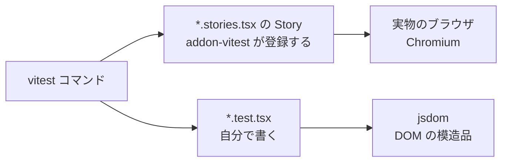

# Day 49: コンポーネントテストの書き場所 — Story に書くか、テストファイルに書くか

## 今日のゴール

- コンポーネントのテストが「描画・操作・検証」の3つでできていると知る
- アドオンを入れると、カタログとして書いた Story がそのままテストになると知る
- Story の play 関数とテストファイル、2つの書き方の違いを知る

## コンポーネントのテストで確かめたいこと

ログインフォームを例にします。メールアドレスとパスワードを入力してボタンを押すと、`onSubmit` が呼ばれるコンポーネントです。

このコンポーネントのテストで確かめたいのは、たとえばこんなことです。

- 空のまま送信すると、エラーメッセージが表示される
- 正しく入力して送信すると、入力した値で `onSubmit` が呼ばれる
- 送信中はボタンが押せなくなる

どのケースも、やることは同じ3つに分かれます。

1. **描画する**: コンポーネントを props 付きで画面に出す
2. **操作する**: 入力してボタンを押す
3. **検証する**: エラーが出たか、`onSubmit` が呼ばれたかを確かめる

このうち「描画する」は、Storybook を使っているチームならすでに書いてあります。Story がまさにそれだからです。

## アドオンを入れると Story がテストになる

Story は「このコンポーネントを、この props で描画する」という定義です。

```tsx
// Button.stories.tsx から、Story の定義部分だけを抜き出したもの
export const Primary: Story = { args: { variant: "primary" } };
export const Disabled: Story = { args: { disabled: true } };
```

Storybook のアドオン addon-vitest を入れると、この Story が1件ずつ、Vitest というテスト実行ツールのテストとして走るようになります。

```bash
npx storybook add @storybook/addon-vitest
```

実行されるのは「描画がエラーなく完了するか」の確認です。公式ドキュメントはこれを render test と呼び、「Story が正しく描画されれば成功、途中でエラーを投げれば失敗」と説明しています。

Story が8個あるボタンコンポーネントでこの設定を試すと、テストコードを1行も書いていないのに、8件のテストが実行されます。Story を1つ足すたびに、テストも1件増えます。

アクセシビリティのアドオン addon-a11y も入れると、各 Story に対して axe という自動チェックが一緒に走ります。ラベルのないボタンやコントラスト不足のような問題を、Story を書くだけで検出できます。

ただし render test が確かめるのは「壊れずに表示できる」ことまでです。冒頭のケースの「操作して、検証する」はまだ残っています。

## Story に足す play 関数

操作と検証を、Story 自身に書く方法があります。Story には play という関数を持たせることができて、描画が終わったあとに実行されます。

```tsx
// LoginForm.stories.tsx
import type { Meta, StoryObj } from "@storybook/react-vite";
import { expect, fn } from "storybook/test";
import { LoginForm } from "./LoginForm";

const meta = {
  component: LoginForm,
  // fn() は呼び出しを記録する関数（スパイ）。あとで「呼ばれたか」を検証できる
  args: { onSubmit: fn() },
} satisfies Meta<typeof LoginForm>;

export default meta;
type Story = StoryObj<typeof meta>;

/** 空のまま送信するとエラーが出て、送信されない */
export const ValidationErrors: Story = {
  play: async ({ canvas, userEvent, args }) => {
    await userEvent.click(canvas.getByRole("button", { name: "ログイン" }));

    await expect(await canvas.findByText("メールアドレスを入力してください")).toBeInTheDocument();
    await expect(args.onSubmit).not.toHaveBeenCalled();
  },
};
```

- `canvas`: Story が描画された範囲から要素を探すクエリ集
- `userEvent`: クリックや入力を、ユーザーがしたのと同じ形で再現する
- `args.onSubmit`: args に入れたスパイ。呼ばれたかどうかを検証できる

この play は、Storybook の画面を開かなくても実行されます。addon-vitest が Story を1件ずつ Vitest のテストとして登録し、そのテストを実物のブラウザの中で走らせる設定を一緒に入れるからです。

使われるブラウザは、Playwright というブラウザ操作ツールが起動する Chromium です。

同じ play は、Storybook の画面でもそのまま動きます。Story を開くと操作が目の前で再生され、Interactions パネルで1ステップずつ確認できます。

テストが落ちたときは、ログではなく実際の画面を見ながら調べられます。

検証のための Story が増えてカタログが散らかるのが気になるなら、表示だけを消せます。

```tsx
export const ValidationErrors: Story = {
  tags: ["!dev", "!autodocs"], // サイドバーと Docs には出さない。テストとしては実行される
  play: async ({ canvas, userEvent, args }) => { /* 上と同じ */ },
};
```

サイドバーへの表示（dev タグ）とテスト実行（test タグ）は別々に管理されているので、「テストは走るが一覧には出ない」Story を作れます。

## テストファイルに書く Testing Library

同じ操作と検証を、Story とは別のテストファイルに書くこともできます。React のテストの定番、Testing Library を使う書き方です。

さっきとまったく同じケースを書くとこうなります。

```tsx
// LoginForm.test.tsx
import { render, screen } from "@testing-library/react";
import userEvent from "@testing-library/user-event";
import { expect, test, vi } from "vitest";
import { LoginForm } from "./LoginForm";

test("空のまま送信するとエラーが出て、送信されない", async () => {
  const onSubmit = vi.fn(); // 呼び出しを記録するスパイ
  render(<LoginForm onSubmit={onSubmit} />);

  await userEvent.click(screen.getByRole("button", { name: "ログイン" }));

  expect(await screen.findByText("メールアドレスを入力してください")).toBeInTheDocument();
  expect(onSubmit).not.toHaveBeenCalled();
});
```

操作と検証の書き方はほぼ同じです。違うのはその外側で、Story を使わずに `render` とスパイの準備を自分で書いています。

実行環境も違います。ブラウザを起動する設定が入るのは addon-vitest が登録した Story のテストだけで、自分で書いたテストファイルはその外で走ります。

こちら側で使うのは jsdom という「Node.js の上で動く DOM の模造品」です。ブラウザを立ち上げないぶん速く始まります。

## 2つの書き方の違い

同じケースが、どちらの書き方でも成立します。確かめられる内容そのものは変わりません。

どちらも `vitest` コマンドで走りますが、たどり着く先が分かれます。



違いが出るのは、確かめる内容ではなく次の点です。

| | Story の play | テストファイル |
|---|---|---|
| 書く場所 | `*.stories.tsx` | `*.test.tsx` |
| 描画の準備 | Story の args をそのまま使う | 自分で `render` とスパイを書く |
| 実行環境 | 実物のブラウザ（Chromium） | jsdom |
| 立ち上がり | ブラウザ起動に数秒かかる | 起動なしで速い |
| 落ちたときの調べ方 | Storybook の画面で操作を再生 | ターミナルの出力を読む |
| Story を足すと | render test も1件増える | テストの数は変わらない |

テストが何件あっても、起動の数秒は毎回かかります。件数が少ないうちは、これがそのまま実行時間の差になります。

差は速度だけではありません。jsdom は模造品なので、フォーカスの移動や Tab キーで移る順番のような、ブラウザ本体の振る舞いに踏み込む検証は、本物と同じという保証がありません。

公式ドキュメントも、実ブラウザでの実行を「jsdom のようなシミュレーションより正確」と説明しています。

## 選ぶときの観点

play とテストファイルのどちらに書くべきかの基準は、公式ドキュメントにはありません。書かれているのは、実ブラウザで見られる、Story とテストが同じファイルにある、という play 側の利点までです。

決め手になるのは、自分たちの条件のほうです。

- キーボード操作やフォーカスなど、ブラウザ本体の挙動に踏み込む検証がどれだけあるか
- テストを自動実行する環境（CI）で Chromium を動かせるか。play を自動実行するには Playwright のブラウザが必要になる
- Testing Library で書かれた既存のテストがどれだけあるか

## まとめ

- Story は「この props で描画する」という定義で、addon-vitest を入れるとそのまま render test になる
- 操作と検証は、Story の play に書けば実ブラウザ、テストファイルに書けば jsdom で走る
- 確かめられる内容は同じで、違いは実行環境と失敗を調べる場所
