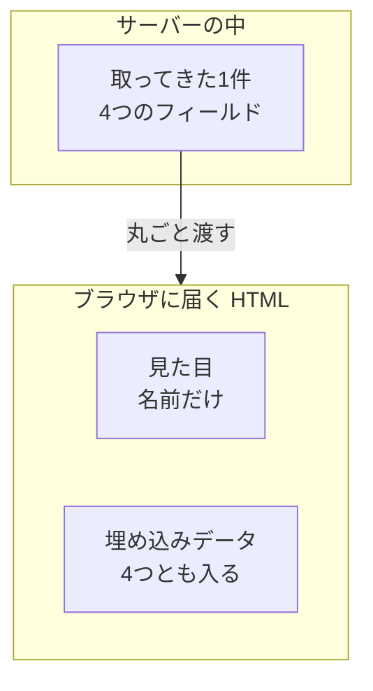
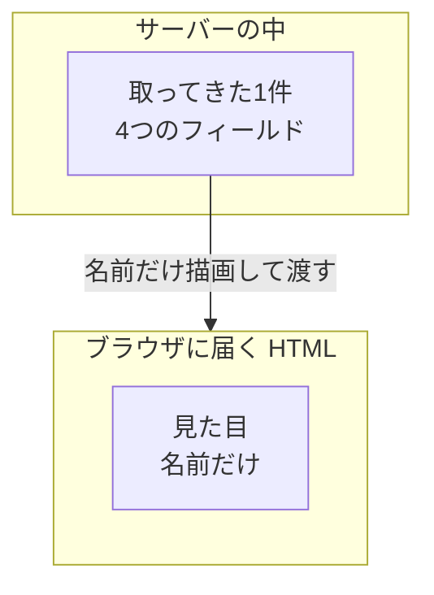
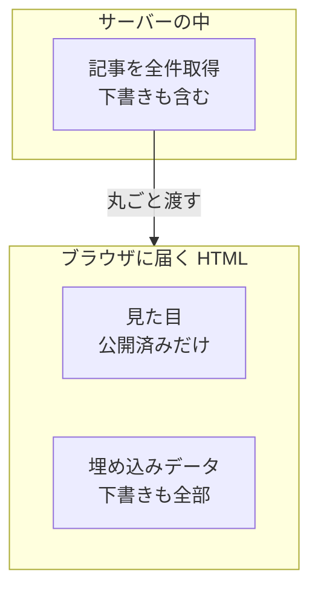

# Day 51: サーバーから渡したデータは全部見える — 表示しないフィールドも HTML に載る

## 今日のゴール

- サーバーで取ったデータが、画面に出していなくてもページのソースに残ると知る
- 残るのはブラウザ側に渡した値だけで、サーバーの中で使い切った値は残らないと知る
- 渡す前に必要なフィールドだけ選ぶ、という直し方を知る

## 画面には名前しか出ていないのに

利用者のプロフィールを表示するページを考えます。サーバーでデータベースから利用者の情報を取ってきて、名前を表示するだけの画面です。

```tsx
// app/page.tsx
import Profile from "./profile";

async function getUser() {
  // データベースから取ってきた1件。テーブルの列がそのまま入っている
  return {
    name: "田中",
    email: "tanaka@example.com",
    passwordHash: "$2b$10$SUPERSECRETHASH",
    isAdmin: false,
  };
}

export default async function Page() {
  const user = await getUser();
  return <Profile user={user} />;
}
```

```tsx
// app/profile.tsx
"use client";

export default function Profile({ user }: { user: User }) {
  return <h1>{user.name}</h1>;
}
```

画面に出るのは「田中」だけです。メールアドレスも、パスワードのハッシュ（パスワードを変換した照合用の文字列）も、どこにも表示していません。

ところが、このページを開いてブラウザの「ページのソースを表示」を選ぶと、こういう中身のデータが見つかります。

```
{"user":{"name":"田中","email":"tanaka@example.com",
"passwordHash":"$2b$10$SUPERSECRETHASH","isAdmin":false}}
```

取ってきた4つのフィールドが、そのまま HTML の中に入っています。開発者ツールも要らず、ソースを表示して検索するだけで読めます。

## なぜ HTML に入るのか

サーバーが作った HTML は、文字と要素が並んだ静止画のようなものです。それだけでは、ボタンを押しても何も起きません。

押したら動く画面にするには、ブラウザ側でも同じ部品を組み立て直す必要があります。組み立て直すには、サーバーが描画に使ったのと同じデータが要ります。

届いた HTML にブラウザ側で部品を結びつけて、押したら動く状態にすることを**ハイドレーション**と呼びます。乾いた HTML に水を差して動かす、という比喩から来た言葉です。

そこでサーバーは、HTML を返すときに**組み立て直しに使うデータも一緒に埋め込んで**送ります。ブラウザはそれを読んで、画面の続きを引き受けます。



埋め込まれる場所は `<script>` タグの中です。実物はこういう形をしています。

```html
<script>self.__next_f.push([1,"4:[\"$\",\"$Ld\",null,{\"user\":{\"name\":\"田中\",
\"email\":\"tanaka@example.com\",\"passwordHash\":\"$2b$10$...\"}}]"])</script>
```

読みづらい形をしていますが、渡したデータが JSON の形でそのまま入っています。検索すれば普通に見つかります。

これは Next.js の欠陥ではありません。サーバーで作った画面をブラウザ側で動かす作りにする以上、組み立て直しに使うデータを渡すことは避けられないからです。同じ作りのフレームワークは、名前と置き場所が違うだけで、どれも同じことをしています。

## 埋め込まれるのは渡した値だけ

ここで大事なのは、サーバーが触ったデータが何でも埋め込まれるわけではないことです。

App Router の部品は2種類に分かれます。サーバーだけで動く部品（サーバーコンポーネント）と、ブラウザでも動く部品（クライアントコンポーネント）です。ファイルの先頭に `"use client"` と書いてあるものが後者で、これがブラウザ側に渡る境目になります。

さっきの `Profile` はブラウザでも動く部品なので、そこへ渡した `user` は丸ごとブラウザに送られます。表示に使ったのが `name` だけでも関係ありません。**渡したオブジェクトの全フィールドがそのまま運ばれます。**

同じデータを、サーバーだけで動く部品の中で使い切るとどうなるか。

```tsx
// app/page.tsx（ブラウザ側に渡さない書き方）
export default async function Page() {
  const user = await getUser();
  return <h1>{user.name}</h1>;
}
```

このページのソースには「田中」しか出てきません。`passwordHash` も `email` も `isAdmin` も、文字列としてどこにも存在しません。サーバーの中で使い終わり、結果の文字だけが HTML になったからです。



| 書き方 | HTML に残るもの |
|---|---|
| ブラウザ側の部品に丸ごと渡す | 渡したオブジェクトの全フィールド |
| サーバー側の部品の中で使い切る | 描画された文字だけ |

境目は「サーバーで取ったかどうか」ではなく、「ブラウザ側に渡したかどうか」です。

## 事故になりやすい形

漏れるのはたいてい、悪意でも手抜きでもなく、ありふれた書き方が2つ重なったときです。データベースの1行を `SELECT *` でそのまま取ってくると、パスワードのハッシュも内部フラグも付いてきます。その1行を `<Profile user={user} />` とそのまま部品に渡しても、画面は期待どおりに動きます。

期待どおりに動くので、動作確認では気づけません。**表示は正しいのに中身が漏れている**という形の事故です。

漏れて困るのはパスワードのハッシュだけではありません。一覧を出す画面では、条件で絞ったつもりの分まで渡していることがあります。

```tsx
// 公開済みだけ表示するつもりの一覧
export default async function Page() {
  const articles = await db.article.findAll(); // 下書きも含めて全部取れている
  return <ArticleList articles={articles} />;
}
```

```tsx
"use client";

export default function ArticleList({ articles }) {
  // 画面には公開済みしか出ない
  return <ul>{articles.filter((a) => a.published).map(/* ... */)}</ul>;
}
```

絞り込みをブラウザ側でやると、絞る前の全件が HTML に載ります。未公開記事の本文も、他人の下書きも、ソースを見れば読めます。



同じことが権限の出し分けでも起きます。`isAdmin` を渡して管理メニューの表示を切り替える書き方だと、権限のない利用者にもフラグが届いています。**隠しただけで、渡してはいる**という状態です。

絞り込みも出し分けも、サーバー側で済ませてから渡せば起きません。

## 実際に見つかっている

ある政府系のサイトでは、ページに埋め込まれたデータの中に、画面には出していない情報が入ったままになっていました。外部の開発者がそれを見つけて指摘しています。

セキュリティ診断の手引きにも、Next.js で作られたサイトを調べるときは埋め込みデータを開いて余分なフィールドがないか確かめる、という手順が載っています。

攻撃の腕前は要りません。埋め込みデータは**ページを開ける人なら誰でも読める**ので、外に出てしまうかどうかは、誰かが見たかどうかだけで決まります。

## 渡す前に絞る

直し方は単純で、渡す前に必要なフィールドだけ選びます。

```ts
// data/user.ts
export async function getUser(id: string) {
  const user = await db.user.findById(id);

  // 画面に必要なものだけを返す
  return {
    name: user.name,
    avatarUrl: user.avatarUrl,
  };
}
```

取得する場所で絞ってしまえば、あとから誰がどう渡しても漏れません。呼び出し側で毎回気をつける作りにすると、いつか漏れます。

受け取る側の型を絞っても、それだけでは防げません。TypeScript は、必要なフィールドさえ揃っていれば余分なフィールドを持つ値もそのまま受け入れますし、型が実行時に値を削ってくれるわけでもないからです。

「ブラウザに渡すな」という話ではありません。入力欄に初期値としてメールアドレスを出すなら、それは渡す必要があります。渡してよいかどうかは、本人に見せてよい値かどうかで決まります。

まずいのは、必要かどうかを考えずに丸ごと渡すことです。渡すものを1つずつ選んでいれば、選んだ時点で「これは見せてよいか」を考えることになります。

## 自分の画面で確かめる

いま作っているページで確かめられます。

ブラウザで右クリックして「ページのソースを表示」を選び、出てきたテキストを検索します。探す言葉は、画面に出していないのに知っている値です。自分のメールアドレス、内部 ID、フラグの名前など。

出てきたら、そのデータはブラウザに届いています。そのページを開ける人なら誰でも読めます。

見るのは開発者ツールの Elements ではなく、ページのソースのほうが確実です。ソースにはサーバーが送った HTML がそのまま出るので、埋め込まれたデータもテキスト検索でそのまま引っかかります。

## まとめ

- ブラウザ側の部品に渡したデータは、表示しなくても HTML に埋め込まれる
- 埋め込まれるのは渡したオブジェクトの全フィールドで、使ったフィールドだけではない
- 取得する場所で必要なフィールドだけに絞れば、渡し方に関係なく漏れない
