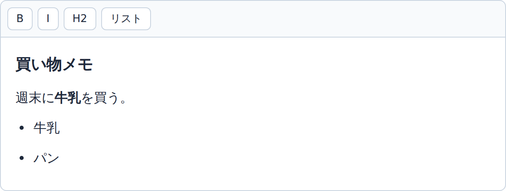
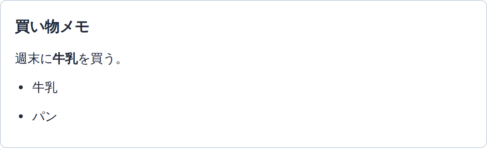

# Day 52: Tiptap — 見た目は自分で作るリッチテキストエディタ

## 今日のゴール

- 書きながら装飾できる入力欄は、既製のエディタライブラリで作ると知る
- Tiptap は動きだけを提供して見た目を持たない、ヘッドレスなライブラリだと分かる
- 中身は HTML の文字列ではなく、スキーマで定義された木だと知る
- 定義外が落ちるのはエディタを通した入力だけで、サーバー側の検証は別に要ると分かる

## 書きながら装飾できる入力欄

Notion でも、Google ドキュメントでも、note の投稿画面でもかまいません。文字を打ちながら、その場で一部を太字にしたり、見出しにしたり、箇条書きにしたりできる入力欄を使ったことがあると思います。

<figure class="day52-fig">
  
  <figcaption class="day52-sub">これから説明する Tiptap で作った入力欄。B を押すと選んだ文字が太字になる</figcaption>
</figure>

こういう入力欄は、**リッチテキストエディタ**と呼ばれます。「書式付きの文章を書ける入力欄」という意味です。

`<textarea>` では作れません。`<textarea>` が持てるのはただの文字だからです。改行はできますが、一部だけ太字にすることはできません。

## エディタは一から作らずライブラリを使う

リッチテキストエディタは、自分で一から作るものではありません。文字の装飾、選択範囲の扱い、取り消しとやり直し、外部からの貼り付け、日本語の変換中の挙動など、考えることが多く、どれも細かい調整が要ります。

そこで既製のライブラリを使います。この分野にはいくつも選択肢があり（Quill、Lexical など）、そのうちのひとつが **Tiptap** です。

Tiptap は ProseMirror というエディタ基盤の上に作られています。ProseMirror は書式付き文書を扱うための土台で、長く使われてきた実績があります。

ただし ProseMirror は細かい部品を自分で組み上げる作りで、そのまま使うには手間がかかります。Tiptap はその上に、React などから使いやすい形の API をかぶせたものです。

## ヘッドレス — 動きはあるが見た目がない

Tiptap は自らを headless（ヘッドレス）と説明しています。**動きは全部持っているが、見た目は一切持っていない**という意味です。

インストールして表示しても、ツールバーは出てきません。太字ボタンも、見出しのプルダウンもありません。出てくるのは、編集できる領域だけです。

<div class="day52-box">
  <div class="day52-cols">
    <div>
      <div class="day52-cap">置いただけの状態</div>
      
      <div class="day52-sub">編集はできる。ボタンは付いてこない</div>
    </div>
    <div>
      <div class="day52-cap">ボタンを自分で作ると</div>
      
      <div class="day52-sub">見た目も並びも自分で決められる</div>
    </div>
  </div>
  <div class="day52-sub">どちらも同じ Tiptap。違うのは、上のボタンを自分で置いたかどうかだけ</div>
</div>

ボタンは自分で作り、押されたら Tiptap に命令を送ります。

```jsx
<button onClick={() => editor.chain().focus().toggleBold().run()}>
  太字
</button>
```

面倒に見えますが、これが選ぶ理由でもあります。ボタンの見た目も並びも、既存のデザインに合わせて作れます。付いてきた UI を CSS で上書きして戦う作業が発生しません。

## Next.js で動かす

インストールするのはこれです。

```bash
npm install @tiptap/react @tiptap/pm @tiptap/starter-kit
```

公式が案内している最小の形はこうです。

```jsx
"use client";

import { useEditor, EditorContent } from "@tiptap/react";
import StarterKit from "@tiptap/starter-kit";

const Tiptap = () => {
  const editor = useEditor({
    extensions: [StarterKit],
    content: "<p>Hello World! 🌎️</p>",
    // サーバー側では描画しない
    immediatelyRender: false,
  });

  return <EditorContent editor={editor} />;
};

export default Tiptap;
```

`"use client"` が要ります。エディタはブラウザの操作を扱うので、サーバー側では動かせません。

`immediatelyRender: false` も公式が付けています。ブラウザ側の準備が終わってから描画させる指定です。

Next.js はサーバーでいったん HTML を作り、ブラウザで動きを付け直すときに両者を突き合わせます（ハイドレーション）。エディタはブラウザでしか動かないため、この指定がないと突き合わせでずれが出てエラーになります。

`extensions` に渡している StarterKit は、よく使う機能をまとめた詰め合わせです。段落、見出し、太字、斜体、箇条書き、引用、コードブロックなどが入っています。

## 中身は HTML 文字列ではなく部品の木

書いた内容は `editor.getJSON()` で取り出せます。中身は HTML の文字列ではありません。

「買い物メモ」という見出しと、「週末に**牛乳**を買う。」という段落を書くと、こうなります。

<div class="day52-box" id="day52-map">
  <div class="day52-cols">
    <div>
      <div class="day52-cap">画面の見た目</div>
      <div class="day52-render">
        <div class="day52-h2"><button type="button" class="day52-p " data-k="h" onclick="var k=this.dataset.k;document.querySelectorAll('#day52-map [data-k]').forEach(function(e){e.classList.toggle('day52-on', e.dataset.k===k)})">買い物メモ</button></div>
        <div class="day52-para"><button type="button" class="day52-p " data-k="t1" onclick="var k=this.dataset.k;document.querySelectorAll('#day52-map [data-k]').forEach(function(e){e.classList.toggle('day52-on', e.dataset.k===k)})">週末に</button><button type="button" class="day52-p day52-b" data-k="b" onclick="var k=this.dataset.k;document.querySelectorAll('#day52-map [data-k]').forEach(function(e){e.classList.toggle('day52-on', e.dataset.k===k)})">牛乳</button><button type="button" class="day52-p " data-k="t2" onclick="var k=this.dataset.k;document.querySelectorAll('#day52-map [data-k]').forEach(function(e){e.classList.toggle('day52-on', e.dataset.k===k)})">を買う。</button></div>
      </div>
    </div>
    <div>
      <div class="day52-cap">Tiptap が持っている中身</div>
<pre class="day52-json">{
  "type": "doc",
  "content": [
    <button type="button" class="day52-p " data-k="h" onclick="var k=this.dataset.k;document.querySelectorAll('#day52-map [data-k]').forEach(function(e){e.classList.toggle('day52-on', e.dataset.k===k)})">{ "type": "heading", "attrs": { "level": 2 },<br>      "content": [{ "type": "text", "text": "買い物メモ" }] }</button>,
    { "type": "paragraph", "content": [
      <button type="button" class="day52-p " data-k="t1" onclick="var k=this.dataset.k;document.querySelectorAll('#day52-map [data-k]').forEach(function(e){e.classList.toggle('day52-on', e.dataset.k===k)})">{ "type": "text", "text": "週末に" }</button>,
      <button type="button" class="day52-p " data-k="b" onclick="var k=this.dataset.k;document.querySelectorAll('#day52-map [data-k]').forEach(function(e){e.classList.toggle('day52-on', e.dataset.k===k)})">{ "type": "text", "marks": [{ "type": "bold" }], "text": "牛乳" }</button>,
      <button type="button" class="day52-p " data-k="t2" onclick="var k=this.dataset.k;document.querySelectorAll('#day52-map [data-k]').forEach(function(e){e.classList.toggle('day52-on', e.dataset.k===k)})">{ "type": "text", "text": "を買う。" }</button>
    ] }
  ]
}</pre>
    </div>
  </div>
  <div class="day52-sub">どちらかを選ぶと、対応する相手が光ります</div>
</div>

タグの並びではなく、入れ子になった部品の木です。太字は `<strong>` というタグではなく、その文字に付いた `bold` という**マーク**として表されています。

この形は**スキーマ**という定義に沿っています。どんな部品が存在してよいか、どれがどれの中に入れるか、どんな属性を持てるかが、あらかじめ決まっています。StarterKit で定義されているのは次の範囲です。

| 種類 | 定義されているもの |
|---|---|
| ノード（部品） | doc, paragraph, heading, text, bulletList, orderedList, listItem, blockquote, codeBlock, horizontalRule, hardBreak |
| マーク（文字に付く装飾） | bold, italic, strike, underline, code, link |

## 定義にないタグや属性は落ちる

スキーマの効き目は、汚れた HTML をエディタの変換に通してみると分かります。

```js
import { generateJSON, generateHTML } from "@tiptap/html";
import StarterKit from "@tiptap/starter-kit";

const dirty =
  '<p>ふつうの文</p>' +
  '<script>alert(1)</script>' +
  '<marquee>流れる</marquee>' +
  '<p onclick="steal()">クリック</p>';

console.log(generateHTML(generateJSON(dirty, [StarterKit]), [StarterKit]));
// <p>ふつうの文</p><p>流れる</p><p>クリック</p>
```

`<script>` は中身ごと消え、`<marquee>` は `<p>` になり、`onclick` も落ちました。`img` も StarterKit の一覧にないので残りません。

よそのページからコピーした文章を貼り付けても、通るのは定義のあるものだけです。色の指定も知らないタグも、木に入らないので残りません。

## 足りない部品は拡張で足す

画像が落ちるのは、スキーマに画像の定義がないからです。使いたい部品があるなら、定義そのものを足します。それが**拡張**です。

```jsx
import Image from "@tiptap/extension-image";

const editor = useEditor({
  extensions: [StarterKit, Image],
  // ...
});
```

これでスキーマに image ノードが加わり、画像が木に入るようになります。StarterKit も、こうした拡張の詰め合わせです。足りなければ足し、要らないものは外せます。

よくある要望には、たいてい公式の拡張があります。

| やりたいこと | 拡張 |
|---|---|
| 画像を貼る | `@tiptap/extension-image` |
| 表を入れる | `@tiptap/extension-table` |
| @ で人を呼ぶメンション | `@tiptap/extension-mention` |
| YouTube 動画を埋め込む | `@tiptap/extension-youtube` |
| 蛍光ペンのように文字を塗る | `@tiptap/extension-highlight` |
| 未入力時の案内文・文字数カウント | `@tiptap/extensions` |

部品を増やすものだけでなく、表の最後の2つのように、木はそのままで振る舞いだけ足す拡張もあります。エディタに機能が欲しくなったら、まず公式の拡張一覧を探します。

コメント機能や変更履歴のような大きめの機能は Pro 拡張という別枠で、アカウント登録のうえ専用のレジストリからインストールします。一部は有料プランの契約が要ります。

## 取り出し方は JSON と HTML

保存するときは、書いた内容をどちらかの形で取り出します。

```js
editor.getJSON();  // 上のような木
editor.getHTML();  // <h2>買い物メモ</h2><p>…</p>
```

公式はどちらで保存してもよいとしたうえで、選ぶ理由を挙げています。

- **JSON**: 走査しやすい。本文中のメンションを探すような処理が書きやすい。エディタが内部で使っている形に近い
- **HTML**: ほかの場所でそのまま描画しやすい。メールに載せるなど。広く使われている形なので、あとでエディタを乗り換えるときに移しやすい

HTML で取り出す場合も、出てくるのは木から組み立て直した HTML です。入れた HTML の写しではありません。

## 保存した内容を画面に出す

保存した内容は、書く画面の外でも表示することになります。投稿した文章を読むページに、編集機能は要りません。

エディタをそのまま置いて、編集だけできなくする方法があります。

```jsx
const editor = useEditor({
  extensions: [StarterKit],
  content: saved, // 保存してあった JSON
  editable: false,
  immediatelyRender: false,
});
```

書く画面とまったく同じ見た目で表示され、CSS を二重に持たずに済みます。その代わり、読むだけのページにもエディタ一式の JavaScript が載ります。

ただ読ませたい記事ページなら、保存した JSON から HTML を組み立てる方法もあります。さっき汚れた HTML の実験で使った `generateHTML` は、エディタなしで動く関数で、サーバー側でも実行できます。

```js
import { generateHTML } from "@tiptap/html";
import StarterKit from "@tiptap/starter-kit";

// saved はデータベースから読み出した JSON
const html = generateHTML(saved, [StarterKit]);
// <h2>買い物メモ</h2><p>週末に<strong>牛乳</strong>を買う。</p>
```

ただし、できた HTML 文字列を React の画面に入れるには `dangerouslySetInnerHTML` を使うことになります。名前からして警告で、流し込む中身が安全かどうかは自分で保証しなければなりません。

## 落ちるのはエディタを通した入力だけ

ここまでを読むと、Tiptap を使えば危ないタグは勝手に消えるように見えます。**これは危険な読み方です。**

消えたのは、エディタの変換を通したからです。通っていないものには何も起きません。

保存 API はリクエストを受け取るだけで、送り主が画面のエディタを使ったかどうかを知りません。攻撃する側はエディタを開く義務がなく、好きな中身を API へ直接送れます。

公式ドキュメントも、セキュリティを理由に JSON と HTML のどちらかを選ぶ理由はないと書いています。悪意ある内容を送りたい人にとってはどちらでも同じで、そもそも Tiptap を使っているかどうかも関係ありません。だから入力は常に検証するように、と念を押しています。

スキーマは、**書く人が意図せず壊れた構造を作らないための仕組み**です。送られてきた内容を信用してよいという保証ではありません。受け取る側で確かめる処理が別に要ります。

## まとめ

- リッチテキストエディタは既製のライブラリで作り、Tiptap はその選択肢のひとつ
- Tiptap はヘッドレスで、ツールバーなどの見た目は自分で作る
- 中身はスキーマで定義された部品の木で、出力の HTML はそこから組み立て直したもの
- 定義外が落ちるのはエディタを通したときだけで、サーバー側の検証は別に要る

<style>
.day52-box { border: 1px solid var(--vp-c-divider); border-radius: 8px; padding: 16px; margin: 1.5rem 0; }
.day52-cols { display: grid; grid-template-columns: 1fr 1fr; gap: 16px; }
.day52-cols > * { min-width: 0; }
@media (max-width: 640px) { .day52-cols { grid-template-columns: 1fr; } }
.day52-cap { font-size: 12px; opacity: 0.7; margin-bottom: 6px; }
.day52-sub { font-size: 12px; opacity: 0.7; margin-top: 10px; }
.day52-fig { margin: 1.5rem 0; }
.day52-shot { width: 100%; height: auto; display: block; border: 1px solid var(--vp-c-divider); border-radius: 6px; }
.day52-render { background: #ffffff; color: #1e293b; border: 1px solid #cbd5e1; border-radius: 6px; padding: 14px; }
.day52-h2 { font-size: 18px; font-weight: 700; margin-bottom: 8px; }
.day52-para { font-size: 14px; line-height: 1.9; }
.day52-json { background: #ffffff; color: #1e293b; border: 1px solid #cbd5e1; border-radius: 6px; padding: 12px; font-size: 11px; line-height: 1.8; overflow-x: auto; margin: 0; }
#day52-map .day52-cols { grid-template-columns: 1fr; }
.day52-p { font: inherit; color: inherit; background: none; border: 0; cursor: pointer; border-radius: 3px; padding: 0 2px; text-align: inherit; }
.day52-p:focus-visible { outline: 2px solid #f59e0b; outline-offset: 1px; }
.day52-b { font-weight: 700; }
.day52-on { background: #fde68a; color: #1e293b; outline: 1px solid #f59e0b; }
</style>
