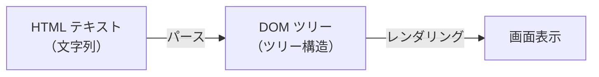
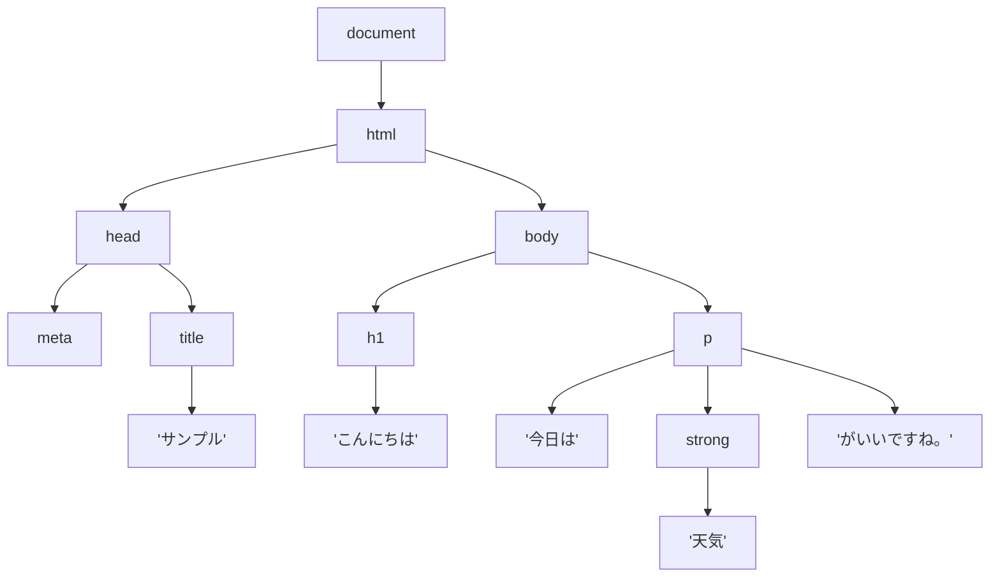
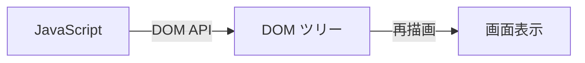
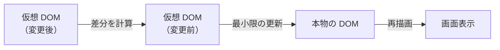

# HTML がブラウザに届くまで — パースから DOM ツリーができるまで

## 今日のゴール

- ブラウザが HTML テキストを DOM ツリーに変換する仕組みを知る
- DevTools の Elements パネルが DOM の可視化であることを知る
- JavaScript や React が DOM を通じて画面を操作することを知る

## HTML は「ただの文字列」

Day 1 で「ブラウザが HTML を受け取って画面を組み立てる」と学びました。しかし、サーバーから届く HTML はただの文字列（テキストデータ）です。

```
<!DOCTYPE html><html lang="ja"><head><meta charset="UTF-8"><title>サンプル</title></head><body><h1>こんにちは</h1><p>今日は天気がいいですね。</p></body></html>
```

ブラウザはこの文字列を受け取り、画面を組み立てます。しかし文字列のままでは「`<h1>` の中身は何か」「`<p>` は `<body>` の子要素か」といった構造がわかりません。そこでブラウザが行うのが **パース**（parse = 解析） です。

## パース — 文字列をツリー構造に変換する

パースとは、文字列を解析して意味のある構造に変換することです。ブラウザは HTML の文字列をパースして、**DOM ツリー**（Document Object Model のツリー）を構築します。



**DOM**（Document Object Model） は、HTML の構造をプログラムから操作できるようにしたモデルです。「Document（文書）を Object（オブジェクト）として Model（モデル化）したもの」で、HTML の各要素がオブジェクトとして表現されます。

## DOM ツリーとは

たとえば、次の HTML を考えてみましょう。

```html
<!DOCTYPE html>
<html lang="ja">
  <head>
    <meta charset="UTF-8" />
    <title>サンプル</title>
  </head>
  <body>
    <h1>こんにちは</h1>
    <p>今日は<strong>天気</strong>がいいですね。</p>
  </body>
</html>
```

ブラウザはこの HTML をパースして、以下のようなツリー構造を作ります。



HTML のタグの入れ子関係が、そのまま**ツリーの親子関係**になっています。

- `<html>` は `<head>` と `<body>` の親
- `<body>` は `<h1>` と `<p>` の親
- `<p>` は テキスト「今日は」、`<strong>` 要素、テキスト「がいいですね。」の親
- テキスト自体もツリーの一部（**テキストノード**と呼ばれる）

このようにタグだけでなく、テキストもツリーの構成要素（ノード = 節）になっていることに注目してください。

## よく使う用語

DOM ツリーの中で、要素同士の関係を表す用語があります。

| 用語 | 意味 | 例 |
|------|------|-----|
| **親要素**（parent） | ある要素を直接含んでいる要素 | `<body>` は `<h1>` の親 |
| **子要素**（child） | ある要素に直接含まれている要素 | `<h1>` は `<body>` の子 |
| **兄弟要素**（sibling） | 同じ親を持つ要素 | `<h1>` と `<p>` は兄弟 |
| **ノード**（node） | ツリーの構成要素すべて（要素、テキスト、コメントなど） | `<p>` も「こんにちは」もノード |

これらの用語は CSS セレクタ（Day 4 で学んだ子孫セレクタなど）や、後で学ぶ JavaScript の DOM 操作で頻繁に出てきます。

## DevTools の Elements パネル = DOM ツリーの可視化

ブラウザの DevTools（開発者ツール）を開いて **Elements パネル**を見ると、HTML のようなものが表示されています。実はあれは HTML ソースコードそのものではなく、**ブラウザが構築した DOM ツリーの可視化**です。

### HTML ソースと DOM の違い

HTML ソースと DOM は多くの場合同じに見えますが、異なることがあります。

```html
<!-- HTML ソースコード -->
<table>
  <tr>
    <td>データ</td>
  </tr>
</table>
```

ブラウザの Elements パネルで見ると:

```html
<!-- DOM（ブラウザが自動補完） -->
<table>
  <tbody>
    <tr>
      <td>データ</td>
    </tr>
  </tbody>
</table>
```

HTML ソースには `<tbody>` がないのに、DOM には `<tbody>` が追加されています。ブラウザは HTML を解析するとき、仕様に基づいて省略されたタグを**自動的に補完**します。つまり、DevTools の Elements パネルで見えるのは「ブラウザが解釈した結果」である DOM です。

## JavaScript は DOM を操作する

Day 12 で詳しく学びますが、JavaScript はこの DOM ツリーを通じて画面を操作します。

```javascript
// DOM から h1 要素を取得する
const heading = document.querySelector("h1");

// テキストを変更する
heading.textContent = "こんばんは";
```

`document.querySelector("h1")` は「DOM ツリーの中から `<h1>` 要素を探して返す」という意味です。JavaScript は HTML のテキストを直接書き換えるのではなく、**DOM ツリーのオブジェクトを操作**することで画面を更新します。



DOM を変更すると、ブラウザが自動的に画面の表示を更新します。

## React の仮想 DOM への橋渡し

Day 12 で学ぶように、JavaScript で DOM を直接操作するのは意外と煩雑です。要素を1つ追加するだけでも、要素の作成、テキストの設定、親要素への追加と複数のステップが必要になります。

React（Day 21 以降で学びます）は**仮想 DOM**（Virtual DOM）という仕組みを使って、この煩雑さを解決しています。仮想 DOM は「本物の DOM」のコピーを JavaScript のメモリ上に持ち、変更前後の差分だけを本物の DOM に反映します。



今は「React は DOM の操作を効率化する仕組みを持っている」ということだけ覚えておいてください。そのためには、まず「DOM とは何か」を知っている必要がある — それが今日のレッスンの役割です。

## まとめ

- HTML はただの文字列。ブラウザがパース（解析）してツリー構造（DOM ツリー）に変換する
- タグの入れ子関係がツリーの親子関係になる。テキストもツリーの一部（テキストノード）
- DevTools の Elements パネルは HTML ソースではなく、DOM ツリーの可視化
- ブラウザは `<tbody>` の補完など、HTML ソースにない要素を DOM に追加することがある
- JavaScript は DOM を通じて画面を操作する（Day 12 で詳しく学ぶ）
- React の仮想 DOM は本物の DOM との差分を効率よく反映する仕組み（Day 21 で詳しく学ぶ）
